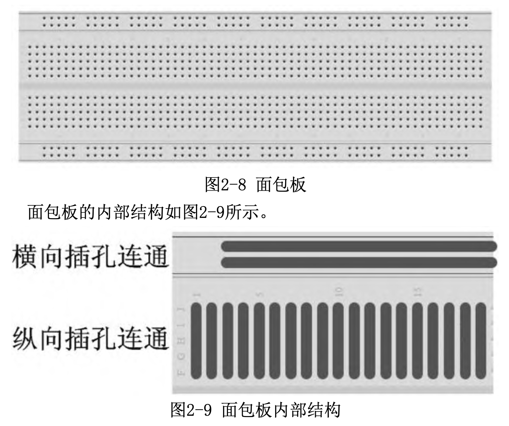
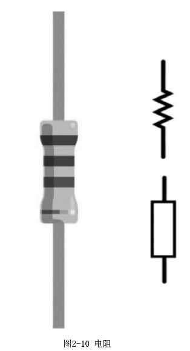
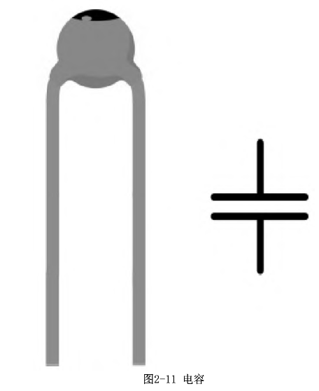
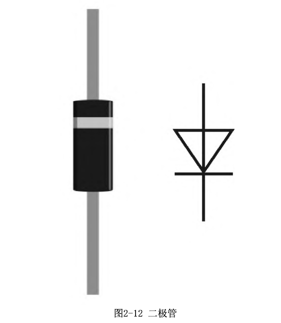
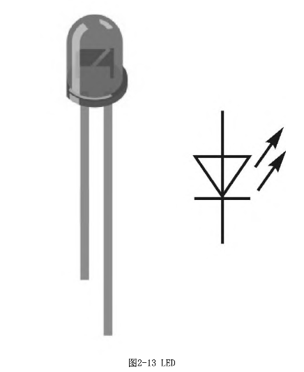
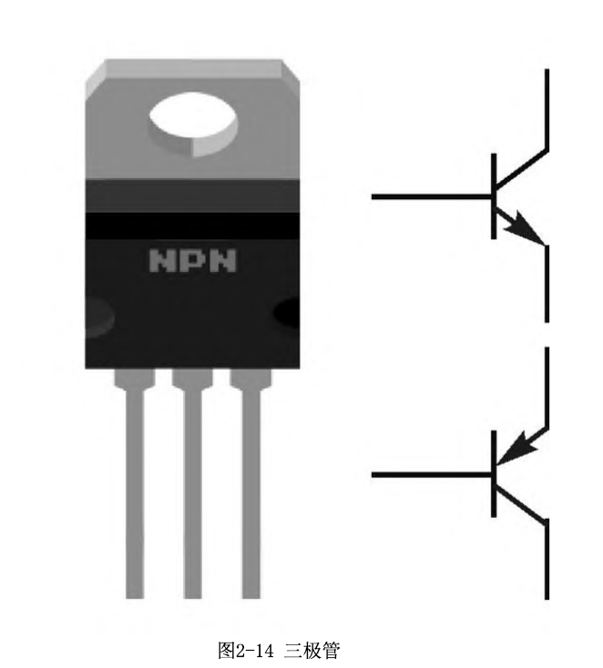
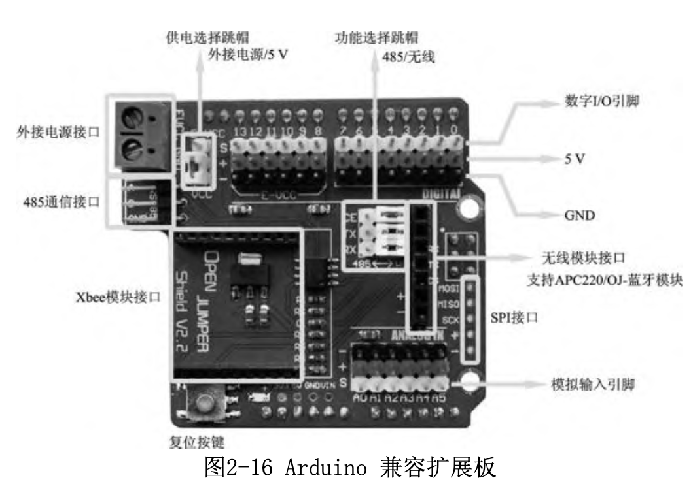
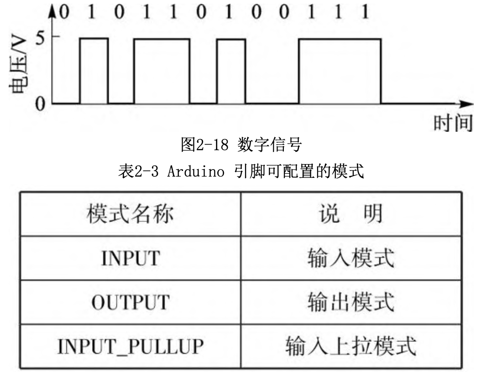
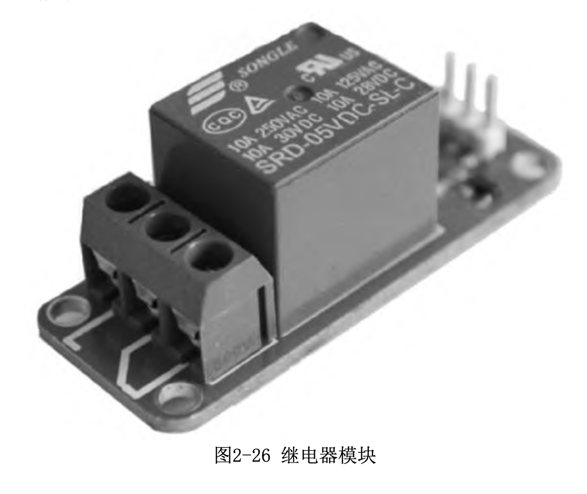
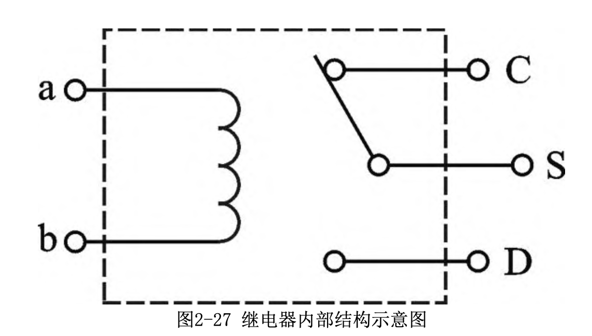

# Arduino

## 如何快速学会arduino

学习Arduino可能有一定难度，但是如果您有耐心和毅力，可以通过以下步骤快速学会Arduino：

1. 了解基础知识：首先，您需要了解Arduino是什么，它能做什么，以及如何使用它。您可以在网上搜索有关Arduino的资料，或者阅读有关Arduino的书籍或教程。
2. 获取必要的工具和硬件：为了开始使用Arduino，您需要获得一个Arduino板，以及一些基本的组件，如LED、电阻、电位器等。您还需要一台计算机，并安装Arduino IDE（Integrated Development Environment，集成开发环境）。
3. 开始编程：使用Arduino IDE编写基本的Arduino程序。您可以从简单的“Hello World”程序开始，然后逐渐学习更多复杂的功能。
4. 尝试新的项目：在学习了基础知识后，您可以尝试新的项目。您可以在网上搜索有关Arduino项目的资料，或者自己设计一个项目。
5. 继续学习：随着您的技能和知识提高，您可以继续学习更高级的知识和技能，如使用传感器、控制电机等。
6. 加入社区：加入线上或线下的Arduino社区，可以帮助您获得更多帮助和灵感。您可以在论坛、社交媒体或邮件列表上寻找这样的社区。
7. 参加比赛和项目：参加各种比赛和项目可以帮助您提高技能，并与其他Arduino爱好者交流经验。
8. 尝试使用不同的板子：Arduino不仅有多种不同的板子，而且还有很多其他的微控制器板子可供选择。尝试使用不同的板子可以帮助您了解各种不同的硬件和软件。
9. 学习其他编程语言：虽然Arduino使用的是C/C++语言，但是学习其他编程语言也可以帮助您提高编程能力。例如，学习Python可以帮助您编写高级的脚本和程序。

## 基础知识

### arduino是什么？

Arduino是一种开源的微控制器平台，它是一个基于微控制器的开发板，可以用来控制和自动化各种设备。可以通过使用Arduino来创建各种电子项目，如智能机器人，智能家居系统，智能照明系统，温湿度传感器等。

与其他微控制器不同，Arduino具有开源的硬件和软件，使其易于使用，并且拥有一个强大的社区，可以获得各种帮助和支持。 Arduino的硬件是建立在普通的微控制器之上的，并且具有一些额外的功能，如引脚，连接器和其他硬件。

除了控制电子设备外，Arduino还可以用于数据采集和分析，例如使用传感器来收集环境数据，并使用这些数据来控制设备或者进行数据分析。

总的来说，Arduino是一种非常强大的工具，可以用来创建各种电子项目，并在不同的领域中使用它来控制和自动化设备。

### 如何使用arduino？

要使用Arduino，您需要以下步骤：

1. 安装Arduino IDE：首先，您需要在计算机上安装Arduino IDE。您可以从Arduino官网下载最新版本的IDE。
2. 连接Arduino板：使用USB线将Arduino板连接到计算机。
3. 选择板型：在Arduino IDE中打开“工具”菜单，然后选择您使用的Arduino板的型号。这将确保IDE与您的板型兼容。
4. 编写代码：在Arduino IDE中打开一个新文件，然后编写代码。Arduino使用C++语言。
5. 编译代码：使用Arduino IDE中的“编译”按钮编译您的代码。这会检查您的代码是否有语法错误。
6. 下载代码：使用Arduino IDE中的“上传”按钮将代码下载到Arduino板。
7. 运行代码：当代码成功下载到板上时，它就会自动运行。您可以使用连接到板上的传感器和其他硬件来测试代码的输出。

注意：这些步骤仅是大致概述。在开始使用Arduino之前，建议您阅读官方文档和教程，了解如何使用Arduino IDE和C++语言编写代码。

### 如何模拟arduino硬件？

1. 使用软件模拟器：有许多软件模拟器可以帮助您模拟Arduino硬件。例如，您可以使用Proteus、Arduino SIM、Tinkercad等软件来模拟Arduino。这些软件可以帮助您在计算机上模拟Arduino板子和组件，并运行您的程序。
2. 使用物理模型：如果您希望更真实地模拟Arduino硬件，可以使用物理模型。您可以使用带有Arduino板子的套件，或者自己制作一个模型。然后，您可以使用真实的组件，如LED、电位器、按钮等，来测试您的程序。
3. 使用真实的Arduino硬件：如果您希望真正地模拟Arduino硬件，您可以使用真实的Arduino板子和组件。这样，您就可以在真实的硬件上测试您的程序，并确保它的正常运行。

不过，使用真实的Arduino硬件可能会比较昂贵，并且需要您拥有相应的知识和技能。因此，如果您是初学者，建议先使用软件模拟器或物理模型来学习和测试程序。

- Proteus是一款专业的电子电路设计软件，可以帮助您设计和仿真电子电路。它支持多种微控制器，包括Arduino。您可以使用Proteus设计电路图，并运行您的程序来测试电路的功能。
- Arduino SIM是一款专门为Arduino设计的软件模拟器。它可以帮助您在计算机上模拟Arduino板子和组件，并运行您的程序。Arduino SIM支持多种常用的组件，如LED、电位器、按钮等，可以帮助您测试和调试程序。
- Tinkercad是一款在线的3D设计软件，可以帮助您设计和模拟电子电路。它也支持Arduino，可以帮助您在计算机上模拟Arduino板子和组件，并运行您的程序。

总的来说，Proteus是一款专业的电子电路设计软件，可以帮助您设计和仿真电子电路；Arduino SIM是一款专门为Arduino设计的软件模拟器；Tinkercad是一款在线的3D设计软件，可以帮助您设计和模拟电子电路。选择哪种软件取决于您的需求和偏好。

如果您希望设计和仿真电子电路，可以使用Proteus或Tinkercad。如果您只希望模拟Arduino硬件，可以使用Arduino SIM。

不过，需要注意的是，Proteus和Tinkercad都是付费软件，需要购买才能使用。而Arduino SIM是免费软件，您可以免费使用。

- [Proteus基础使用](https://www.bilibili.com/video/BV12Q4y1A7QM)
- [Proteus仿真arduino](https://www.bilibili.com/video/BV19K4y1p7Eo)

### arduino的代码如何在proteus里运行？

如果你想在Proteus中运行Arduino代码，你可以按照以下步骤来操作：

1. 在Arduino IDE中编写你的代码，然后编译并下载到你的板子上。
2. 在Proteus中新建一个电路工程，然后添加一个Arduino模拟器组件。
3. 在Arduino模拟器组件的属性面板中，选择你使用的Arduino型号，然后加载你之前编译的Hex文件。
4. 在Proteus中设置你的电路图，并连接好所有的电子元件。
5. 在Proteus中运行仿真，你的Arduino代码就会在模拟器中运行。

注意，在Proteus中运行Arduino代码是模拟运行，并不是真正的在板子上运行。如果你想在板子上运行你的代码，你需要使用编译器将代码编译成Hex文件，然后使用下载工具将Hex文件烧录到板子上。

#### .with_bootloader.hex后缀文件有什么用途？

在Arduino开发流程中，你可能会看到输出的一个后缀名为".with_bootloader.hex"的文件。这个文件通常是在你将程序烧录到板子上时使用的。

在Arduino板子中，Bootloader是一段特殊的程序，它位于微控制器的固件区域，并且在板子启动时会被自动执行。Bootloader的作用是在板子启动后，从外部存储器（比如SD卡或者串口）加载用户程序，然后将其运行在微控制器上。

当你在Arduino IDE中编译程序时，编译器会自动生成一个Hex文件，这个Hex文件包含了你的程序代码和配置数据。如果你希望将这个Hex文件烧录到板子上，并且希望在板子启动后自动加载这个程序，你可以使用带有Bootloader的Hex文件。

在Arduino IDE中，你可以在"文件"菜单的"首选项"对话框中设置是否在编译时生成带有Bootloader的Hex文件。如果你选择了生成带有Bootloader的Hex文件，那么编译器会在生成Hex文件时，自动将Bootloader代码和你的程序代码合并在一起，生成一个新的Hex文件。这个Hex文件就是带有Bootloader的Hex文件。

## 硬件知识

### 面包板

面包板（图2-8）是专为进行各种电子实验所设计的工具。在面包板上可以根据自己的想法搭建各种电路，对于众多电子元器件，都可以根据需要随意插入或拔出，免去了焊接的烦恼，节省了电路的组装时间。同时，免焊接使得元件可以重复使用，避免了浪费和多次购买元件。

对于两边的插孔，是数个横向插孔连通，而纵向插孔不连通。对于中间的插孔，是纵向的5 个插孔相互连通，而横向的都不连通

### 电阻

电阻（图2-10）是对电流起阻碍作用的元件。

### 电容

电容（图2-11），顾名思义，装电的容器。除电阻以外，最常见的元件应该就是电容了。电容也有很多作用，如旁路、去耦、滤波、储能等。

### 二极管

二极管（图2-12）是单向传导电流的元件。二极管在电路中使用广泛，作用众多，如整流、稳压等。

### LED（发光二极管）

发光二极管（图2-13）是可以发光的二极管。发光二极管有正负两极，短脚为负极、长脚为正极。它广泛应用于信号指示和照明等领域。

### 三极管

三极管（图2-14）是能够起放大、振荡或开关等作用的元件。三极管有发射极E（Emitter）、基极B（Base）和集电极C（Collector）三极。有PNP和NPN两种类型的三极管。

### 传感器扩展板

通过扩展板转换，各个引脚的排座变为更方便接插的排针。数字I/O引脚和模拟输入引脚处有红黑两排排针，以“＋”、“－”号标识。“＋”表示 VCC，“－”表示GND。在一些厂家的扩展板上，VCC和GND也可能会以“V”、“G”标识。

通常习惯用红色代表电源（VCC） ，黑色代表地（GND） ，其他颜色代表信号（signal）。传感器与扩展板间的连接线也遵守这样的习惯。

### 数字信号

数字信号是以0、1表示的不连续信号，也就是以二进制形式表示的信号。在Arduino中数字信号用高低电平来表示，高电平为数字信号1 ，低电平为数字信号0（图2-18）。

Arduino上每一个带有数字编号的引脚都是数字引脚，包括写有“A”编号的模拟输入引脚。使用这些引脚可以完成输入/输出数字信号的功能。

在使用输入或输出功能前，需要先通过pinMode()函数配置引脚的模式为输入模式或输出模式，即pinMode(pin, mode)；

其中参数pin为指定配置的引脚编号，参数mode为指定的配置模式。可使用的三种模式如表2-3所列。

如之前在Blink程序中使用到的pinMode(13, OUTPUT)语句，就是把13号引脚配置为输出模式。

配置为输出模式以后，还需要使用digitalWrite()函数使该引脚输出高电平或低电平。

其调用形式为：digitalWrite(pin, value)；其中参数pin为指定输出的引脚编号。参数value为要指定的输出电平，使用HIGH指定输出高电平，使用LOW指定输出低电平。

Arduino中输出的低电平为0V，输出的高电平为当前Arduino的工作电压，例如UNO的工作电压为5V，则其高电平输出也是5V。

数字引脚除了用于输出信号外，还可用digitalRead()函数读取外部输入的数字信号，其调用形式为：digitalRead(pin);其中参数pin为指定读取状态的引脚编号。

当Arduino以5V供电时，会将范围为－0.5～1.5V的输入电压作为低电平识别，而将范围在3～5.5V的输入电压作为高电平识别。所以，即使输入电压不太准确，Arduino也可以正常识别。需要注意的是过高的输入电压会损坏Arduino。在Arduino核心库中，OUTPUT被定义为1，INPUT被定义为0，HIGH被定义为1，LOW被定义为0。因此这里也可用数字替代这些定义。如：pinMode(13,1);digitalWrite(13,1);

### 继电器模块

继电器（图2-26）是一种可控的电子开关，可以使用Arduino发出一个控制信号来闭合或断开这个开关。

由于数字引脚的输出电平是有限制的，最大输出电流通常在20mA左右，所以你不能使用数字引脚来控制大电流的电路。如果你需要控制大电流的电路，你可以使用继电器或其他电路元件来实现。

继电器有多个种类，这里使用的是电磁继电器，其工作原理如图2-27所示。

ab之间是线圈，只要在ab两端加上一定的电压，线圈中就会流过一定的电流，从而产生电磁效应。S端上的衔铁开关也会在电磁力吸引的作用下克服弹簧的拉力，吸向D端所连接的铁芯，从而导通S端和D端。当线圈断电后，电磁的吸力也随之消失，衔铁开关就会在弹簧的反作用力作用下返回原来的位置，将S端与C端导通。如此吸合、释放衔铁开关，便达到了闭合、断开电路的目的。

### 体热释电红外传感器

