# 从零开始学架构

## 第一章 概念和基础

### 软件架构是什么？

软件架构是指软件系统的顶层结构，而架构设计的目的是为了解决软件复杂度。

- 避免为了高指标而做架构设计，有时候并不需要架构设计，会造成更高的项目成本
- 机器语言、汇编语言、高级语言的演进，解决了编码复杂度

#### 系统架构的结构该如何拆解？

可基于以下维度拆解：

- 系统、子系统： 由一群有关联的个体所组成，根据某种规则运作。
- 模块、组件： 从逻辑角度拆分得到的单元是模块，负责职责分离；从物理角度拆分得到的单元是组件，负责单元复用，独立可替换。
- 框架、架构： 框架提供组件的规范；架构提供系统的结构。

### 架构设计的复杂度来源于什么？

- 高性能，理论上会存在上限，优化只能逼近该上限，有以下手段：
  - 单进程 -> 多进程
  - 单线程 -> 多线程
  - 单机 -> 多机
  - 单任务 -> 多任务
- 高可用：
  - 机器冗余，包含连接管理，分配算法（n主n备）
  - 存储高可用（一致性、可用性、分区容错性最多满足两个）
  - 状态决策： 独裁式（单点监测）、协商式（监测&投票）、民主式（去中心化）
- 可拓展，可通过面向对象、设计模式解决：
  - 预测变化： 预测可能错误，不能每个设计点都考虑可拓展性
  - 应对变化： 
    - 方法一： 基本架构拆分变化层和稳定层
    - 方法二： 提炼出抽象层和实现层，抽象层保持稳定，实现层支持定制开发
- 低成本
  - 和高性能、高可用冲突，所以属于架构设计的附加约束
  - 往往通过新技术引入实现
- 安全性：
  - 功能安全、架构安全

## 第二章 架构设计原则

### 架构设计三原则是什么？

- 合适原则： 合适由于业界领先
- 简单原则： 简单优于复杂
- 演化原则： 演化优于一步到位

#### 合适原则

结合当前人力、条件、业务等约束，将资源整合发挥最大功效，快速落地，而不是生搬硬套。

常见问题：
- 没有那么多人，却想干那么多活
- 没有那么多卓越的业务场景积累，却想创造业界领先方案

#### 简单原则

简单优于复杂。

- 结构复杂性： 当组成的组件越多，组件的稳定性会直接影响系统的稳定性
- 逻辑复杂性： 逻辑杂糅在一个组件里，改动影响范围大

#### 演化原则

架构应满足当下业务需要，随着业务变化而变化

- 设计过程中，保留优秀设计，修复缺陷设计，去掉无用设计
- 业务变化时，架构要拓展、重构、甚至重写
- 避免生搬硬套大公司做法，要根据自身业务特点，逐步演化

## 第三章 架构设计流程

- 识别复杂度： 罗列复杂度问题，优先级排序处理
- 设计备选方案：
  - 设计3-5个最佳
  - 备选方案差异要比较明显
  - 避免局限于已熟悉的技术
  - 备选阶段关注技术选型，而非技术细节
- 评估和选择备选方案：
  - 360度环评： 性能、可用性、成本、复杂度、安全性、可拓展性等
  - 评估是否遵守架构设计的三大原则
  - 指导思想： 最简派（选择最简单）、最牛派（技术上看起来最牛）、最熟派（熟悉哪个用哪个）、领导派（领导拍板）
  - 通过质量属性优先级排序，选择最优备选方案，质量属性如： 性能、复杂度、成本、可拓展性、可用性
- 详细方案设计：
  - 深入技术细节和原理，避免成为PPT架构师
  - 通过分步骤、分阶段、分系统等方式，降低方案复杂度，逐步演化，避免单一细节推翻整体方案
  - 如果方案过于复杂，可采用设计团队的方式，避免1、2个设计师时可能的思维盲点或经验盲区

### 实践

- 技术需求方案输出可考虑设计3-5个方案备选，罗列明显差异，避免局限于已熟悉的技术；拆分技术选型评审和方案详细评审，避免在不必要的方向上花太多时间梳理方案；
- 技术方案评审时，从方案的性能、可用性、成本、复杂度、安全性、可拓展性角度，思考是否符合合适、简单、演化原则。

## 第四章 高性能架构模式

### 关系数据库

#### 读写分离

主机负责写，从机负责读

- 常见问题： 如果大量写入，导致主从复制延迟，eg： 注册后立即登录
- 解决方案：
  - 方案一： 写操作后的读操作都在主机上读。对业务侵入和影响比较大
  - 方案二： 读从机失败后，读主机。如果存在攻击，可能导致主机压力过大
  - 方案三： 关键业务读写都在主机上，非关键业务读写分离。可能导致非关键业务读取数据不一致

#### 分库分表

分散数据库的读写操作压力

##### 业务分库

- 常见问题： 
  - join操作： 无法跨库join
  - 跨库事务： 无法跨库事务
  - 成本问题： 业务复杂度增加，维护成本增加，如果考虑备份，双倍成本

##### 垂直分表

- 常见问题：
  - 可能查询一次就变成两次

##### 水平分表

- 水平分表算法：
  - 范围路由： 选取有序的数据列作为路由的条件，eg: 创建时间，1～10000的时间放在一个库
    - 常见问题：
      - 如果分段太少，会导致切分后子表数量过多，增加维护复杂度；如果分段太多，会导致单表性能问题
      - 数据分布不均匀
  - hash路由： 取某列的值进行hash运算，eg: 取用户ID，然后`%10`取模
    - 常见问题：
      - 增加子表时，需要重新分布数据
  - 配置路由：  建一张独立的路由表记录路由信息，eg: 用户ID，表名
    - 常见问题：
      - 所有查询必须多查询一次
      - 如果路由表过大，还是会存在性能瓶颈问题
- 常见问题：
  - join操作： 如果需join查询，需多次join再汇总
  - count操作： 需每个表count相加；或者记一张中间表，但每次insert/delete都要更新中间表
  - orderby操作： 需每个表orderby后再汇总排序
- 实现方式：
  - 程序代码封装： 抽象到数据访问层实现读写分离、分库分表。
    - 特点：
      - 实现简单，可以根据业务做定制化
      - 每个编程语言需自己实现一次，无法通用
      - 故障情况下，所有系统需修改和重启
    - 开源方案： 淘宝的TTDL
  - 数据库中间件封装： 独立一套系统出来，实现读写分离、分库分表
    - 特点：
      - 通用性强，可以支持多种编程语言
      - 故障情况下，只需修改中间件，无需修改业务系统
      - 中间件性能要求高
    - 开源方案： MySQLRouter、Atlas

### 关系数据库的问题

- 无法存储数据结构： 需将数据拆分成多个行记录存储
- schema扩展不方便： 需要修改表结构
- 大数据场景IO高： 即使取某一列进行计算，也会读取整行数据
- 全文搜索功能较弱： like整表扫描匹配，性能较差

### NoSQL

NoSQL（Not Only SQL）通过牺牲一些ACID特性，换取更高的性能和可拓展性。常见四种方案：
- K-V存储： 解决关系型数据库无法存储数据结构问题。eg: Redis
- 文档数据库： 解决关系型数据库schema约束问题。eg: MongoDB
- 列式数据库： 解决大数据场景IO高问题。eg: HBase
- 全文搜索引擎： 解决全文搜索功能较弱问题。eg: ElasticSearch

#### K-V存储

Key是数据的标识，Value是具体的数据。eg: Redis的数组操作LPOP，关系型数据库需执行多次操作（创建编号、查询、删除、更新编号），而NoSQL只需一次操作

- 特点：
  - 确保隔离性和一致性（I和C），会牺牲原子性和持久性（A和D）
    - 原子性（A）： Redis事务不支持回滚操作，也不会中断后续操作
    - 一致性（C）： Redis事务能保证事务开始之前和结束之后，数据库完整性没有被破坏
    - 隔离性（I）： Redis是单进程单线程的工作模式。如果某一客户端执行大量的命令，会阻塞其他客户端的命令
    - 持久性（D）： Redis支持RDB和AOF两种持久化方式。RDB是定时备份（可能数据还在内存中未写入磁盘），AOF是追加写日志（执行命令后立即写入磁盘，可能丢失1条命令数据）

#### 文档数据库

文档数据库的数据以文档的形式存储，文档是一种类似JSON的结构，可以存储不同结构的文档。

- 特点：
  - 新增字段简单，无需事先执行DDL（Data Definition Language，数据定义语言），可以存储不同结构的文档
  - 不支持事务
  - 不支持join操作

#### 列式数据库

列式数据库将数据按列存储，如果一行数据是1KB，其中需要查询的列只有1B，那么只需读取1B数据。一般用于离线的大数据分析和统计场景

- 特点：
  - 多个列读取时效率高，因为列存储是按行存储在一起的，只需读取需要的列
  - 多个列写操作时，可能会导致部分列写成功，部分列写失败，导致数据不一致

#### 全文搜索引擎

关系型数据库是根据索引实现快速查询，但是like会会整表扫描，效率低下；全文搜索的条件会随意组合，如果建更多索引会导致索引数量特别多。 全文搜索引擎是通过倒排索引（又称反向索引、置入档案或反向档案）的索引方式，建立单词到文档的索引。

### 缓存的架构设计要点

单台memcached服务器简单的key-value查询可以达到5w以上的TPS。实现方式是： RDBMS拉数据存储到memcached，首次查询时，memcached没有数据，再去RDBMS查询，然后存储到memcached，下次查询直接从memcached查询。

- 缓存穿透： 缓存中查不到数据，需要查存储系统，可能是数据不存在，也可能是缓存数据生成需要耗费大量的时间或资源。eg: 爬虫拉取数据
  - 解决方案：
    - 空对象缓存
    - 慢查询场景过滤爬虫，但可能影响SEO和推广
- 缓存雪崩： 当缓存失效后，高并发场景下，会有大量请求打到存储系统，可能导致存储系统造成巨大性能压力，进而拖慢整个系统
  - 解决方案：
    - 更新锁： 缓存失效时，加锁，只有一个线程去更新缓存，其他线程要么等待锁释放后重新读缓存，要么直接返回默认值
    - 后台更新： 由后台线程更新缓存，缓存永久有效，后台定时更新缓存。如果内存不足清除后，期间访问返回默认值，后台更新缓存
      - 定时更新策略： 间隔一段时间更新缓存，判断如果缓存过期，立即更新缓存
      - 消息队列策略： 缓存失败时，通过消息队列通知后台更新缓存
    - 缓存预热： 系统上线后，直接把数据加载到缓存中，而不是等到请求时再加载
- 缓存热点： 热点数据集中在同一份缓存数据，可能导致缓存服务器压力过大
  - 解决方案：
    - 分布式缓存： 将热点数据分散到不同的缓存服务器。 eg: 微博大V每条微博都可以生成100份缓存，分散到100台缓存服务器

### 实践

- 在高并发场景下，如果查询接口的qps比较低，可以通过缓存预热的方式，在业务上线前将缓存加载好，缓存的更新机制可通过消息队列监听事件触发时，更新缓存。

## 第五章 计算高性能

主要集中在两方面：
- 单服务器高性能
- 服务器集群高性能
- 编码高性能

### 单服务器高性能

#### 网络编程模型

关键设计在于如何管理和处理请求，与以下模型相关：
- I/O模型： 阻塞、非阻塞、同步、异步
- 进程模型： 单进程、多进程、多线程

##### PPC模型

PPC(Process Per Connection)模型是一种进程模型，每个连接对应一个进程。优点是简单，缺点是进程切换开销大，进程资源占用大，父子进程通信复杂，不适合高并发场景

##### prefork模型

prefork模型与PPC模型的区别是，prefork模型是预先fork出多个进程。

##### TPC模型

TPC(Thread Per Connection)模型是一种线程模型，每个连接对应一个线程。优点是线程切换开销小，与进程共享内存，线程通信比PPC模型简单，缺点是可能会导致死锁问题、线程异常的内存越界问题，CPU线程调度和切换开销大，不适合高并发场景

##### prethread模型

prethread模型与TPC模型的区别是，prethread模型是预先创建多个线程。

##### Reactor模型

又名Dispatcher模型，是一种I/O模型，主要用于处理高并发的I/O操作。Reactor模型的核心是，当事件发生时，调用事件处理器处理事件。Reactor模型的优点是高并发、高性能。不同编程语言，对应支持的进程、线程、Reactor模型不同。常见以下三种方案：

- 单Reactor单进程单线程： 没有进程间通信，没有进程竞争，没有锁，性能高。但是，单进程模型下，无法充分利用多核CPU、多线程的优势；
- 单Reactor单进程多线程： 可以共享进程内存，所以进程间通信简单；但是Reactor承担了所有事件的监听和响应，只在主进程进行，所以可能会成为性能瓶颈；
- 多Reactor多进程多线程： 主进程负责监听事件，子进程负责处理事件。子进程之间不会有竞争，可以充分利用多核CPU、多线程的优势。例如：Nginx

##### Proactor模型

是非阻塞同步网络模型，与Reactor模型的区别是，Reactor模型是同步I/O，Proactor模型是异步I/O。异步处理完了再通知应用程序，适用于高并发场景

#### 集群高性能

通过负载均衡将请求分发到不同机器上。

##### 负载均衡分类

- DNS负载均衡： 根据不同地理位置，DNS解析到不同IP地址。缺点是更新不及时、拓展性差、无法根据服务器负载情况分配请求
- 硬件负载均衡： 通过类似基础网络设备做分流，支持多种负载均衡算法。缺点是价格昂贵、维护成本高
- 软件负载均衡： 如Nginx、LVS。优点是价格低、维护成本低、支持多种负载均衡算法。缺点是性能低于硬件负载均衡

##### 负载均衡架构

常见组合为： 
- DNS负载均衡实现地理级别的负载均衡
- 硬件负载均衡实现集群级别的负载均衡
- 软件负载均衡实现服务器级别的负载均衡

##### 负载均衡算法

算法分类：
- 任务平分类： 根据比例、权重均分任务
  - 轮询： 每次请求按顺序分配到不同服务器，不考虑服务器的性能
  - 加权轮询： 每次请求按权重分配到不同服务器
- 负载均衡类： 依据CPU负载、连接数、I/O使用率、网卡吞吐量等来均衡系统的压力
  - 负载最低优先： 每次请求分配到负载最低的服务器，需指定负载计算方式，明确负载计算的时间间隔，如果太短可能早晨频繁波动，太长可能导致负载不均衡。负载计算算法容易成为性能瓶颈。
- 性能最优类： 根据服务器响应速度进行分配
  - 响应速度最快优先： 收集和分析每台服务器每个任务的响应时间，再进行分配。如果采样率过高，则会导致性能消耗较大，采样率过低则会导致结果不准确
- Hash类： 根据请求的hash值来分配请求
  - 源地址Hash： 同一个源地址分配到同一台服务器上进行处理
  - ID Hash： 根据请求的ID参数来分配请求

## 第六章 高可用架构模式

### CAP理论

强调一致性和可用性的权衡。系统不可能同时满足以下三个特性：

- 一致性（Consistency）： 客户端读操作能返回最新的写操作结果
- 可用性（Availability）： 非故障节点在合理的时间里返回合理的响应（不是错误和超时的响应）
- 分区容错性（Partition Tolerance）： 当出现网络分区(可能是丢包、连接中断、阻塞)后，系统能够继续工作

#### CAP应用

在分布式环境下，因为网络无法做到100%可靠，所以P无法舍弃，所以只能选择CP或AP架构。这里的CP或AP架构是网络分区时，相对侧重C或A。

- CP架构： 当网络异常，数据查询时，表现为提示客户端错误
- AP架构： 当网络异常，数据查询时，表现为返回旧数据

### ACID理论

强调一致性。数据库为了保证事务的正确性而提出的，一个事务要么全完成，要么全不完成，没有中间态。包含四个约束：

- 原子性（Atomicity）
- 一致性（Consistency）： 事务前后数据完整性保持一致
- 隔离性（Isolation）： 事务之间互不干扰
- 持久性（Durability）： 事务一旦提交，数据就会永久保存

### BASE理论

强调可用性。是CAP理论中AP方案的延伸，是为了解决分布式系统的一致性问题。BASE是指：

- 基本可用（Basically Available）： 分布式系统故障时，允许损失部分可用性，保证核心功能可用
- 软状态（Soft State）： 允许系统中存在中间状态，不同节点数据可能不一致
- 最终一致性（Eventually Consistent）： 系统中的所有数据副本经过一定时间后，最终能够达到一致状态

## 第七章 故障模式与影响分析

FMEA（Failure Mode and Effect Analysis）是一种系统性的、有方法的分析方法，用于识别和评估系统中的潜在故障模式及其影响，从而提高系统的可靠性。

### FMEA方法

FMEA分析表应包含以下内容：

- 功能点： 业务层面划分的功能，非技术层面
- 故障模式： 系统可能出现的故障点和故障形式，eg: MySQL响应达3s
- 故障影响： 当发生故障模式中的故障时，功能点会有什么影响，eg: 20%用户无法访问
- 严重程度： 根据功能点重要程度、故障影响范围、功能点受损程度判断，高中低分级
- 故障原因
- 故障概率： 可重点按硬件、开源系统、自研系统维度评估，预留资源投入，高中低分级
- 风险程度： 根据严重程度和故障概率评估，高中低分级
- 已有措施： 针对故障原因，系统是否提供了对呀措施应对 eg: 告警、容错、自恢复
- 规避措施： 降低故障发生概率而做的事，可以是技术或管理手段 eg: 冗余、定时重启
- 解决措施： 为了解决问题而做的事，如果某个故障既可以规避又可以解决，通常优先采用解决措施
- 后续规划： 综合前面的分析，检查哪些故障缺乏对应措施和不足，按优先级排序针对性优化

## 第八章 存储高可用

通过将数据复制到多个设备，以数据冗余的方式提高数据的可用性，主要的复杂性再如何应对复制延迟和中断导致的数据不一致问题，通常需思考以下问题：

- 数据如何复制
- 各节点职责是什么
- 如何应对复制延迟
- 如何应对复制中断

### 主备复制

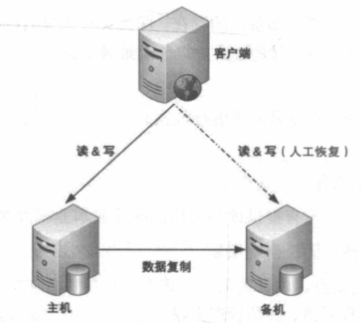

详细设计：
- 主机存储数据，复制到备机
- 正常情况下，读写在主机上进行，备机不对外提供读写服务
- 主机故障情况下，且主机短时间内不能自动恢复（eg:硬盘损坏），则人工将备机主动升级为主机
- 主机不能恢复，写入主机但还没备份到备机的数据会丢失，需要人工排查和恢复，数据可能丢失，业务需考虑该风险应对方案
- 如果复制延迟了，主机又宕机了，可能会丢失较多数据，需要监控复制延迟情况，延迟较多需告警

优点：
- 主备切换时无感知
- 主备双方只需要数据传输，无复杂操作

缺点：
- 备机只用作备份用途，没有读写操作，硬件成本浪费
- 故障需要人工干预，无法自动恢复

### 主从复制

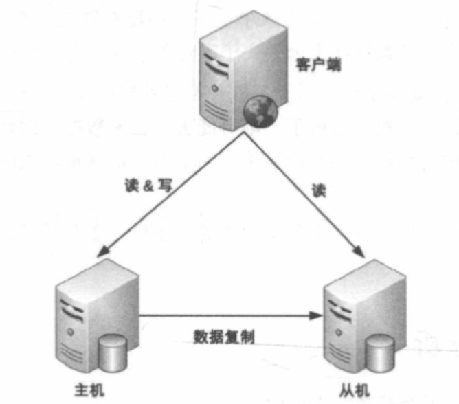

相比主备复制方案，差异点是：
- 写操作发送到主机，读操作发送到主机或从机，算法可以是随机或者轮询读等
- 主机故障时，无法写入，但不影响读操作

### 主备倒换和主从倒换

主要解决主备复制和主从复制的以下问题：
- 主机故障后，无法进行写操作
- 如果主机无法恢复，需要指定新的主机角色

详细设计：
- 主备间状态判断： 状态传递的渠道和状态检测的内容
  - 状态传递的渠道： 是相互连接还是第三方仲裁？
  - 状态检测的内容： eg: 机器是否掉电，进程是否存在等
- 倒换决策：
  - 倒换时机： 明确什么情况下切换主机 eg: 进程不存在，主机响应超2s，3分钟内连续重启3次等
  - 倒换策略： 明确主机恢复后，应该成为备机还是主机
  - 自动程度： 全自动还是半自动 eg: 人工切换主机
- 数据冲突解决： 主备切换后，旧主机的新数据未备份到新主机，可能导致数据不一致

#### 常见架构

##### 互连式

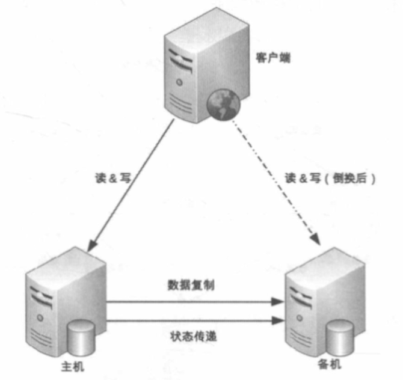

- 主机发送状态给备机，或者备机主动获取主机状态
- 主备机器通过网络+串口通道连接，进行状态传递通信
- 如果状态传递的通道出现异常（eg:网线拔了），可能导致备机误以为主机宕机，升级为主机
  - 可通过增加更多通道增强传递可靠性，但是只是降低了出现概率，无法完全避免

##### 中介式

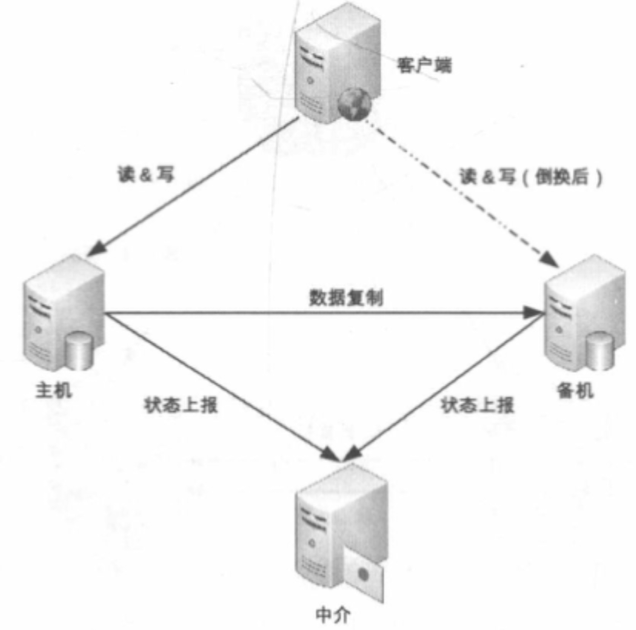

- 主备设备连接到中介设备，中介设备负责主备设备的状态传递和切换
- 代价就是实现中介设备的高可用
- 可使用开源成熟方案 eg: Zookeeper

##### 模拟式

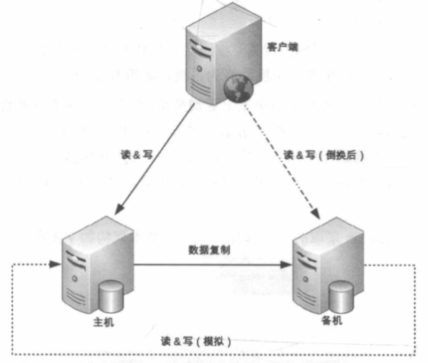

- 通过模拟读写操作来探测主机状态，如果主机无法响应，备机升级为主机

### 主主复制

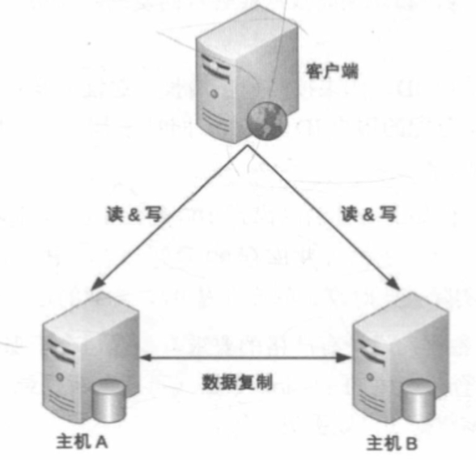

- 两台机器都是主机，通过互相将数据复制给对方，客户端客挑选任意机器进行写操作
- 详细设计与主备复制相似，但不存在主备倒换概念
- 需保障数据能够双向复制，数据在大多数情况下不允许双向复制 eg: 插入记录id自增、库存扣减
- 适用于临时性、可丢失、可覆盖的数据场景

### 数据集群

单机运算能力有限，集群处理存储和处理问题

#### 数据集中集群

- 类似主备、主从架构，主机读写，从机只读
- 由于服务器数量更多，会出现多条复制通道、主机状态检测的性能问题，主机选举决策问题

#### 数据分散集群

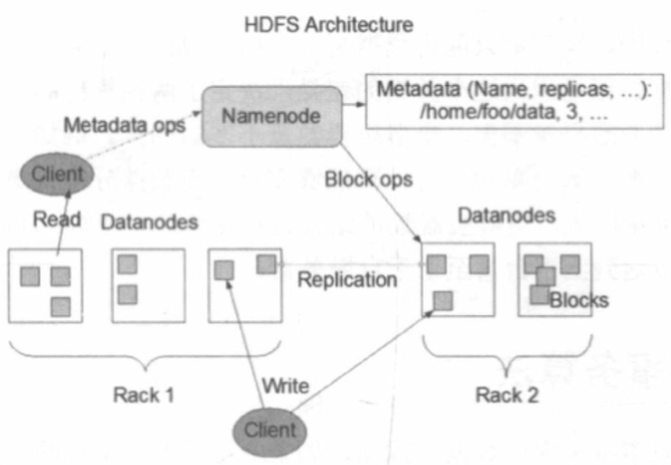

- 无主从概念，每台机器都是主机，数据分散存储在多台机器上
- 要有一个角色执行数据分配算法，可以是独立的也可以是选举出来的服务器
- 设计上需通过算法保障均衡性，避免数据倾斜；需考虑容错性，服务器故障时分区数据需分配到其他服务器；需考虑可伸缩性，扩容时需自动将数据迁移到新服务器

#### 分布式事务算法

数据的一致性可采用事务实现，在集群中该数据分布在不同节点上，节点间只能通过消息通信，所以事务依赖消息通知实现。但消息可能丢失，所以存在分布式事务算法

- 两阶段提交(2PC: Two-phase commit protocol)： 通过协调者和参与者两个角色，协调者发起事务，参与者执行事务，协调者发起提交，参与者执行提交。
  - 缺点:
    - 同步阻塞： 协调者和参与者需等待对方响应的消息，过程中节点处于阻塞状态，可能导致阻塞
    - 状态不一致： 部分参与者未收到提交消息，超时直接ROLLBACK了
    - 单点故障： 协调者故障，整个事务无法进行，参与者一直等待
- 三阶段提交(3PC: Three-phase commit protocol)： 在两阶段提交基础上，增加了超时机制，防止参与者长时间阻塞

#### 分布式一致性算法

确保分散在多个节点的数据的一致性，以满足CP架构要求

##### 复制状态机技术

常用的算法有： Paxos（最权威）、Raft、Zab

主要角色：
- 副本： 每个节点都有一份完整状态机副本
- 状态机： 接受输入和执行操作，流转状态
- 算法： 协调各副本处理逻辑，保证数据一致性

### 数据分区

基于地理级别的故障设计高可用架构，一个良好的设计需考虑多个方面：

- 数据量： 如果只是水平扩容，可能导致较高的运维成本；
- 分区规则： 可按洲际、国家、城市分区，主要考虑业务范围和成本因素等；
- 复制规则： 部分数据如果受影响，整体数据不会受影响，但需考虑恢复损坏或丢失的这部分数据，所以需要复制方案，常见以下备份架构
  - 集中式： 多地区数据集中备份到一个地区，特点是成本高，易扩展，简单
  - 互备式： 每个分区备份另一个分区的数据，特点是成本低，但是复杂度高，拓展时要考虑备份方向，不易扩展
  - 独立式： 每个分区都有自己独立的备份中心，特点是成本高（比集中式高，不同的场地成本），易拓展，简单

## 第九章 计算高可用

当部分硬件损坏时，计算任务可正常运行，通过冗余更多服务器达到计算高可用。复杂度主要在于任务管理上，如何在任务失败时重新分配到新服务器执行。

### 主备架构

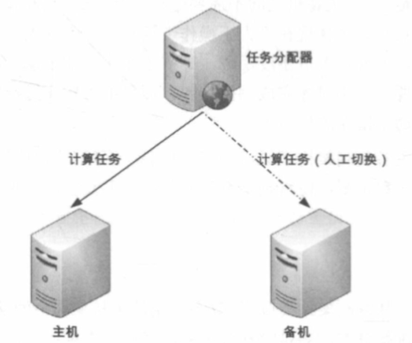

类似于存储高可用的主备架构，主要分为冷备和温备架构。

- 冷备： 程序和配置文件都准备好，但是不运行，需要手动启动。优点是节约资源
- 温备： 程序和配置文件都准备好，且运行，但是不对外提供服务，需将任务分配器的任务请求切换为备机即可。优点是减少手工操作

### 主从架构

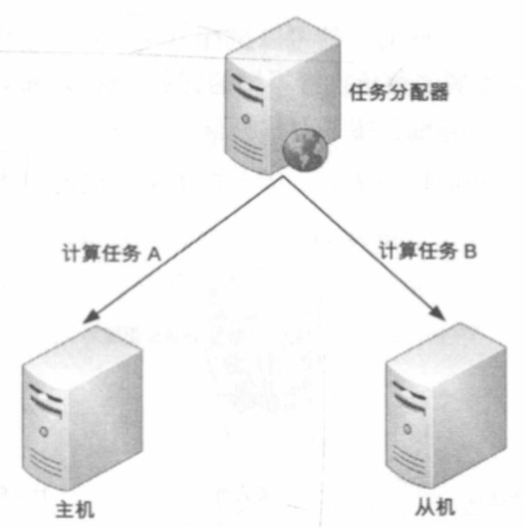

主机和从机都对外提供服务，主机负责写操作，从机负责读操作。主机故障时，从机升级为主机。

### 对称集群

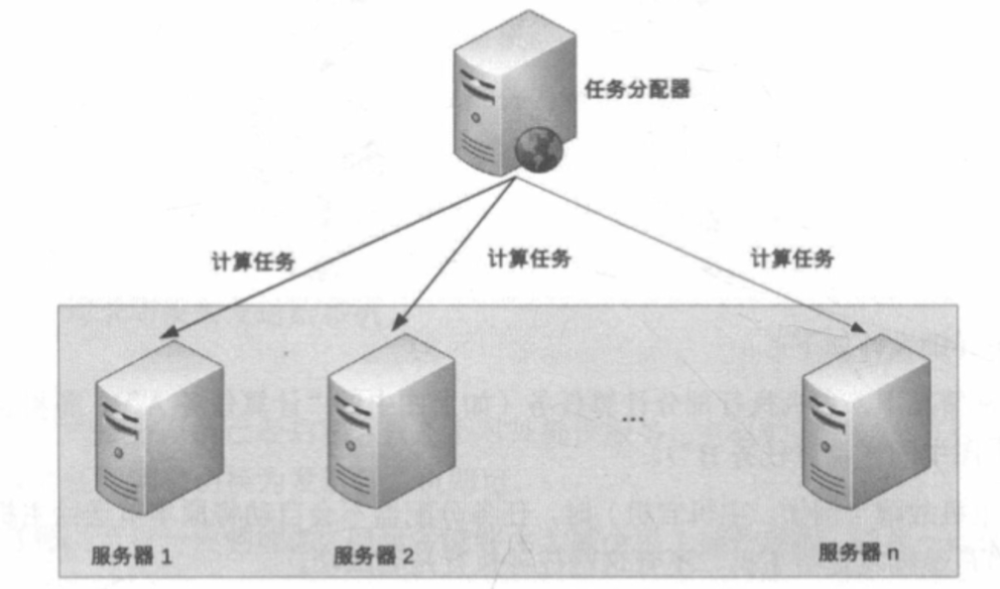

任务分配器检查服务状态，并分配任务到多台服务器上，每台服务器都可以执行任务。

- 任务分配： 常用轮询和随机算法；
- 状态检测： 服务器状态（宕机、网络是否正常等）、任务状态（是否执行成功等）、心跳检测（是否正常运行）；

#### 非对称集群

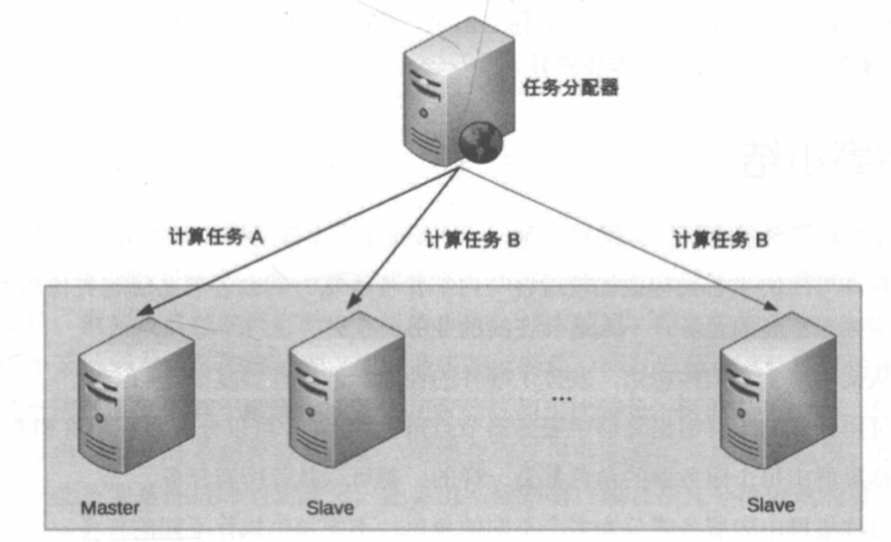

不同角色的服务器承担不同的职责，如任务分配器、任务执行器、任务监控器等。

## 第十章 业务高可用

### 异地多活

如果业务规模很大，业务系统中断会带来很大影响，那么就需要对业务做异地多活架构，避免单点故障。异地多活架构分为以下几种：

- 同城异区： 部署在同一个城市不同市区的多个机房。从复杂度、成本、故障发生概率综合考虑，是最优选择
- 跨城异地： 部署在不同城市的多个机房。由于距离较远，数据传输时不可控因素会非常多，可能导致数据不一致问题
- 跨国异地： 部署在不同国家的多个机房。由于跨国，可能会受到政策、网络等因素影响，延时可能达好几秒。主要应用场景有：
  - 为不同地区提供服务，eg: 亚马逊中国和亚马逊美国帐号不互通
  - 只读类业务做多活

#### 关键设计

- 关键业务做多活： 并非所有业务都适合做多活 eg: 注册和登录，确保登录多活，注册单活，避免数据一致性问题
- 核心数据一致：
  - 减少异地距离，搭建高速网络；
  - 尽量减少数据同步，只同步核心业务数据；
  - 保障最终一致性，不保证实时一致性；
- 采用多种数据同步手段： 
  - 消息队列同步；
  - 二次读取数据（请求重试）；
  - 存储系统主从复制；
  - 根据sessionId回源读取；
  - 回源失败，重新生成数据；
- 只保证绝大部分用户的异地多活：
  - 将实时操作改为异步操作，eg: 转账拆分成转账申请和转账操作，转账申请异地多活，转账操作单活；
  - 不可用情况下，通过一些措施安抚用户； eg: 挂公告、事后补偿、事后通知等；

#### 设计步骤

1. 业务分级： 挑选核心业务、访问量大、产生大量收入进行多活
2. 数据分类：
  - 数据量级
  - 唯一性要求： 避免多机生成唯一id不一致
  - 实时性要求： 实时性要多高
  - 可丢失性： 是否允许数据丢失
  - 可恢复性： 是否可恢复、重置、重复生成（eg:重登）
3. 数据同步： 选择合适的同步方案，存储系统同同步、消息队列同步、重复生成策略
4. 异常处理：
  - 目的： 问题发生时，减少影响范围；问题修复后，修正异常数据；补充用户损失
  - 方案： 
    - 多通道同步： 同时使用MySQL主从同步和消息队列同步。
    - 日志记录： 服务器存储一份日志，数据库存储一份，避免数据库宕机丢失日志
    - 用户补偿

### 接口故障

原因分为内部和外部原因，可能是程序死循环、慢查询、黑客攻击等等，应对措施有：

- 降级： 通过系统后门降级、独立降级系统，以禁用部分功能，保障其他功能
- 熔断： 通过熔断器，当接口调用失败率达到一定阈值，自动熔断，避免雪崩
- 限流： 通过限流器，限制接口调用频率，避免雪崩
  - 基于请求限流： 限制某个指标的累积上限
  - 基于资源限流： 限制某个资源的累积上限
- 排队： 通过消息队列，将请求排队，避免瞬间高并发

## 第十一章 可拓展模式

通过拆分模块，拓展时仅需修改某一部分即可，无需到处修改

### 可拓展的基本思想

拆分思路：
- 面向流程拆分
- 面向服务拆分
- 面向功能拆分

