# 认知世界的经济学

## 什么是经济学

- Q: 经济学研究什么？
- A: 可进行独立决策的个体，所进行的选择
- Q: 宏观经济学与微观经济学的区别是什么?
- A: 根据是否从时间线的角度分析趋势进行区分

### 经济学的假设

- 假设1: 因为往往人的欲望是大于资源供给的，所以资源永远是稀缺的
- 假设2: 人是理性的

经济循环图

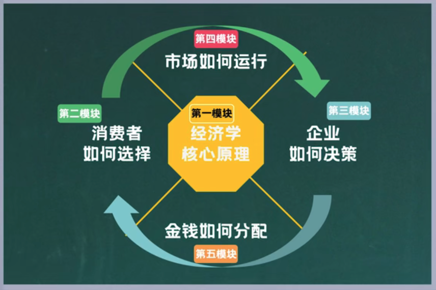

### 经济学的历史

过去

- 农耕时代，为了防止人多地少导致的流浪汉增加问题，从政治制度去约束人必须劳动，否则会受到惩罚
- 到了工业时代，经历了劳动力资源流向的调整，进而促使政治制度的调整

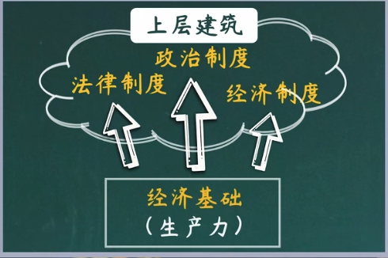

现在

- 讨论如何解决就业、贫富分化等问题
- 凯恩斯主义： 通过政府调控，缓冲问题
- 芝加哥学派： 货币主义，通过印钞，缓冲问题

### 经济学道德观

- 实证经济学： 没有立场，只有对错。如： 法官、警察
- 规范经济学： 只有立场，没有对错

## 经济学的基本方法

- 机会成本分析： 放弃其他选择带来的成本
- 沉默成本分析： 已经支出无法回收的成本，我们应该通过机会成本做决策，通过沉默成本计算损失，但不应该受沉默成本影响决策
- 边际成本分析： 衡量投入程度的方法。通过边际成本和边际收益分析，不看总成本多少，只看增量成本带来的收益
- 存量/增量成本分析： 通过存量/增量的收益，分析是否该付出存量/增量成本

### 概念

马斯洛需求定律

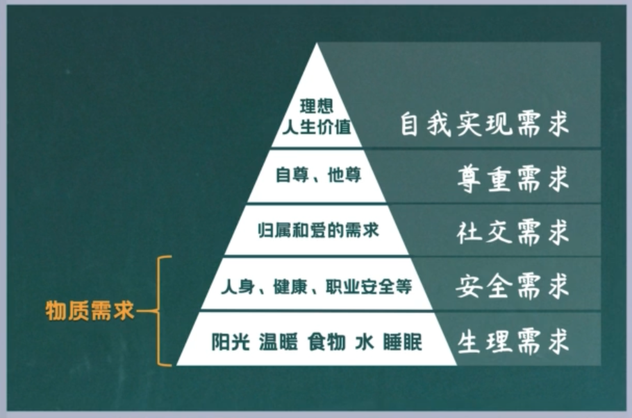

### 个体选项优化

- 预算约束和可行选项
- 权衡选项：成本收益分析
- 激励： 选择的变化，正向和负向的反馈，会改变成本和收益，从而改变人的选择

### 群体均衡

- 群体分析： 人与人间会互相影响，要考虑他人选择
- 均衡： 人与人长期影响后，会维持一种不变的状态
- 合成谬误： 当个体做某事看起来结果是对的，当群体效仿后，结果不对的现象
- 搭便车： 当个体不作为，享受群体作为带来的收益

当出现合成谬误和搭便车现象时，需出台相应策略去解决

### 归因谬误

事物的成功与否，原因是多因多果的。

- 一件事伴随另一件事发生，归为`相关性`；一件事引起另一件事，归为`因果关系`。
- 有因果关系一定有相关性，有相关性不一定有因果关系。

当事物有相关关系，却没有因果关系，可能是以下原因：

- 遗漏因素
- 反向因果关系
- 巧合

### 模型与数据校验

- 建立假说
- 解释假说，找到因果关系进行阐述
- 数据检验，通过统计到的数据进行分析
- 查看结果

#### 数据检验的数据统计方法

- 自然实验法： 通过分人群分实验方式进行
- 调查法： 发问卷等方式采集
- 经济实验法： 拉一实验者，不断修改某一条件，得到结论

## 经济学核心原理

### 需求

需求量的隐含因素：

- 购买意愿
- 购买能力

#### 需求定律

价格上升，其他条件不变，需求量减少

#### 需求曲线

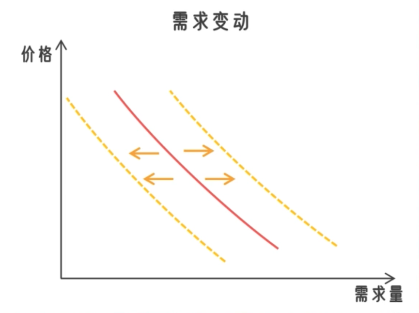

- 需求量的变化： 价格变化导致的需求变化
- 需求变化： 由其他因素造成的需求变化，导致需求曲线左右移动

需求曲线变化的原因：

- 人的收入
- 互补品
- 替代品
- 人的变化： 人口数量变化、人的选择流向变化、人口流动变化
- 消费者对未来的预期变化
- 消费者的偏好喜好

### 供给

供给量的隐含因素：

- 供给意愿
- 供给能力

#### 供给定律

价格上升，其他条件不变，供给量增加

#### 供给曲线

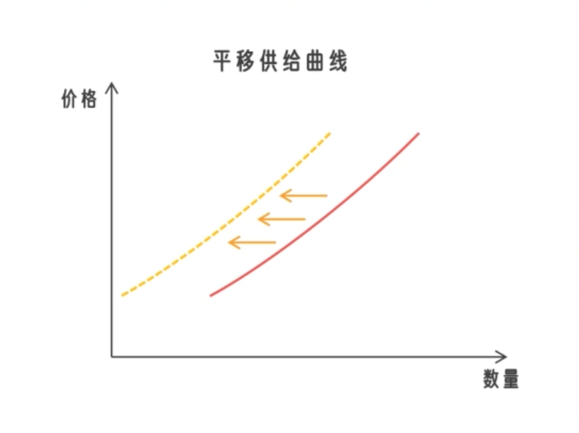

供给曲线变化的原因：

- 投入资源的价格变化
- 技术因素
- 同一生产线或同一生产流程下的产品
- 厂商数量
- 预期
- 其他因素： 政策 / 国际关系 / 自然天气等

#### 如何做商业企划书

- 思路： 供给条件分析，自顶向下分析
- 分析市场供需影响因素，进行供给分析
- 输出供需曲线，预测行业趋势，进而分析公司用人、市场策略

### 市场均衡与价格形成

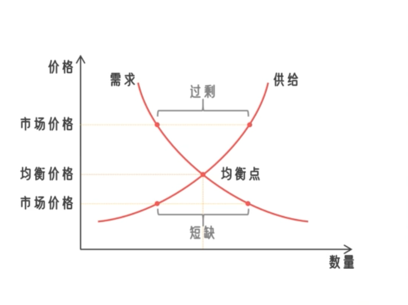

看不见的手

- 均衡价格、出清价格： 供需平衡状态的价格，并非固定值
- 短缺： 需求增大，库存较少的场景
- 过剩： 需求减少，库存较大的场景

#### 市场指数分析

- CPI： 居民消费价格指数，随着时间的变化，包括上百种商品和服务零售价格的平均变化值
- PPI： 生产者价格指数，工业品出厂价格指数，是一个用来衡量制造商出厂价的平均变化值
- PMI： 采购经理人指数，抽取n家企业，进行采购数量比过去多与少的问卷调查，预测采购需求量变化

## 消费者是如何做选择的

追求效用最大化

### 消费者选择模型

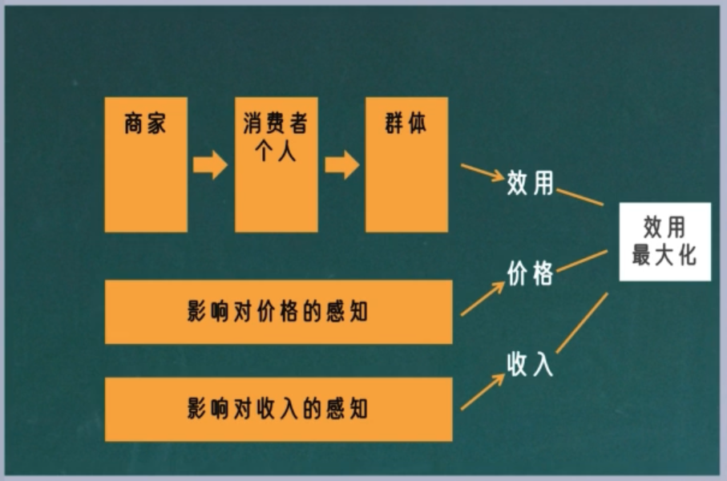

- 购买意愿： 效用
- 购买能力： 价格、收入

主要因素：

- 消费者的偏好
- 商品或服务的价格
- 消费者的收入

#### 效用

> 引申： 通过分析穷人富人的资产分配，可预计总效用的变化，可衡量资本主义和社会主义的发展程度。

- 效用是不可量化对比的
- 总效用是随着消费递增的
- 不同个体间无法衡量效用
- 边际效用递减现象： 消费越多，效用越小。所以税率是累进制

#### 影响消费者因素

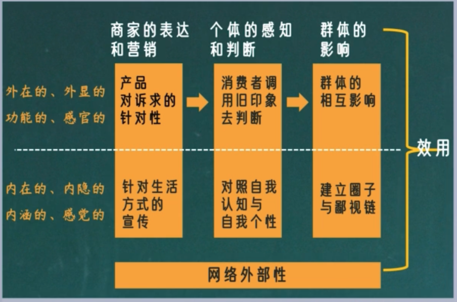

- 宣传上不追求全能，追求切中需求重点
- 色彩、灯光冷暖、秩序给人心理上的感受
- 群体间的相互影响
- 消费年龄段的成长背景产生的不同消费特征
- 网络外部性： 又称网络效应，消费者选择商品时，获得的效用与用户数有相关关系，则称为拥有网络外部性。具有先发优势，强者恒强的特点。当出现竟品且服务间存在高转换成本时，会造成垄断现象。如：社交工具、支付方式等

#### 相关研究的商业学科

- 市场营销学
- 广告学
- 消费者行为学
- 行为经济学

### 时间与风险

风险补偿：

- 无风险的数值 * 风险补偿系数 = 含风险的数值
- 无风险的数值 = 含风险的数值 / 风险系数

时间补偿： 受钱的机会成本高低影响，如通货膨胀、通货紧缩时候。计算方式类似风险补偿计算

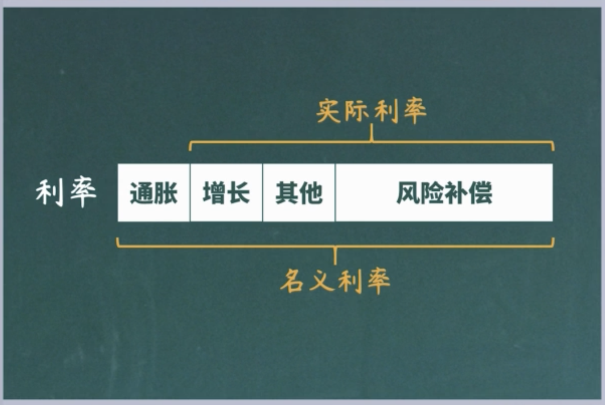

#### 利率

- 利率： 包含了风险和时间补偿的总称
- 负利率： 金融机构资本流入过大，经济增长较慢，用于减小通货膨胀，减小贫富差距

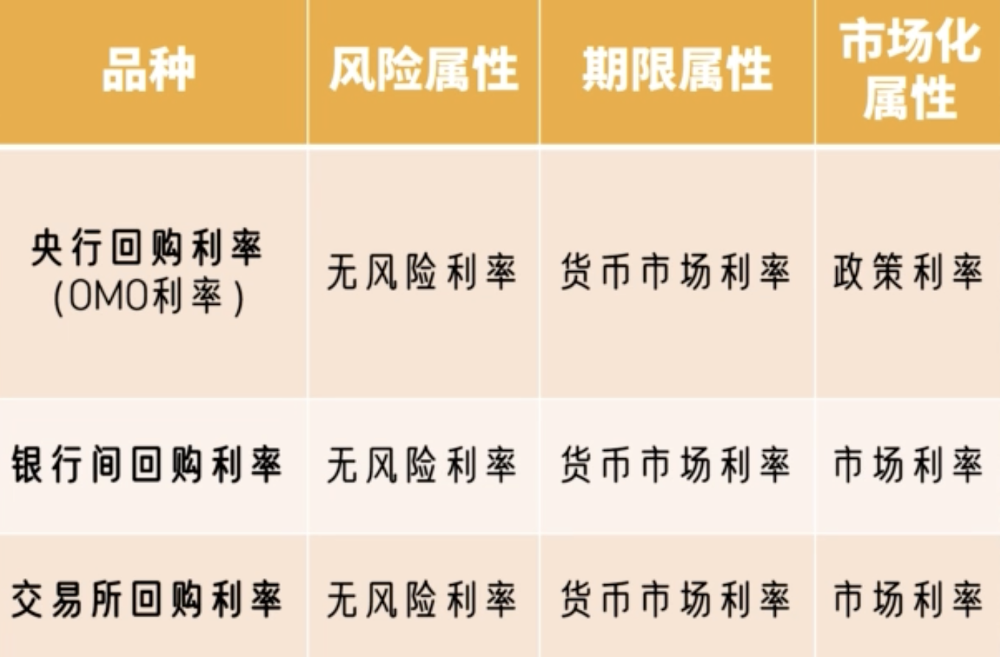

- 正回购： 个人向机构典当，如央行向金融机构发行国债，回收资金，防止通胀，到期后购回债券
- 逆回购： 机构向个人典当，释放资金流动性，如购买国债
- OMO利率： 央行回购利率，代表国家调控的目标，短期利率，周期一般7、14、28天
- MLF利率： 中期借贷利率，俗称麻辣粉，周期一般3个月、6个月、一年
- SLF利率： 常备借贷利率，俗称酸辣粉，紧急情况下使用，市场利率的上限
- 超额准备金利率： 银行钱存到央行的利率，市场利率的下限
- LPR利率： 贷款报价利率，2019年8月开始实行，由多家银行利率报价计算得出

##### 利率影响地图

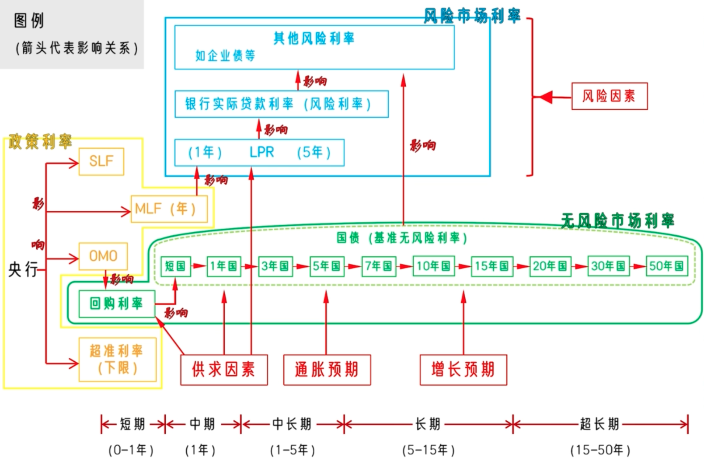

##### 利率计算

计算方式：

- 单利计算： 以本金计算利息
- 复利计算： 以本金+利息计算利息
- 折现： 将终值除以利率得出

##### 永续年金

假设每年都有年收益，通过利率计算现值

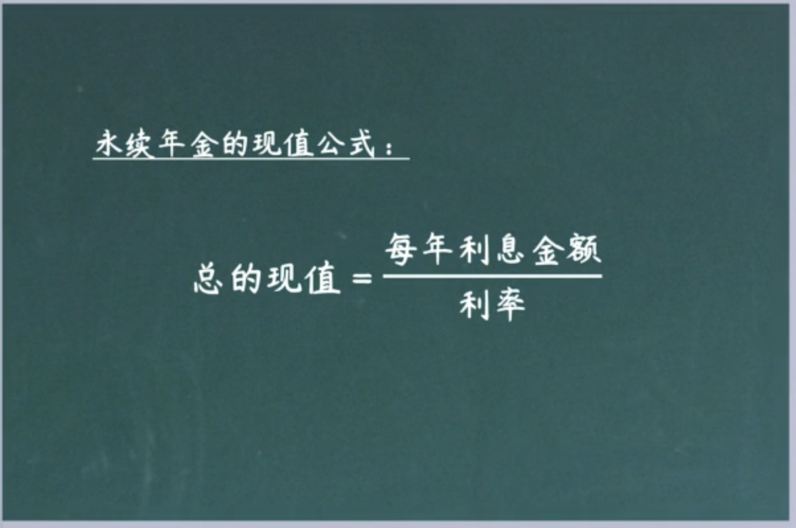

##### 金融资产价格

- 有息资产： 会产生利息的资产，如房产
- 无息资产： 无法产生利息的资产，如名画

###### 房产

- 城市薪资水平存在基数低到高快，高到更高慢的问题
- 房租和城市薪资水平有相关性
- 房子售价与房租可进行间接计算，超出现值即为泡沫

#### 跨期消费决策

- 利率可参照10年国债或5年LPR
- 利率高于GDP增速，则是高风险利率，GDP增速是下降的，所以复利的利率是下降的

### 行为经济学

站在传统经济学的对立面

#### 反理性人假设

- 过度自信： 高估自己能力水平，对未来过于乐观
- 细枝末节的误导： 扬长避短的宣传
- 锚定效应： 当一个锚点价格出现时，看待其他商品价格的心理落差会减小，如星巴克高价矿泉水
- 偏向维持现状： 如旅游坐车，开会吃饭的座位选择，不调整默认选项

##### 商品定价的心理学技巧

利用框架效应和锚定效应做设计

- 价格标签的文字位置、大小的影响
- 活动力度文字描述方式，百分比、价格力度
- 商品摆放位置与周边产品应具备差异，减少消费者顾虑，如价格差异
- 旧商品价格有折扣会影响新商品的销量

#### 反效用感受假设

- 交易效用： 商品参考价和实际价格之间的差额效果
- 反射效应： 人们获利时，会选择稳妥；失利时，会选择冒险
- 禀赋效应： 当拥有一个商品时，对他的评价会提高
- 对比效应： 变化比例在感知层面大小会影响决策
- 损失与收益次数的影响： 当持续损失多次，和一次损失，带来的负面效应一致时，会觉得前者难以接受些

##### 证券分析

- 压力线： 当股价上涨到压力线时，会停止上涨，甚至回落，该线接近于一条向下的曲线
- 支撑线： 当股价下跌到支撑线时，会停止下跌，甚至回升，该线接近于一条水平线
- 移动平均线： 简称MA线，描述周期内的平均成本，一般后面会带一个数字n，代表过去n个周期下的平均值。短周期具备灵敏性，长周期具备延迟性
- 布林线： 简称BOLL线，通过计算股价的标准差，求股价的信赖区间，有上下2条组成

#### 反效用最大化假设

- 峰终定律： 设计终点，会让人忽视峰值，如：宜家排队漫长产生的负面情绪（峰值），排完队后的甜点店（终值）
- 利他主义
- 公平心
- 心理账户： 对每类消费的开支会有限额，不同类别消费不可比较

### 需求弹性

一方变化对另一个方的影响，对变化的敏感程度称为弹性。

如：

工资的时间弹性 = 工资变化幅度 / 时间变化幅度 = （50 / 4400） / （1 / 22） = 0.25

#### 商品属性

- 奢侈品： 随着收入提升，需求量会提升的商品
- 普通品： 随着收入提升，需求量不变的商品
- 劣等品： 随着收入提升，需求量会减少的商品

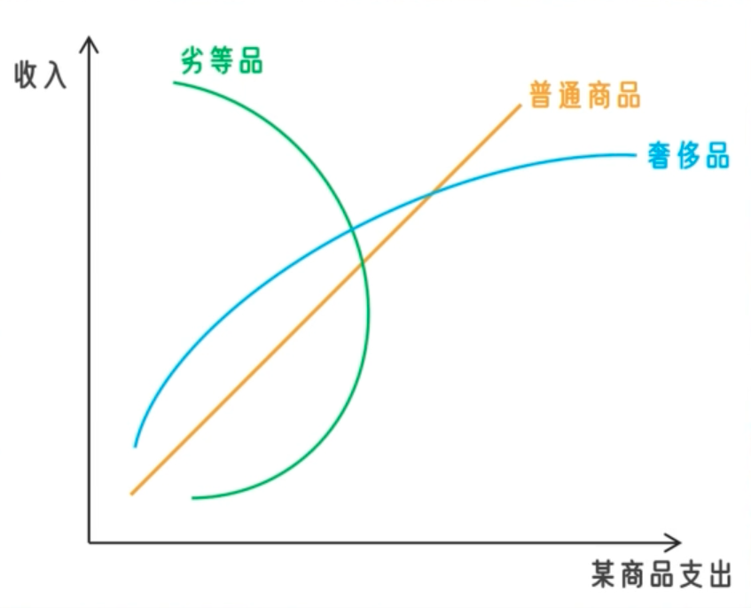

#### 恩格尔系数

饮食占收入比例大小

#### 交叉弹性

某种商品的需求弹性变化，会影响替代品和互补品

#### 消费者剩余

指消费者消费一定数量的某种商品愿意支付的最高价格与这些商品的实际市场价格之间的差额。

##### 价格歧视

针对不同消费群体特征，提供不同的定价。

##### 反思

需根据消费者剩余量，针对不同群体提供不同价位的服务

## 企业是如何做选择的

追求利润最大化

### 成本

- 显性成本 = 会计成本
- 显性成本 + 隐性成本 = 经济成本 = 各项机会成本的总和 = 生产成本
- 收入 - 会计成本 = 会计利润
- 收入 - 经济成本 = 经济利润 
- 总成本 = 固定成本 + 可变成本
- 平均总成本 = 平均固定成本 + 平均可变成本
- 规模经济： 当规模扩大到一定程度，成本会降低

#### 成本和收益

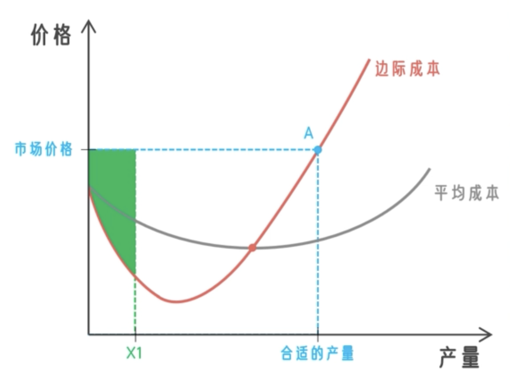

绿色区域为收益

#### 案例

奶茶店的成本

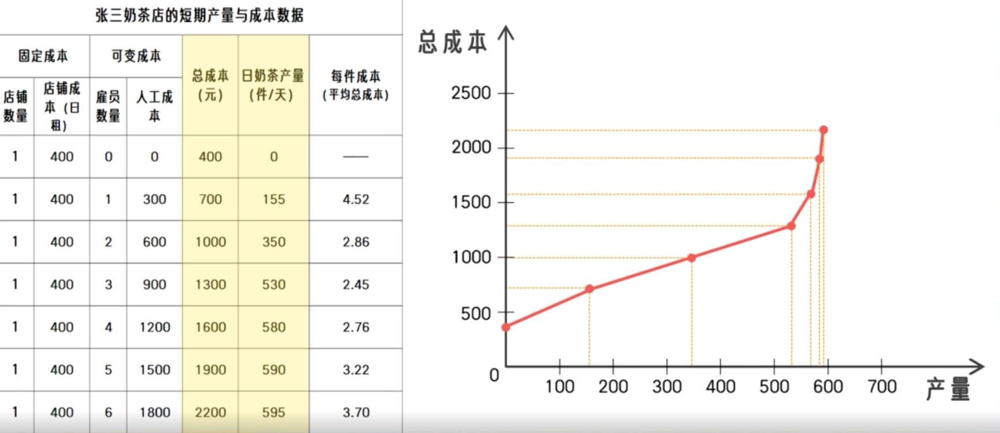

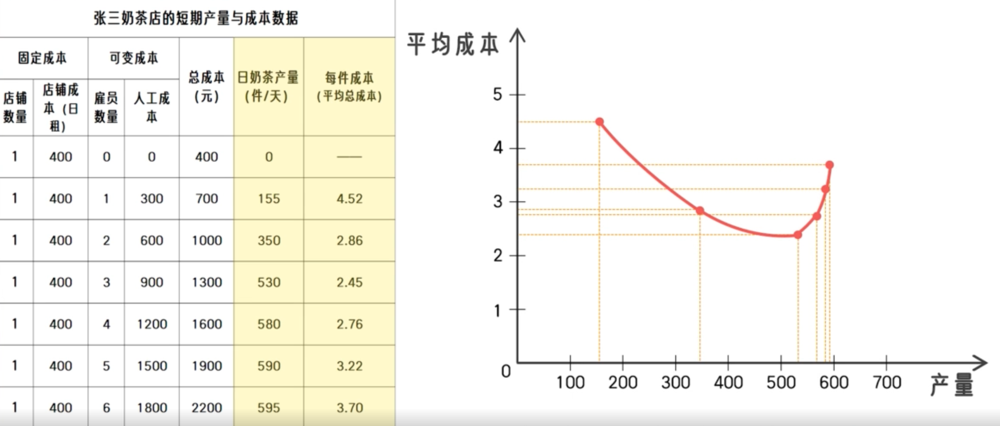

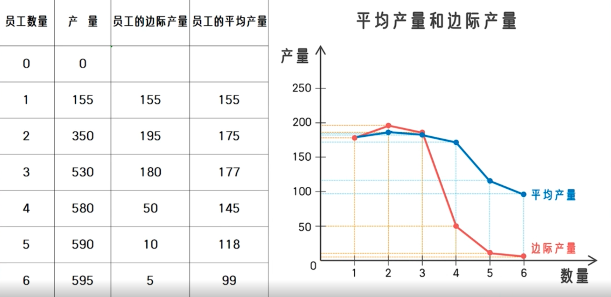

### 收益

计算不同产量下的成本，得出边际成本曲线，寻找边际收益和边际成本相交的位置，即收益最大化

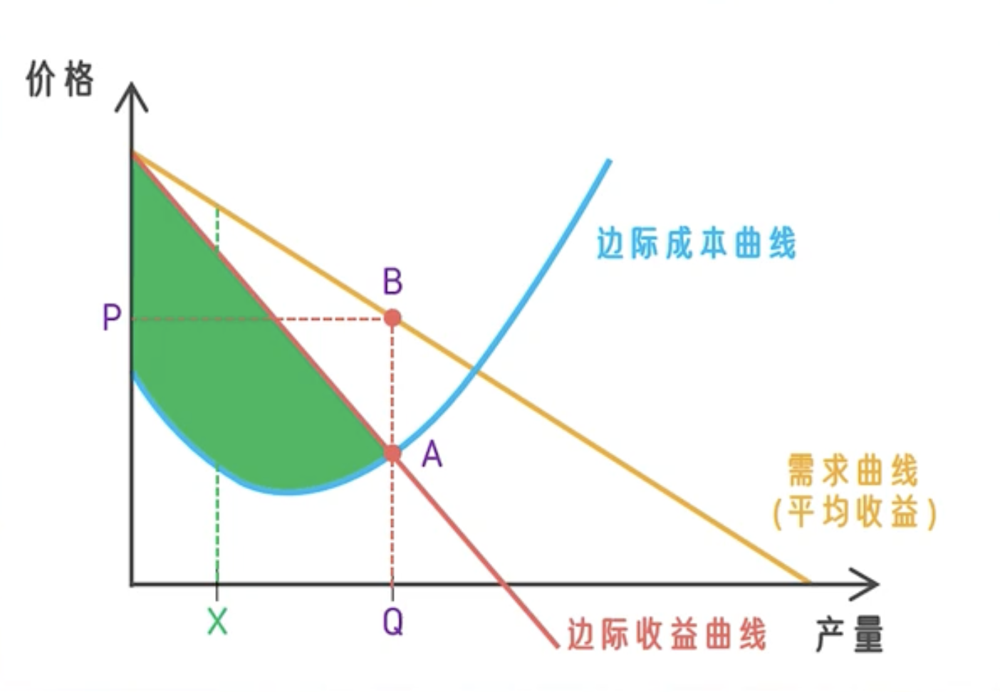

#### 估算实践

- 需求曲线： 根据销售数据，画出不同销售价下，因需求弹性原因，导致的销量变化
- 边际收益曲线： 每增加一个单位的产量，带来的销售价变化
- 边际成本曲线： 根据产量不同，所付出的成本变化

- 通过打听多家供应商的报价，得出边际成本曲线
- 通过市场调研，获取不同价格下的需求曲线变化
- 计算出边际收益曲线和边际成本曲线的交汇点，控制成本和收益

### 生产者剩余

指生产者销售某种得到的收入与该商品的实际成本价格之间的差额。

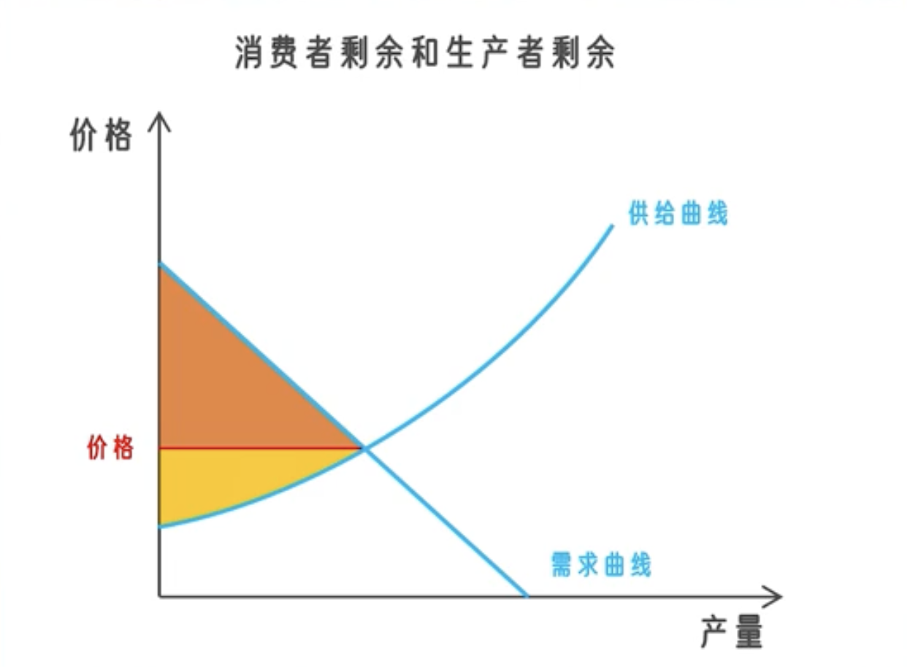

### 供给弹性

影响因素：

- 企业库存情况
- 商品类目大小
- 生产难度、门槛、资源的耗费
- 需求时间长短

### 阿米巴

来自于变形虫，单细胞生物，可以分裂生长。将公司拆分为多个子公司，让员工持股，驱动员工的积极主动性。
