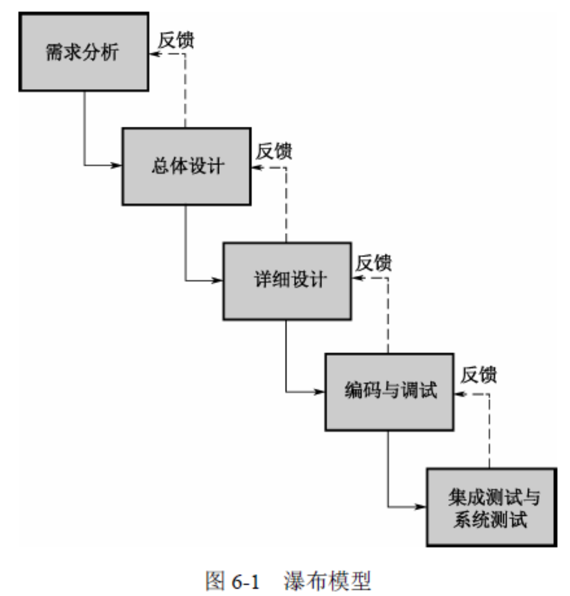
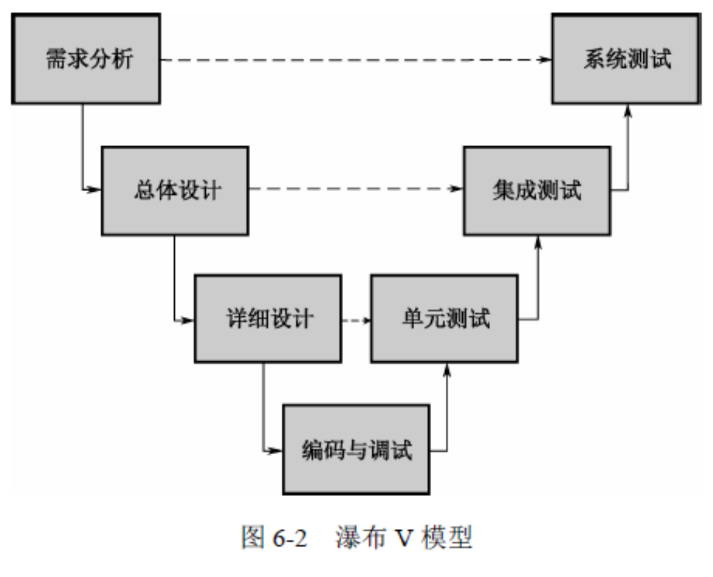
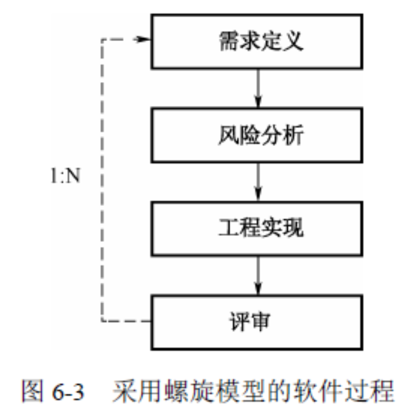
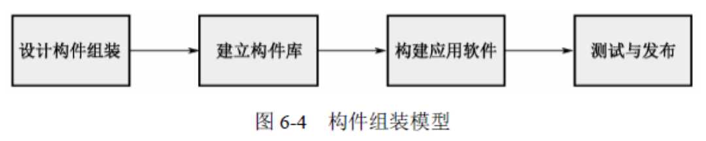
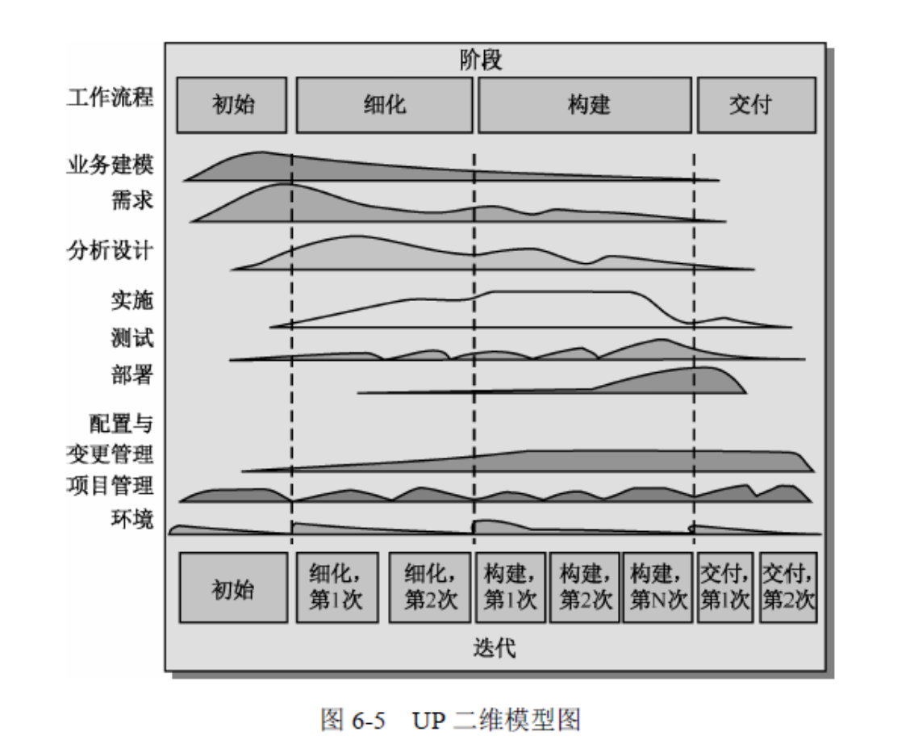
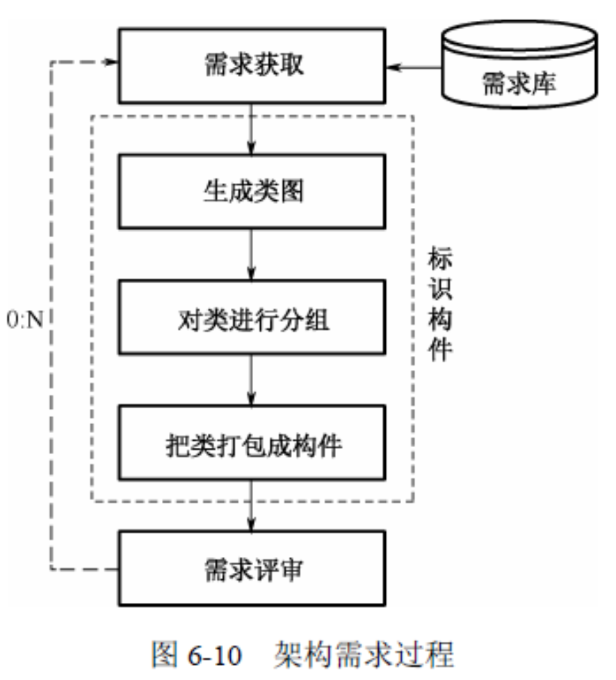
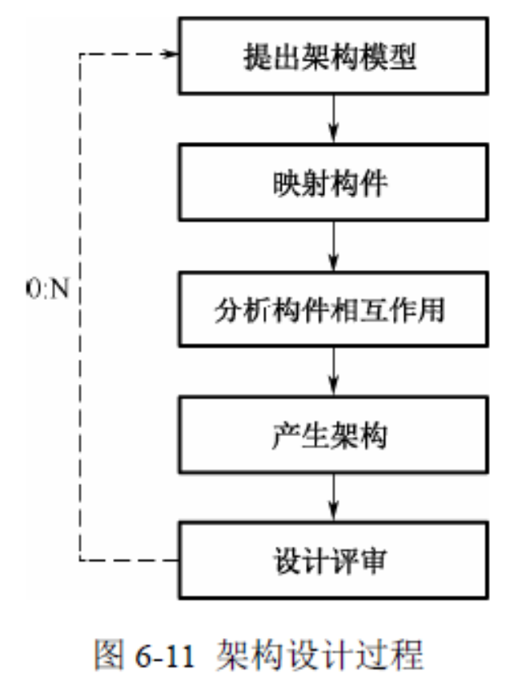
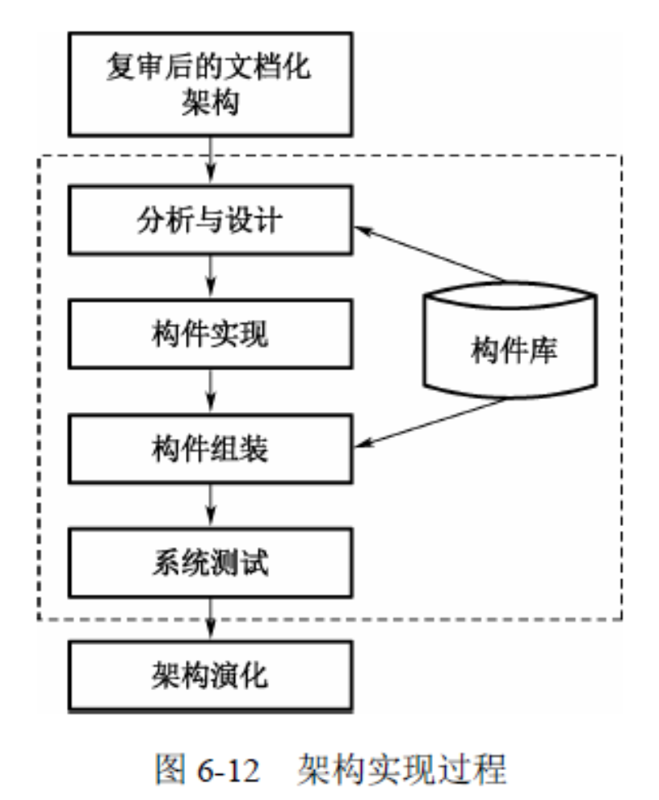
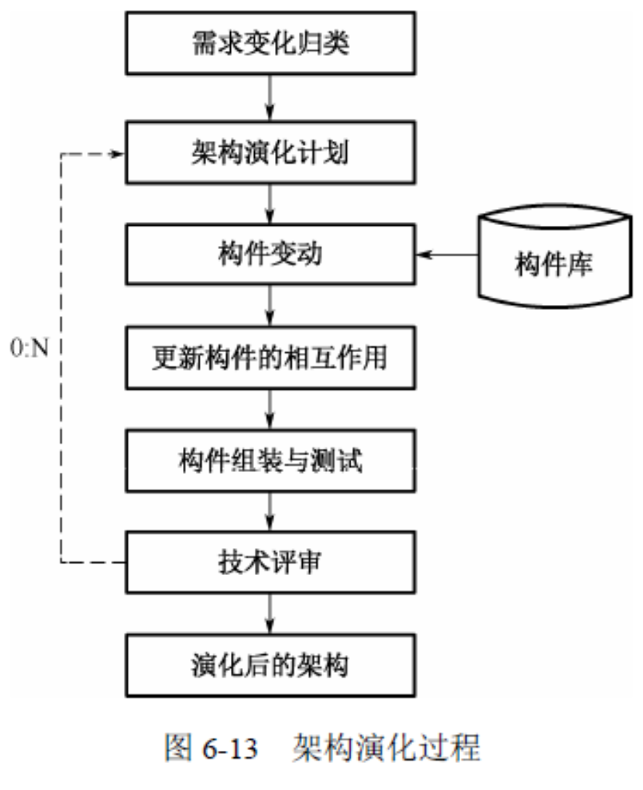

# 系统架构设计师

[TOC]

> 根据考点 随手记录一些知识点

# 第 1 章 计算机组成与体系结构

## 1.1 计算机系统组成
### 1.1.1 计算机硬件的组成
### 1.1.2 计算机系统结构的分类
### 1.1.3 复杂指令集系统与精简指令集系统
### 1.1.4 总线
## 1.2 存储器系统
### 1.2.1 主存储器
### 1.2.2 辅助存储器
### 1.2.3 Cache 存储器
## 1.3 流水线
### 1.3.1 流水线周期
### 1.3.2 计算流水线执行时间
### 1.3.3 流水线的吞吐率
### 1.3.4 流水线的加速比

# 第 2 章 操作系统

## 2.1 操作系统的类型与结构
### 2.1.1 操作系统的定义
### 2.1.2 操作系统分类
## 2.2 操作系统基本原理
### 2.2.1 进程管理
### 2.2.2 存储管理
### 2.2.3 设备管理
### 2.2.4 文件管理
### 2.2.5 作业管理

# 第 3 章 数据库系统

## 3.1 数据库管理系统的类型
## 3.2 数据库模式与范式
### 3.2.1 数据库的结构与模式
### 3.2.2 数据模型
### 3.2.2 关系代数
### 3.2.4 数据的规范化
### 3.2.5 反规范化
## 3.3 数据库设计
### 3.3.1 数据库设计的方法
### 3.3.2 数据库设计的基本步骤
### 3.3.3 需求分析
### 3.3.4 概念结构设计
### 3.3.5 逻辑结构设计
### 3.3.6 物理结构设计
## 3.4 事务管理
### 3.4.1 并发控制
### 3.4.2 故障与恢复
## 3.5 备份与恢复
## 3.6 分布式数据库系统
### 3.6.1 分布式数据库的概念
### 3.6.2 分布式数据库的架构
## 3.7 数据仓库
### 3.7.1 数据仓库的概念
### 3.7.2 数据仓库的结构
### 3.7.3 数据仓库的实现方法
## 3.8 数据挖掘
### 3.8.1 数据挖掘的概念
### 3.8.2 数据挖掘的功能
### 3.8.3 数据挖掘常用技术
### 3.8.4 数据挖掘的流程
## 3.9 NoSQL
## 3.10 大数据

# 第 4 章 计算机网络

## 4.1 网络架构与协议
### 4.1.1 网络互联模型
### 4.1.2 常见的网络协议
### 4.1.3 IPv6
## 4.2 局域网与广域网
### 4.2.1 局域网基础知识
### 4.2.2 无线局域网
### 4.2.3 广域网技术
### 4.2.4 网络接入技术
## 4.3 网络互连与常用设备
## 4.4 网络工程
### 4.4.1 网络规划
### 4.4.2 网络设计
### 4.4.3 网络实施
## 4.5 网络存储技术
## 4.6 综合布线

# 第 5 章 系统性能评价

## 5.1 性能指标
### 5.1.1 计算机
### 5.1.2 网络
### 5.1.3 操作系统
### 5.1.4 数据库管理系统
### 5.1.5 Web 服务器
## 5.2 性能计算
## 5.3 性能设计
### 5.3.1 阿姆达尔解决方案
### 5.3.2 负载均衡
## 5.4 性能评估
### 5.4.1 基准测试程序
### 5.4.2 Web 服务器的性能评估
### 5.4.3 系统监视

# 第 6 章 开发方法

提高软件的质量、降低软件的成本。

## 6.1 软件生命周期

在 GB8566-88(《软件工程国家标准——计算机软件开发规范》) 中将软件生命周期划分为 8 个阶段:

1. 可行性研究与计划
2. 需求分析
3. 概要设计
4. 详细设计
5. 实现
6. 集成测试
7. 确认测试
8. 使用和维护

(1)可行性研究与计划:在决定是否开发软件之前，首先需要进行可行性研究。通过可行性研究，来确定开发此软件的必要性，并根据可行性研究的结果初步确定软件的目标、范围、风险、开发成本等内容。从而制定出初步的软件开发计划。通过可行性研究，如果确定该软件具有研发的必要，则将产生《可行性研究报告》和《软件开发计划》，并进入需求分析的阶段。

(2)需求分析:需求分析是软件开发的重要阶段。经过可行性研究后，初步确定了软件开发的目标和范围，之后则需要对软件的需求进行细致的分析，来确定软件要做成什么样的。需求分析是软件开发过程中极其重要的一环，如果需求分析出现了重大偏差，那么软件开发必然会偏离正确的道路，越走越远。尤其是需求分析的错误如果在软件开发后期才被发现，修正的代价是非常大的。

(3)概要设计:概要设计确定整个软件的技术蓝图，负责将需求分析的结果转化为技术层面的设计方案。在概要设计中，需要确定系统架构、各子系统间的关系、接口规约、数据库模型、编码规范等内容。概要设计的结果将作为程序员的工作指南，供程序员了解系统的内部原理，并在其基础上进行详细设计和编码工作。

(4)详细设计:详细设计完成编码前最后的设计，详细设计在概要设计的基础上，进行细化，如类设计。详细设计不是开发过程中必需的阶段，在一些规模较小、结构简单的系统中，详细设计往往被省略。同样，在某一次软件开发中，可能只会对部分关键模块进行详细设计。

(5)实现:实现过程包括编码和单元测试。单元测试指的是对刚刚编写出的一个小的程序单元进行测试，如某一个过程、方法或函数。因为单元测试的对象是小的程序单元，而不是完整的程序，因此往往需要编写一些测试程序来进行测试。有效的单元测试可以大大提高编码的质量，降低软件系统的缺陷率。

(6)集成测试:集成测试又称为组装测试。通过单元测试的程序并不意味着没有缺陷，当程序单元被集成到一起进行交互的时候，往往会出现单元测试中不能发现的问题。同单元测试不同，集成测试必须经过精心的组织，指定集成测试计划，确定如何将这些程序单元集成到一起，按照什么样的顺序进行测试，使用哪些测试数据等问题。

(7)确认测试:当完成集成测试后，软件之间的接口方面的错误已经排除，这时需要验证软件是否同需求一致，是否达到了预期目标。同集成测试一样，确认测试也需要进行计划和组织，逐步地验证软件系统同需要的一致性。经过确认测试的软件将投入正常使用，并进入维护期。

(8)使用和维护:即使通过了单元测试、集成测试和确认测试，也不可能发现软件系统中的全部缺陷;软件系统的需求也会根据业务的发展变化而变化。因此，在软件使用过程中，必须不断地对软件进行维护，修正软件中的缺陷，修改软件中已经不能适应最新情况的功能或者增加新的功能。软件维护的过程会贯穿整个软件的使用过程。当使用和维护阶段结束后，软件系统也就自然消亡，软件系统的生命周期结束。

## 6.2 软件开发模型

### 6.2.1 瀑布模型

瀑布模型就如同瀑布一样，从一个特定的阶段流向下一个阶段，如图 6-1 所示。

1. 瀑布模型的核心思想

瀑布模型认为，软件开发是一个阶段化的精确的过程。软件要经过需求分析、总体设计、详细设计、编码、调试、集成测试和系统测试阶段才能够被准确地实现。在图 6-1 中，每一阶段都有回到前一阶段的反馈线，这指的是，在软件开发中当在后续阶段发现缺陷的时候，可以把这个缺陷反馈到上一阶段进行修正。

从图 6-1 中可以看出瀑布模型的一个重要特点:软件开发的阶段划分是明确的，一个阶段到下一个阶段有明显的界线。在每个阶段结束后，都会有固定的文档或源程序流入下一阶段。在需求分析阶段结束后，需要有明确的描述软件需求的文档;总体设计结束后，需要有描述软件总体结构的文档;详细设计结束后，需要有可以用来编码的详细设计文档;而编码结束后，代码本身被作为文档流到下一个阶段。因此也称瀑布模型是面向文档的软件开发模型。

当软件需求明确、稳定时，可以采用瀑布模型按部就班地开发软件，当软件需求不明确或变动剧烈时，瀑布模型中往往要到测试阶段才会暴露出需求的缺陷，造成后期修改代价太大，难以控制开发的风险。

2. 瀑布 V 模型

瀑布 V 模型是瀑布模型的一种变体。随着对瀑布模型的应用，人们发现，缺陷是无法避免的，任何一个阶段都会在软件中引入缺陷，而最后的测试也不能保证软件完全没有缺陷，只能争取在交付前发现更多的缺陷。测试成为软件开发中非常重要的环节，测试的质量直接影响到软件的质量。因此，人们对瀑布模型进行了小小的更改，提出了更强调测试的瀑布 V 模型，如图 6-2 所示。

整个瀑布模型在编码与调试阶段转了个弯，形成了一个对称的 V 字。瀑布 V 模型同标准瀑布模型一样，在进行完需求分析后就将进入总体设计阶段，但是除总体设计外，需求分析还有一条虚线指向系统测试。这指的是，需求分析的结果将作为系统测试的准则，即需求分析阶段也将产生同软件需求一致的系统测试;同时软件产品是否符合最初的需求将在系统测试阶段得到验证。以此类推，总体设计对应了集成测试，详细设计对应了单元测试。瀑布 V 模型不但保持了瀑布模型的阶段式文档驱动的特点，而且更强调了软件产品的验证工作。

3. 瀑布模型的缺点

虽然是经典的开发模型，但瀑布模型中仍存在一些难以克服的缺陷，即使是在改进的瀑布 V 模型中还是会存在。

首先，在瀑布模型中，需求分析阶段是一切活动的基础，设计、实现和验证活动都是从需求分析阶段的结果导出的。一旦需求分析的结果不完全正确，存在偏差，那么后续的活动只能放大这个偏差，在错误的道路上越走越远。事实上，由于用户和开发者的立场、经验、知识域都不相同，不同的人对同一件事物的表述也不同，这就造成需求分析的结果不可能精确、完整地描述整个软件系统。所以瀑布模型后期的维护工作相当繁重，而这些维护工作大多都是修正在需求分析阶段引入的缺陷。这个问题是瀑布模型难以克服的。

其次，瀑布模型难以适应变化。在瀑布模型中精确地定义了每一个阶段的活动和活动结果，而每一阶段都紧密依赖于上一阶段的结果。如果在软件的后期出现了需求的变化，整个系统又要从头开始。

再次，使用瀑布模型意味着当所有阶段都结束才能最终交付软件产品，所以在提出需求后需要相当长一段时间的等待才能够看到最终结果，才能发现软件产品究竟能不能够满足客户的需求。

最后，文档驱动型的瀑布模型除了制造出软件产品外还将产生一大堆的文档，大部分的文档对客户没有任何意义，但完成这些对客户没有意义的文档却需要花费大量的人力。所以瀑布模型也是一种重载过程。

### 6.2.2 演化模型

瀑布模型看起来很好，随着一个又一个阶段的流过，软件系统就被建立起来了。可是在应用软件开发的过程中，人们发现很难一次性完全理解用户的需求、设计出完美的架构，开发出可用的系统，这是由于人的认知本身就是一个过程，这个过程是渐进的、不断深化的。对于复杂问题，“做两次”肯定能够做得更好。那么，对于软件开发这个复杂而且与人的认知过程紧密相关的事也应该是一个渐进的过程。

演化模型正是基于这个观点提出的。一般情况下，一个演化模型可以看做若干次瀑布模型的迭代，当完成一个瀑布模型后，重新进入下一个迭代周期，软件在这样的迭代过程中得以演化、完善。根据不同的迭代特点，演化模型可以演变为螺旋模型、增量模型和原型法开发。

### 6.2.3 螺旋模型

螺旋模型将瀑布模型和演化模型结合起来，不仅体现了两个模型的优点，而且还强调了其他模型均忽略了的风险分析。螺旋模型的每一周期都包括需求定义、风险分析、工程实现和评审 4 个阶段，由这 4 个阶段进行迭代，软件开发过程每迭代一次，软件开发就前进一个层次。采用螺旋模型的软件过程如图 6-3 所示。

螺旋模型的基本做法是在“瀑布模型”的每一个开发阶段前，引入一个非常严格的风险识别、风险分析和风险控制。它把软件项目分解成一个个小项目，每个小项目都标识一个或多个主要风险，直到所有的主要风险因素都被确定。

螺旋模型强调风险分析，使得开发人员和用户对每个演化层出现的风险都有所了解，继而做出应有的反应。因此，螺旋模型特别适用于庞大而复杂、具有高风险的系统，对于这些系统，风险是软件开发潜在的、不可忽视的不利因素，它可能在不同程度上损害软件开发过程，影响软件产品的质量。减小软件风险的目标是在造成危害之前，及时对风险进行识别、分析，决定采取何种对策，进而消除或减少风险的损害。

与瀑布模型相比，螺旋模型支持用户需求的动态变化，为用户参与软件开发的所有关键决策提供了方便，有助于提高目标软件的适应能力，为项目管理人员及时调整管理决策提供了便利，从而降低了软件开发风险。

但是，不能说螺旋模型绝对比其他模型优越，事实上，螺旋模型也有其自身的缺点:

(1)采用螺旋模型，需要具有相当丰富的风险评估经验和专业知识。在风险较大的项目开发中，如果未能及时标识风险，势必会造成重大损失。

(2)过多的迭代次数会增加开发成本，延迟提交时间。

### 6.2.4 增量模型

演化模型的另一种形式是增量模型。在系统的技术架构成熟、风险较低的时候，可以采用增量的方式进行系统开发，这样可以提前进行集成测试和系统测试，缩短初始版本的发布周期，提高用户对系统的可见度。

对于增量模型，通常有两种策略。一是增量发布的办法。即首先做好系统的分析和设计工作，然后将系统划分为若干不同的版本，每一个版本都是一个完整的系统，后一版本以前一版本为基础进行开发，扩充前一版本的功能。在这种策略中，第一版本往往是系统的核心功能，可以满足用户最基本的需求，随着增量的发布，系统的功能逐步地丰富、完善起来。用户在很短的时间内就可以得到系统的初始版本并进行试用。试用中的问题可以很快地反馈到后续开发中，从而降低了系统的风险。在应用增量模型中需要注意:

(1)每一个版本都是一个完整的版本。虽然最初的几个增量不能完全地实现用户需求，但这些版本都是完整的、可用的。

(2)版本间的增量要均匀，这一点是很重要的。如果第一个版本花费一个月的时间，而第二个版本需要花费 6 个月的时间，这种不均匀的分配会降低增量发布的意义，需要重新调整。

另一种策略是原型法。同增量发布不同，原型法的每一次迭代都经过一个完整的生命周期。当用户需求很不明确或技术架构中存在很多不可知因素的时候，可以采用原型法。在初始的原型中，针对一般性的用户需求进行快速实现，并不考虑算法的合理性或系统的稳定性。这个原型的主要目的是获得精确的用户需求，或验证架构的可用性。一般情况下，会在后面的开发中抛弃这个原型，重新实现完整的系统。

### 6.2.5 构件组装模型

随着软构件技术的发展，人们开始尝试利用软构件进行搭积木式的开发，即构件组装模型。在构建组装模型中，当经过需求分析定义出软件功能后，将对构件的组装结构进行设计，将系统划分成一组构件的集合，明确构件之间的关系。在确定了系统构件后，则将独立完成每一个构件，这时既可以开发软件构件，也可以重用已有的构件，当然也可以购买或选用第三方的构件。构件是独立的、自包容的，因此架构的开发也是独立的，构件之间通过接口相互协作。

构件组装模型的一般开发过程如图 6-4 所示。

构件组装模型的优点如下:

(1)构件的自包容性让系统的扩展变得更加容易

(2)设计良好的构件更容易被重用，降低软件开发成本

(3)构件的粒度较整个系统更小，因此安排开发任务更加灵活，可以将开发团队分成若干组，并行地独立开发构件。

鱼与熊掌不可兼得，构件组装模型也有明显的缺点:

(1)对构件的设计需要经验丰富的架构设计师，设计不良的构件难以实现构件的优点，降低构件组装模型的重用度。

(2)在考虑软件的重用度时，往往会对其他方面做出让步，如性能等。

(3)使用构件组装应用程序时，要求程序员熟练地掌握构件，增加了研发人员的学习成本。

(4)第三方构件库的质量会最终影响到软件的质量，而第三方构件库的质量往往是开发团队难以控制的。

## 6.3 统一过程

统一过程(Unified Process，UP)是由 Rational公司开发的一种迭代的软件过程，是一个优秀的软件开发模型，它提供了完整的开发过程解决方案，可以有效地降低软件开发过程的风险，经过裁剪的 UP 可以适应各种规模的团队和系统。

1. UP 的二维模型

UP 是一个很有特色的模型，它本身是一个二维的结构，如图 6-5 所示。对于 UP 而言，时间主线就是横轴的阶段，随着时间的流逝，软件开发活动总要经过初始、细化、构建和交付这 4 个阶段方能完成。而纵轴的工作流程则描述了在不同的阶段需要进行的主要工作。例如在初始阶段，软件组织需要进行大量的调研，对软件进行业务建模、需求，同时进行一些设计以验证建模的合理性，还要进行一些实施甚至测试和部署的工作，用以验证需求和设计的工作及开发系统原型，当然配置与变更管理、项目管理和环境是在任何阶段都是不能缺少的。

从这个模型中可以看出 UP 迭代的特点。任何一个阶段的工作都不是绝对的，都是相互交叠配合的。但每一个阶段都有其侧重点:

在初始阶段，开发者刚刚接入系统，此时最重要的工作是界定系统范围，明确系统目的。在这一阶段，业务建模和需求工作成了重头戏。

在细化阶段，开发者需要抽象出软件的逻辑模型，设计出软件的架构，在这一阶段，分析设计工作是最主要的工程活动。

在构建阶段，开发者需要基本完成系统的构建，使之成为一个完整的实体，并进行测试和部署，在这一阶段，实施和测试是最主要的活动。

当进入交付阶段(该阶段也经常被称为转移阶段)，软件系统需求已经完全成熟或产品化，或进入下一个版本。在这一阶段不可避免地要对软件系统进行重构、修改、测试和部署。在这 4 个阶段中，各有侧重点，但也不是像瀑布模型那样完全不允许其他活动的存在。在初始阶段，为了验证开发者的想法，就需要进行一部分的实施和测试;而即使到了交付阶段，需要也可能会发生变化，仍然需要进行部分业务建模、需求和设计的活动。在每个阶段中，系统推进不是一蹴而就的。在图中将细化阶段划分为第 1 次细化和第 2 次细化，将构建阶段也划分为 3 个小阶段。在实际开发中，可以根据实际的需要划分为更多的小阶段来完成。

对于纵轴而言，业务建模、需求、分析设计、实施、测试、部署、配置与变更管理、项目管理、环境称为 UP 的 9 个核心工作流。可以把这 9 个工作流进行简单的分类以帮助理解，业务建模、需求、分析设计、实施、测试和部署是工程活动，而配置与变更管理、项目管理和环境是管理活动。

在这 9 个工作流中，前 8 个可以说是绝大多数人都耳熟能详的东西，而“环境”工作流则相对难以理解。“环境”工作流很重要，也可以称之为“环境管理”。俗语说，“巧妇难为无米之炊”，“环境”工作流就是为软件开发准备“米”的活动。在软件开发中，需要为各种工作准备相应的工作环境，在工作环境中需要包含必需的工具、活动的指南、活动的流程规范、工作产品的模板、基本的开发设施等。在很多组织中，“环境”工作流没有得到应有的重视，或者完全被忽视，以为为开发者提供了工作台和计算机就万事大吉了，其实这种做法是错误的。每一个开发团体都有自己特定的活动准则和规范，这些准则和规范是团体协作的基础，万万少不得。没有合理的工具配备，没有充分的指南、规范和模板，软件开发的活动肯定是放羊式的管理，管理者除了一些“羊毛”外什么也收获不到。观察 UP 模型就可以发现，在每一阶段的最开始，“环境”工作流都有一个小小的波峰。在这里面，开发团队需要为开发环境进行相应的准备并在后续活动中为开发环境提供支持。

2. UP 的生命周期

前面已经提到，UP 模型的时间主线是阶段，UP 的生命周期也是与阶段一一对应的。在 UP 的生命周期中共有 4 个里程碑:

(1)目标里程碑。目标里程碑对应着先启阶段的结束，当开发者可以明确软件系统的目标和范围时即达到了该里程碑。

(2)架构里程碑。架构里程碑是 UP 生命周期中的第二个里程碑，在这个里程碑前，开发者需要确定稳定的系统架构。

(3)能力里程碑。当系统已经足够的稳定和成熟并完成 Alpha 测试后，认为达到了第 3 个里程碑。

(4)发布里程碑。在达到发布里程碑前，需要完成系统的测试、完成系统发布和用户培训等工作。在经过这 4 个里程碑后，即为一个完整的生命周期，开发出一个新的版本。此时可以关闭该产品的开发，也可以迭代进入下一版本。

3. UP 的特点

UP 是一个特点鲜明的开发模型，下面列出 UP 的一些特点:

(1)UP 是一个迭代的二维开发模型，在生命周期的每一阶段都可以进行需求、设计等活动。UP 不但给出了迭代的生命周期，还给出了生命周期每一阶段的迭代指南。

(2)采用不同迭代方式的 UP 可以演变为演化模型或增量模型。

(3)UP 的迭代特点使得更容易控制软件开发的风险。

(4)虽然 UP 是一个迭代的开发模型，但 UP 本身并不属于敏捷方法。相反，一般认为，未经裁减的 UP 是一个重载过程。

(5)在实际应用中可以根据具体问题对 UP 进行裁减，从而使其可以适应各种规模的软件和开发团队。

4. 架构设计师在 UP 中的活动架构设计师在 UP 活动中承担着非常重要的角色。在 UP 中，架构设计师除了需要建立系统架构模型外，还需要:

(1)同需求人员和项目管理人员密切协作。

(2)细化软件架构。

(3)保持整个架构的概念完整性。具体地说，架构设计师不但需要设计系统架构，还需要定义设计方法、设计指南、编码指南、评审设计等工作。因此，有人也称 UP 是一个以架构为中心的开发模型。

## 6.4 敏捷方法

2001 年 2 月，在美国的犹他州，17 位“无政府主义者”共同发表了《敏捷软件开发宣言》，在宣言中指出:

尽早地、持续地向客户交付有价值的软件对开发人员来说是最重要的。拥抱变化，即使在开发的后期。敏捷过程能够驾驭变化，保持客户的竞争力。经常交付可工作的软件，从几周到几个月，时间范围越小越好。在整个项目中，业务人员和开发者紧密合作。围绕士气高昂的团队进行开发，为团队成员提供适宜的环境，满足他们的需要，并给予足够的信任。在团队中，最有效率的、也是效果最好的沟通方式是面对面地交流。可以工作的软件是进度首要的度量方式。可持续地开发。投资人、开发团队和用户应该保持固定的节奏。

不断追求优秀的技术和良好的设计有助于提高敏捷性。要简单，尽可能减少工作量。减少工作量的艺术是非常重要的。最好的架构、需求和设计都来自于一个自我组织的团队。团队要定期地总结如何能够更有效率，然后相应地自我调整。至此，敏捷软件联盟建立起来，敏捷软件开发方法进入了大发展的时代。这份宣言也就是敏捷方法的灯塔，所有的敏捷方法都在向这个方向努力。目前已形成多种敏捷方法，其中 XP 传播最为广泛，为此，本节主要介绍 XP，其次简单介绍另外几种很有特色的开发模型。

### 6.4.1 极限编程

### 6.4.2 特征驱动开发
### 6.4.3 Scrum
### 6.4.4 水晶方法
### 6.4.5 其他敏捷方法
## 6.5 软件重用
### 6.5.1 软件重用
### 6.5.2 构件技术
## 6.6 基于架构的软件设计
### 6.6.1 ABSD 方法与生命周期
### 6.6.2 基于架构的软件开发模型

基于架构的软件开发模型(Architecture-Based Software Design Model，ABSDM)把整个 基于架构的软件过程划分为架构需求、设计、文档化、复审、实现、演化等 6 个子过程，如图 6-9 所示。

1. 架构需求

需求是指用户对目标软件系统在功能、行为、性能、设计约束等方面的期望。架构需求 受技术环境和架构设计师的经验影响。需求过程主要是获取用户需求，标识系统中所要用到 的构件。架构需求过程如图 6-10 所示。如果以前有类似的系统架构的需求，我们可以从需求库中取出，加以利用和修改，以节省需求获取的时间，减少重复劳动，提高开发效率。

(1)需求获取

架构需求一般来自三个方面，分别是系统的质量目标、系统的业务目标和系统开发人员的业务目标。软件架构需求获取过程主要是定义开发人员必须实现的软件功能，使得用户能完成他们的任务，从而满足业务上的功能需求。与此同时，还要获得软件质量属性，满足一些非功能需求。

(2)标识构件

在图 6-10 中虚框部分属于标识构件过程，该过程为系统生成初始逻辑结构，包含大致的构件。这一过程又可分为三步来实现。

第一步:生成类图。生成类图的 CASE 工具有很多，例如 Rational Rose 就能自动生成类图。

第二步:对类进行分组。在生成的类图基础上，使用一些标准对类进行分组可以大大简化类图结构，使之更清晰。一般地，与其他类隔离的类形成一个组，由泛化关联的类组成一个附加组，由聚合或组合关联的类也形成一个附加组。

第三步:把类打包成构件。把在第二步得到的类簇打包成构件，这些构件可以分组合并成更大的构件。

(3)需求评审

组织一个由不同代表(如分析人员、客户、设计人员、测试人员)组成的小组，对架构 需求及相关构件进行仔细的审查。审查的主要内容包括所获取的需求是否真实反映了用户的要求，类的分组是否合理，构件合并是否合理等。必要时，可以在“需求获取—标识构件—需求评审”之间进行迭代。

2. 架构设计

架构需求用来激发和调整设计决策，不同的视图被用来表达与质量目标有关的信息。架构设计是一个迭代过程，如果要开发的系统能够从已有的系统中导出大部分，则可以使用已有系统的设计过程。软件架构设计过程如图 6-11 所示。

(1)提出软件架构模型

在建立架构的初期，选择一个合适的架构风格是首要的。在这个风格基础上，开发人员 通过架构模型，可以获得关于架构属性的理解。此时，虽然这个模型是理想化的(其中的某 些部分可能错误地表示了应用的特征)，但是，该模型为将来的实现和演化过程建立了目标。

(2)把已标识的构件映射到软件架构中

把在架构需求阶段已标识的构件映射到架构中，将产生一个中间结构，这个中间结构只 包含那些能明确适合架构模型的构件。

(3)分析构件之间的相互作用

为了把所有已标识的构件集成到架构中，必须认真分析这些构件的相互作用和关系。

(4)产生软件架构

一旦决定了关键的构件之间的关系和相互作用，就可以在第 2 阶段得到的中间架构的 基础上进行细化。

(5)设计评审

一旦设计了软件架构，我们必须邀请独立于系统开发的外部人员对架构进行评审。

3. 架构文档化

绝大多数的架构都是抽象的，由一些概念上的构件组成。例如，层的概念在任何程序设计语言中都不存在。因此，要让系统分析师和程序员去实现架构，还必须得把架构进行文档 化。文档是在系统演化的每一个阶段，系统设计与开发人员的通信媒介，是为验证架构设计 和提炼或修改这些设计(必要时)所执行预先分析的基础。

架构文档化过程的主要输出结果是架构需求规格说明和测试架构需求的质量设计说明 书这两个文档。生成需求模型构件的精确的形式化的描述，作为用户和开发者之间的一个协约。

软件架构的文档要求与软件开发项目中的其他文档是类似的。文档的完整性和质量是软 件架构成功的关键因素。文档要从使用者的角度进行编写，必须分发给所有与系统有关的开 发人员，且必须保证开发者手上的文档是最新的。

4. 架构复审

从图 5-8 中我们可以看出，架构设计、文档化和复审是一个迭代过程。从这个方面来说，在一个主版本的软件架构分析之后，要安排一次由外部人员(用户代表和领域专家)参加的复审。

复审的目的是标识潜在的风险，以及早发现架构设计中的缺陷和错误，包括架构能否满足需求、质量需求是否在设计中得到体现、层次是否清晰、构件的划分是否合理、文档表达是否明确、构件的设计是否满足功能与性能的要求，等等。

由外部人员进行复审的目的是保证架构的设计能够公正地进行检验，使组织的管理者能 够决定正式实现架构。

5. 架构实现

所谓“实现”就是要用实体来显示出一个软件架构，即要符合架构所描述的结构性设计 决策，分割成规定的构件，按规定方式互相交互。架构的实现过程如图 6-12 所示。

图 6-12 中的虚框部分是架构的实现过程。整个实现过程是以复审后的文档化的架构说明书为基础的，每个构件必须满足软件架构中说明的对其他构件的责任。这些决定即实现的约束是在系统级或项目范围内做出的，每个构件上工作的实现者是看不见的。

在架构说明书中，已经定义了系统中构件与构件之间的关系。因为在架构层次上，构件接口约束对外唯一地代表了构件，所以可以从构件库中查找符合接口约束的构件，必要时开发新的满足要求的构件。

然后，按照设计提供的结构，通过组装支持工具把这些构件的实现体组装起来，完成整个软件系统的连接与合成。

最后一步是测试，包括单个构件的功能性测试和被组装应用的整体功能和性能测试。

6. 架构演化

在构件开发过程中，最终用户的需求可能还有变动。在软件开发完毕，正常运行后，由一个单位移植到另一个单位，需求也会发生变化。在这两种情况下，就必须相应地修改软件架构，以适应新的软件需求。架构演化过程如图 6-13 所示。架构演化是使用系统演化步骤去修改应用，以满足新的需求。主要包括以下七个步骤:

(1)需求变动归类首先必须对用户需求的变化进行归类，使变化的需求与已有构件对 应。对找不到对应构件的变动，也要做好标记，在后续工作中，将创建新的构件，以对应这 部分变化的需求。

(2)制订架构演化计划在改变原有结构之前，开发组织必须制订一个周密的架构演化 计划，作为后续演化开发工作的指南。

(3)修改、增加或删除构件在演化计划的基础上，开发人员可根据在第一步得到的需 求变动的归类情况，决定是否修改或删除存在的构件、增加新构件。最后，对修改和增加的 构件进行功能性测试。

(4)更新构件的相互作用随着构件的增加、删除和修改，构件之间的控制流必须得到 更新。

(5)构件组装与测试通过组装支持工具把这些构件的实现体组装起来，完成整个软件 系统的连接与合成，形成新的架构。然后对组装后的系统的整体功能和性能进行测试。

(6)技术评审对以上步骤进行确认，进行技术评审。评审组装后的架构是否反映需求 变动，符合用户需求。如果不符合，则需要在第 2 到第 6 步之间进行迭代。

(7)产生演化后的架构在原来系统上所作的所有修改必须集成到原来的架构中，完成 一次演化过程。

## 6.7 形式化方法

形式化方法是指采用严格的数学方法，使用形式化规约语言来精确定义软件系统。非形式化的开发方法是通过自然语言、图形或表格描述软件系统的行为和特性，然后基于这些描述进行设计和开发，而形式化开发则是基于数学的方式描述、开发和验证系统。

# 第 7 章 系统规划

## 7.1 项目的提出与选择
### 7.1.1 项目的立项目标和动机
### 7.1.2 项目的选择和确定
### 7.1.3 项目提出和选择的结果
## 7.2 可行性研究与效益分析
### 7.2.1 可行性研究的内容
### 7.2.2 成本效益分析
### 7.2.3 可行性分析报告
## 7.3 方案的制订和改进
## 7.4 新旧系统的分析和比较
### 7.4.1 遗留系统的评价方法
### 7.4.2 遗留系统的演化策略

# 第 8 章 系统分析与设计方法

## 8.1 定义问题与归结模型
### 8.1.1 问题分析
### 8.1.2 问题定义
## 8.2 需求分析与软件设计
### 8.2.1 需求分析的任务与过程
### 8.2.2 如何进行系统设计
### 8.2.3 软件设计的任务与活动
## 8.3 结构化分析与设计
### 8.3.1 结构化分析
### 8.3.2 结构化设计
### 8.3.3 模块设计
## 8.4 面向对象的分析与设计
### 8.4.1 面向对象的基本概念
### 8.4.2 面向对象分析
### 8.4.3 统一建模语言
## 8.5 用户界面设计
### 8.5.1 用户界面设计的原则
### 8.5.2 用户界面设计过程
## 8.6 工作流设计
### 8.6.1 工作流设计概述
### 8.6.2 工作流管理系统
## 8.7 简单分布式计算机应用系统的设计
## 8.8 系统运行环境的集成与设计
## 8.9 系统过渡计划

# 第 9 章 软件架构设计

像学写文章一样，在学会字、词、句之后，就应上升到段落，就应追求文章的“布局谋篇”，这就是架构。通俗地讲，软件架构设计就是软件系统的“布局谋篇”。

人们在软件工程实践中，逐步认识到了软件架构的重要性，从而开辟了一个崭新的研究领域。软件架构的研究内容主要涉及软件架构描述、软件架构设计、软件架构风格、软件架构评价和软件架构的形成方法等。

软件设计人员学习软件架构知识旨在站在较高的层面上整体地解决好软件的设计、复用、质量和维护等方面的实际问题。

## 9.1 软件架构概述

软件架构是软件抽象发展到一定阶段的产物，从编程的角度，可以清晰地看到软件抽象层次和表达工具的发展历史。

### 9.1.1 软件架构的定义

(1)架构是对系统的抽象，它通过描述元素、元素的外部可见属性及元素之间的关系来反映这种抽象。因此，仅与内部具体实现有关的细节是不属于架构的，即定义强调元素的“外部可见”属性。

(2)架构由多个结构组成，结构是从功能角度来描述元素之间的关系的，具体的结构传达了架构某方面的信息，但是个别结构一般不能代表大型软件架构。

(3)任何软件都存在架构，但不一定有对该架构的具体表述文档。即架构可以独立于架构的描述而存在。如文档已过时，则该文档不能反映架构。

(4)元素及其行为的集合构成架构的内容。体现系统由哪些元素组成，这些元素各有哪些功能(外部可见)，以及这些元素间如何连接与互动。即在两个方面进行抽象:在静态方面，关注系统的大粒度(宏观)总体结构(如分层);在动态方面，关注系统内关键行为的共同特征。

(5)架构具有“基础”性:它通常涉及解决各类关键的重复问题的通用方案(复用性)，以及系统设计中影响深远(架构敏感)的各项重要决策(一旦贯彻，更改的代价昂贵)。

(6)架构隐含有“决策”，即架构是由架构设计师根据关键的功能和非功能性需求(质量属性及项目相关的约束)进行设计与决策的结果。不同的架构设计师设计出来的架构是不一样的，为避免架构设计师考虑不周，重大决策应经过评审。特别是架构设计师自身的水平是一种约束，不断学习和积累经验才是摆脱这种约束走向自由王国的必经之路。在设计软件架构时也必须考虑硬件特性和网络特性，因此，软件架构与系统架构二者间的区别其实不大。但是，在大多情况下，架构设计师在软件方面的选择性较之硬件方面，其自由度大得多。因此，使用“软件架构”这一术语，也表明了一个观点:架构设计师通常将架构的重点放在软件部分。

将软件架构置于商业背景中进行观察，可以发现软件架构对企业非常重要。

(1)影响架构的因素。软件系统的项目干系人(客户、用户、项目经理、程序员、测试人员、市场人员等)对软件系统有不同的要求开发组织(项目组)有不同的人员知识结构、架构设计师的素质与经验、当前的技术环境等方面都是影响架构的因素。这些因素通过功能性需求、非功能性需求、约束条件及相互冲突的要求，影响架构设计师的决策，从而影响架构。

(2)架构对上述诸因素具有反作用，例如，影响开发组织的结构。架构描述了系统的大粒度(宏观)总体结构，因此可以按架构进行分工，将项目组为几个工作组，从而使开发有序;影响开发组织的目标，即成功的架构为开发组织提供了新的商机，这归功于:系统的示范性、架构的可复用性及团队开发经验的提升，同时，成功的系统将影响客户对下一个系统的要求等。这种反馈机制构成了架构的商业周期。

### 9.1.2 软件架构的重要性

### 9.1.3 架构的模型
## 9.2 架构需求与软件质量属性
### 9.2.1 软件质量属性
### 9.2.2 6 个质量属性及实现
## 9.3 软件架构风格
### 9.3.1 软件架构风格分类
### 9.3.2 数据流风格
### 9.3.3 调用/返回风格
### 9.3.4 独立构件风格
### 9.3.5 虚拟机风格
### 9.3.6 仓库风格
## 9.4 层次系统架构风格
### 9.4.1 二层及三层 C/S 架构风格
### 9.4.2 B/S 架构风格
### 9.4.3 MVC 架构风格
### 9.4.4 MVP 架构风格
## 9.5 面向服务的架构
### 9.5.1 SOA 概述
### 9.5.2 SOA 的关键技术
### 9.5.3 SOA 的实现方法
### 9.5.4 微服务
## 9.6 架构设计
## 9.7 软件架构文档化
## 9.8 软件架构评估
### 9.8.1 软件架构评估的方法
### 9.8.2 架构的权衡分析法
### 9.8.3 成本效益分析法
## 9.9 构件及其复用
### 9.9.1 商用构件标准规范
### 9.9.2 应用系统簇与构件系统
### 9.9.3 基于复用开发的组织结构
## 9.10 产品线及系统演化
### 9.10.1 复用与产品线
### 9.10.2 基于产品线的架构
### 9.10.3 产品线的开发模型
### 9.10.4 特定领域软件架构
### 9.10.5 架构及系统演化
## 9.11 软件架构视图
### 9.11.1 软件视图的分类
### 9.11.2 模块视图类型及其风格
### 9.11.3 C&C 视图类型及其风格
### 9.11.4 分配视图类型及其风格
### 9.11.5 各视图类型间的映射关系

# 第 10 章 设计模式

## 10.1 设计模式概述
### 10.1.1 设计模式的概念
### 10.1.2 设计模式的组成
### 10.1.3 GoF 设计模式
### 10.1.4 其他设计模式
### 10.1.5 设计模式与软件架构
### 10.1.6 设计模式分类
## 10.2 设计模式及实现
### 10.2.1 Abstract Factory 模式
### 10.2.2 Singleton 模式
### 10.2.3 Decorator 模式
### 10.2.4 Facade/Session Facade 模式
### 10.2.5 Mediator 模式
### 10.2.6 Observer 模式
### 10.2.7 Intercepting Filter 模式
## 10.3 设计模式总结

# 第 11 章 测试评审方法

## 11.1 测试方法
### 11.1.1 软件测试阶段
### 11.1.2 白盒测试和黑盒测试
### 11.1.3 缺陷的分类和级别
### 11.1.4 调试
## 11.2 评审方法
## 11.3 验证与确认
## 11.4 测试自动化
## 11.5 面向对象的测试

# 第 12 章 嵌入式系统设计

## 12.1 嵌入式系统概论
## 12.2 嵌入式系统的组成
### 12.2.1 硬件架构
### 12.2.2 软件架构
## 12.3 嵌入式开发平台与调试环境
### 12.3.1 嵌入式系统软件开发平台
### 12.3.2 嵌入式开发调试
## 12.4 嵌入式网络系统
### 12.4.1 现场总线网
### 12.4.2 家庭信息网
### 11.4.3 无线数据通信网
### 12.4.4 嵌入式 Internet
## 12.5 嵌入式数据库管理系统
### 12.5.1 使用环境的特点
### 12.5.2 系统组成与关键技术
## 12.6 实时系统与嵌入式操作系统
### 12.6.1 嵌入式系统的实时概念
### 12.6.2 嵌入式操作系统概述
### 12.6.3 实时嵌入式操作系统
### 12.6.4 主流嵌入式操作系统介绍
## 12.7 嵌入式系统开发设计
### 12.7.1 嵌入式系统设计概述
### 12.7.2 开发模型与设计流程
### 12.7.3 嵌入式系统设计的核心技术
### 12.7.4 嵌入式开发设计环境
### 12.7.5 嵌入式软件设计模型
### 12.7.6 需求分析
### 12.7.7 系统设计
### 12.7.8 系统集成与测试

# 第 13 章 开发管理

## 13.1 项目的范围、时间与成本
### 13.1.1 项目范围管理
### 13.1.2 项目成本管理
### 13.1.3 项目时间管理
## 13.2 配置管理与文档管理
### 13.2.1 软件配置管理的概念
### 13.2.2 软件配置管理的解决方案
### 13.2.3 软件文档管理
## 13.3 软件需求管理
### 13.3.1 需求变更
### 13.3.2 需求跟踪
## 13.4 软件开发的质量与风险
### 13.4.1 软件质量管理
### 13.4.2 项目风险管理
## 13.5 人力资源管理
## 13.6 软件的运行与评价
## 13.7 软件过程改进

# 第 14 章 信息系统基础知识

## 14.1 信息系统概述

信息系统(Information System，IS)总是指以计算机为信息处理 工具、以网络为信息传输手段的信息系统。

### 14.1.1 信息系统的组成

1. 马丁在《信息工程》和《战略数据规划方法学》中将信息系统的数据环境分为 4 种类型：

- 第一类数据环境: 数据文件。其特征是:没有使用数据库管理系统，根据大多数的应用需要，由系统分析师和程序员分散地设计各种数据文件。
- 第二类数据环境: 应用数据库。这类信息系统，虽然使用了数据库管理系统，但没达到第三类数据环境的共享程度。分散的数据库为分散的应用而设计。
- 第三类数据环境: 主题数据库。信息系统所建立的主题数据库与一般具体的应用有很大的区别，它有很强的独立性，数据经过设计，其存储的结构与使用它的处理过程都是独立的。各种面向业务主题的数据，如顾客数据、产品数据或人事数据，通过一些共享数据库被联系和体现出来。
- 第四类数据环境: 信息检索系统。一些数据库经过组织能保证信息检索和快速查询的需要，而不是大量的事务管理。

2. 一个公司的管理活动可以分成 4 级:（与信息系统功能和作用相对应）

- 战略级信息系统： 所有者和使用者都是企业的最高管理层
- 战术级信息系统： 使用者一般是企业的中层经理及其管理的部门
- 操作级信息系统： 使用者一般是服务型企业的业务部门
- 事务级信息系统： 使用者一般是企业的管理业务人员

### 14.1.2 信息系统的生命周期

信息系统的生命周期分为以下 4 个阶段：

- 产生阶段： 信息系统的概念阶段或者是信息系统的需求分析阶段
- 开发阶段： 是信息系统生命周期中最重要和最关键的阶段。该阶段又可分为 5 个阶段，即，总体规划、系统分析、系统设计、系统实施和系统验收阶段。
- 运行阶段： 当信息系统通过验收，正式移交给用户以后，系统就进入了运行阶段。要保障信息系统正常运行，一项不可缺少的工作就是系统维护。在软件工程中，把维护分为 4 种类型，即排错性维护、适应性维护、完善性维护和预防性维护。一般在系统运行初期，排错性维护和适应性维护比较多，而到后来，完善性维护和预防性维护就会比较多。
- 消亡阶段： 企业的信息系统会经常不可避免地会遇到系统更新改造、功能扩展，甚至报废重建的情况。对此，在信息系统建设的初期企业就应当注意系统的消亡条件和时机，以及由此而花费的成本。

开发阶段的 5 个阶段：

- 总体规划： 是系统开发的起始阶段，它的基础是需求分析。包括信息系统的开发目标、信息系统的总体架构、信息系统的组织结构和管理流程、信息系统的实施计划、信息系统的技术规范等。
- 系统分析： 为系统设计阶段提供系统的逻辑模型。内容主要应包括，组织结构及功能分析、业务流程分析、数据和数据流程分析、系统初步方案等。
- 系统设计： 是根据系统分析的结果，设计出信息系统的实施方案。主要内容包括，系统架构设计、数据库设计、处理流程设计、功能模块设计、安全控制方案设计、系统组织和队伍设计、系统管理流程设计等。
- 系统实施： 将设计阶段的结果在计算机和网络上具体实现。由于系统实施阶段是对以前的全部工作的检验，因此，系统实施阶段用户的参与特别重要。
- 系统验收： 通过试运行，系统性能的优劣、是否做到了用户友好等问题都会暴露在用户面前。

### 14.1.3 信息系统建设的原则

在信息系统规划设计，以及系统开发的过程中，必须要遵守一系列原则，这是系统成功的必要条件：

- 高层管理人员介入原则： 一个信息系统的建设目标总是为企业的总体目标服务，否则，这个系统就不应当建设。而真正能够理解企业总体目标的人必然是那些企业高层管理人员，只有他们才能知道企业究竟需要什么样的信息系统，而不需要什么样的信息系统;也只有他们才知道企业有多大的投入是值得的，而超过了这个界限就是浪费。深度介入信息系统开发建设，以及运行是 “首席信息官”(Chief Information Officer，CIO) 的职责所在。CIO是企业设置的相当于副总裁的一个高级职位，负责公司信息化的工作，主持制定公司信息规划、政策、标准，并对全公司的信息资源进行管理控制的公司行政官员。
- 用户参与开发原则： 特别是核心用户，不应是参与某一阶段的开发，而应当是参与全过程的开发，即用户应当参与从信息系统概念规划和设计阶段，直到系统运行的整个过程。
- 自顶向下规划原则： 一个主要目标是达到信息的一致性。信息系统各子系统的设计者在总体规划的指导下，进行有创造性的设计。
- 工程化原则： 在信息系统发展的初期，人们也像软件开发初期一样，只要作出来就行，根本不管实现的过程。这时的信息系统，大都成了少数开发者的“专利”，系统可维护性、可扩展性都非常差。后来，信息工程、系统工程等工程化方法被引入到信息系统开发过程之中，才使问题得到了一定程度的解决。
- 其他原则： 围绕系统的先进性、完整性、超前性、实用性等方面提出的原则。

### 14.1.4 信息系统开发方法

1. 结构化方法： 结构化方法是由结构化系统分析和设计组成的一种信息系统开发方法。

- 开发目标清晰化。结构化方法的系统开发遵循“用户第一”的原则，开发中要保 持与用户的沟通，取得与用户的共识，这使得信息系统的开发建立在可靠的基础之上。
- 工作阶段程式化。结构化方法的每个阶段的工作内容明确，注重开发过程的控制。 每一阶段工作完成后，要根据阶段工作目标和要求进行审查，这使得各阶段工作有条不紊， 也避免为以后的工作留下隐患。
- 开发文档规范化。结构化方法的每一阶段工作完成后，要按照要求完成相应的文 档，以保证各个工作阶段的衔接与系统维护工作的便利。
- 设计方法结构化。结构化方法采用自上而下的结构化、模块化分析与设计方法， 使各个子系统间相对独立，便于系统的分析、设计、实现与维护。结构化方法被广泛地应用 于不同行业信息系统的开发中，特别适合于那些业务工作比较成熟、定型的系统，如银行、 电信、商品零售等行业。

2. 原型法： 根据用户需求，利用系统开发工具，快速地建立一个系统模型展示给用户， 在此基础上与用户交流，最终实现用户需求的信息系统快速开发的方法。具有开发周期短、见效快、与业务人员交流方便的优点，特 别适用于那些用户需求模糊，结构性比较差的信息系统的开发。

3. 面向对象方法： OO（Object-Oriented），把客观世界从概念上看 成一个由相互配合而协作的对象所组成的系统。传统的结构化设计方法的基本点是 面向过程，系统被分解成若干个过程。而面向对象的方法是采用构造模型的观点，在系统的 开发过程中，各个步骤的共同的目标是建造一个问题域的模型。在面向对象的设计中，初始 元素是对象，然后将具有共同特征的对象归纳成类，组织类之间的等级关系，构造类库。在 应用时，在类库中选择相应的类。

4. 面向服务的方法： OO的应用构建在类和对象之上，随后发展起来的建模技术将相关对象按照业务功能进 行分组，就形成了构件(Component)的概念。对于跨构件的功能调用，则采用接口的形式 暴露出来。进一步将接口的定义与实现进行解耦，则催生了服务和面向服务 (Service-Oriented，SO)的开发方法。

## 14.2 信息系统工程
### 14.2.1 信息系统工程的概念

系统具有以下特性：

1. 集合性。系统是由许多元素有机地组成的整体。每个元素服从整体，追求全局最 优。
2. 相关性。系统的各个组成部分之间是互相联系、互相制约的。
3. 目的性。任何系统都是有目的和目标的。
4. 层次性。一个系统往往由多个部门(或部分)组成。每个部门可看作一个小的系
统，称为子系统，子系统之下又可划分为子子系统。系统具有层次结构。
5. 环境适应性。任何系统都是存在并活动于一个特定的环境之中，与环境不断进行
物质、能量和信息的交换。系统必须适应环境。

### 14.2.2 信息系统工程的内容
### 14.2.3 信息系统工程的总体规划
### 14.2.4 总体规划的方法论
## 14.3 政府信息化与电子政务
### 14.3.1 我国政府信息化的历程和策略
### 14.3.2 电子政务的内容
### 14.3.3 电子政务建设的过程模式和技术模式
## 14.4 企业信息化与电子商务
### 14.4.1 企业信息化概述
### 14.4.2 企业资源规划
### 14.4.3 客户关系管理
### 14.4.4 产品数据管理
### 14.4.5 企业门户
### 14.4.6 企业应用集成
### 14.4.7 供应链管理
### 14.4.8 电子商务概述
## 14.6 知识管理与商业智能
### 14.6.1 知识管理
### 14.6.2 商业智能
## 14.7 业务流程重组

# 第 15 章 基于中间件的开发

## 15.1 中间件技术
### 15.1.1 中间件的概念
### 15.1.2 中间件的分类
### 15.1.3 中间件产品介绍
## 15.2 应用服务器技术
### 15.2.1 应用服务器的概念
### 15.2.2 主要的应用服务器
## 15.3 J2EE
### 15.3.1 表示层
### 15.3.2 应用服务层
## 15.4 .NET
### 15.4.1 .NET 平台
### 15.4.2 .NET 框架
## 15.5 企业应用集成
## 15.6 轻量级架构和重量级架构
### 15.6.1 Struts 框架
### 15.6.2 Spring 框架
### 15.6.3 Hibernate 框架
### 15.6.4 基于 Struts、Spring 和 Hibernate 的轻量级架构
### 15.6.5 轻量级架构和重量级架构的探讨

# 第 16 章 安全性和保密性设计

## 16.1 加密和解密
### 16.1.1 对称密钥加密算法
### 16.1.2 不对称密钥加密算法
## 16.2 数字签名与数字水印
### 16.2.1 数字签名
### 16.2.2 数字信封
## 16.3 数字证书与密钥管理
### 16.3.1 密钥分配中心
### 16.3.2 数字证书和公开密钥基础设施
## 16.4 安全协议
### 16.4.1 IPSec 协议简述
### 16.4.2 SSL 协议
### 16.4.3 PGP 协议
## 16.5 计算机病毒与防治
### 16.5.1 计算机病毒概述
### 16.5.2 网络环境下的病毒发展新趋势
### 16.5.3 计算机病毒的检测与清除
### 16.5.4 计算机病毒的预防
## 16.6 身份认证与访问控制
### 16.6.1 身份认证技术
### 16.6.2 访问控制技术
## 16.7 网络安全体系
### 16.7.1 OSI 安全架构
### 16.7.2 VPN 在网络安全中的应用
## 16.8 系统的安全性设计
### 16.8.1 物理安全问题与设计
### 16.8.2 防火墙及其在系统安全中的应用
### 16.8.3 入侵检测系统
## 16.9 安全性规章
### 16.9.1 安全管理制度
### 16.9.2 计算机犯罪与相关法规

# 第 17 章 系统的可靠性分析与设计

## 17.1 可靠性概述
## 17.2 系统故障模型
### 17.2.1 故障的来源以及表现
### 17.2.2 几种常用的故障模型
## 17.3 系统配置方法
### 17.3.1 单机容错技术
### 17.3.2 双机热备份技术
### 17.3.3 服务器集群技术
## 17.4 系统可靠性模型
### 17.4.1 时间模型
### 17.4.2 故障植入模型
### 17.4.3 数据模型
## 17.5 系统的可靠性分析和可靠度计算
### 17.5.1 组合模型
### 17.5.2 马尔柯夫模型
## 17.6 提高系统可靠性的措施
### 17.6.1 硬件冗余
### 17.6.2 信息冗余
## 17.7 备份与恢复

# 第 18 章 软件的知识产权保护

## 18.1 著作权法及实施条例
### 18.1.1 著作权法客体
### 18.1.2 著作权法的主体
### 18.1.3 著作权
## 18.2 计算机软件保护条例
## 18.3 商标法及实施条例
## 18.4 专利法及实施细则
## 18.5 反不正当竞争法

# 第 19 章 标准化知识

## 19.1 标准化概论
## 19.2 标准分级与标准类型
### 19.2.1 标准分级
### 19.2.2 强制性标准与推荐性标准

# 第 20 章 应用数学

## 20.1 运筹方法
### 20.1.1 网络计划技术
### 20.1.2 线性规划
### 20.1.3 决策论
### 20.1.4 对策论
## 20.2 数学建模

# 第 21 章 虚拟化、云计算与物联网

## 21.1 虚拟化
### 21.1.1 虚拟化技术的分类
### 21.1.2 虚拟化的模式
## 21.2 云计算
### 21.2.1 云计算的特点
### 21.2.2 云计算的类型
### 21.2.3 云计算的应用
## 21.3 物联网
### 21.3.1 物联网的层次结构
### 21.3.2 物联网的相关领域与技术
### 21.3.3 物联网的应用