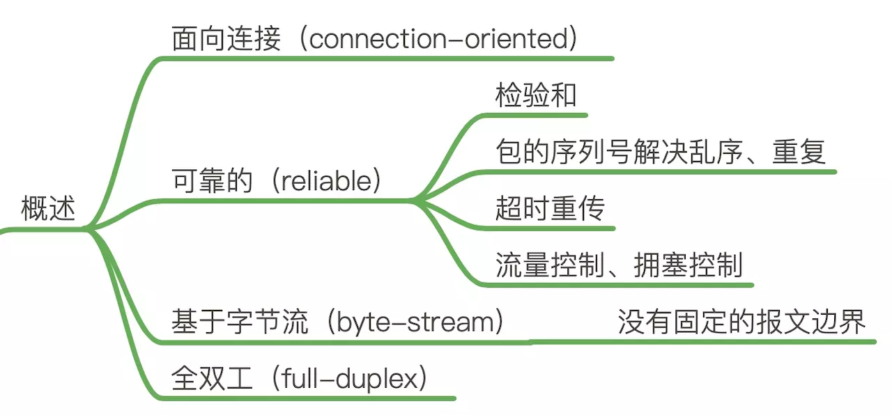
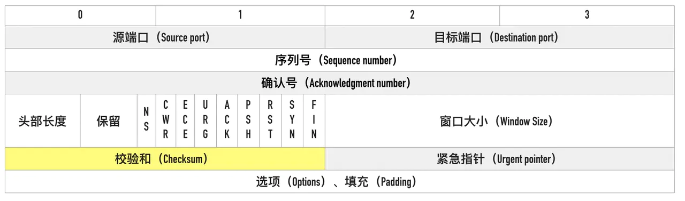
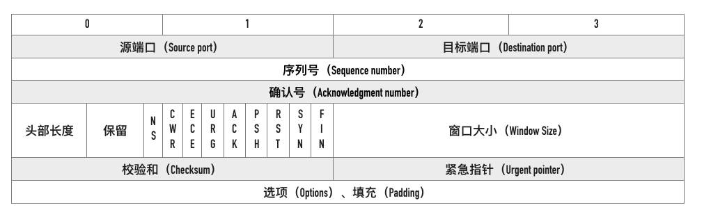
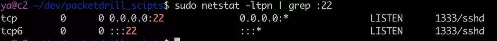
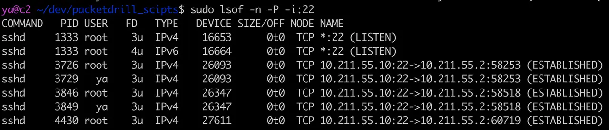

# TCP&IP协议

## OSI七层协议

网络通信问题：

1. 物理层： 网线，物理传输二进制数据
2. 数据链路层： 保证数据双方正确发送和接收

传输问题：

3. 网络层： IP，解决寻址问题
4. 传输层： TCP，保证数据完整性

应用进程：

5. 会话层： 用于管理会话
6. 表示层： 按照接收方通信的语言，对传输内容进行封装，处理加解密，压缩解压
7. 应用层： HTTP协议 DNS协议 按协议封装数据

## TCP协议

TCP 是一个可靠的（reliable）、面向连接的（connection-oriented）、基于字节流（byte-stream）、全双工的（full-duplex）协议。

### 三次握手

建立连接的过程是通过「三次握手」来完成的，顾名思义，通过三次数据交换建立一个连接。 通过三次握手协商好双方后续通信的起始序列号、窗口缩放大小等信息。


### 特点



#### 面向连接（connection-oriented）

面向连接的协议要求正式发送数据之前需要通过「握手」建立一个逻辑连接，结束通信时也是通过有序的四次挥手来断开连接。

#### 无连接（connectionless）

无连接的协议则不需要

#### 可靠的（reliable）

IP 是一种无连接、不可靠的协议：它尽最大可能将数据报从发送者传输给接收者，但并不保证包到达的顺序会与它们被传输的顺序一致，也不保证包是否重复，甚至都不保证包是否会达到接收者。

TCP 要想在 IP 基础上构建可靠的传输层协议，必须有一个复杂的机制来保障可靠性。 

主要有下面几个方面：

- 对每个包提供校验和
- 包的序列号解决了接收数据的乱序、重复问题
- 超时重传
- 流量控制、拥塞控制

**校验和（checksum）：**

每个 TCP 包首部中都有两字节用来表示校验和，防止在传输过程中有损坏。如果收到一个校验和有差错的报文，TCP 不会发送任何确认直接丢弃它，等待发送端重传。



**包的序列号保证了接收数据的乱序和重复问题：**

假设我们往 TCP 套接字里写 3000 字节的数据导致 TCP发送了 3 个数据包，每个数据包大小为 1000 字节：第一个包序列号为[1~1001)，第二个包序列号为 [1001~2001)，第三个包序号为[2001~3001)


假如因为网络的原因导致第二个、第三个包先到接收端，第一个包最后才到，接收端也不会因为他们到达的顺序不一致把包弄错，TCP 会根据他们的序号进行重新的排列然后把结果传递给上层应用程序。

如果 TCP 接收到重复的数据，可能的原因是超时重传了两次但这个包并没有丢失，接收端会收到两次同样的数据，它能够根据包序号丢弃重复的数据。

**超时重传：**

TCP 发送数据后会启动一个定时器，等待对端确认收到这个数据包。如果在指定的时间内没有收到 ACK 确认，就会重传数据包，然后等待更长时间，如果还没有收到就再重传，在多次重传仍然失败以后，TCP 会放弃这个包。后面我们讲到超时重传模块的时候会详细介绍这部分内容。

**流量控制、拥塞控制：**

这部分内容较复杂，后面有专门的文章进行讲解，这里先不展开。

#### 基于字节流（byte-stream）

TCP 是一种字节流（byte-stream）协议，流的含义是没有固定的报文边界。

#### 全双工的（full-duplex）

在 TCP 中发送端和接收端可以是客户端/服务端，也可以是服务器/客户端，通信的双方在任意时刻既可以是接收数据也可以是发送数据，每个方向的数据流都独立管理序列号、滑动窗口大小、MSS 等信息。

## 网络分层设计

### 网络访问层（Network Access Layer）

网络访问层也有说法叫做网络接口层，以太网、Wifi、蓝牙工作在这一层，网络访问层提供了主机连接到物理网络需要的硬件和相关的协议。这一层我们不做重点讨论。


## TCP报文头部



- SYN（Synchronize）：用于发起连接数据包同步双方的初始序列号
- ACK（Acknowledge）：确认数据包
- RST（Reset）：这个标记用来强制断开连接，通常是之前建立的连接已经不在了、包不合法、或者实在无能为力处理
- FIN（Finish）：通知对方我发完了所有数据，准备断开连接，后面我不会再发数据包给你了。
- PSH（Push）：告知对方这些数据包收到以后应该马上交给上层应用，不能缓存起来

## 数据包

**MTU（Maximum Transmission Unit）：** 最大传输单元


**MSS（Max Segment Size）：** TCP 最大段大小

MSS = MTU - IP header头大小 - TCP 头大小

在以太网中 TCP 的 MSS = 1500（MTU） - 20（IP 头大小） - 20（TCP 头大小）= 1460

## 端口号

一般1024~65525端口段可分配。

### 标识

链路层标识： MAC
IP层标识： IP地址
传输层标识： 端口号

### 检测端口号开启情况

使用 nc 和 telnet 这两个命令可以非常方便的查看到对方端口是否打开或者网络是否可达

```sh

telnet 10.211.55.12 6379
Trying 10.211.55.12...
Connected to 10.211.55.12. 
Escape character is '^]'. 

nc -v 10.211.55.12 6379
Ncat: Connected to 10.211.55.12:6379
```

### 检测端口号占用情况

1. 使用 netstat



2. 使用 lsof




