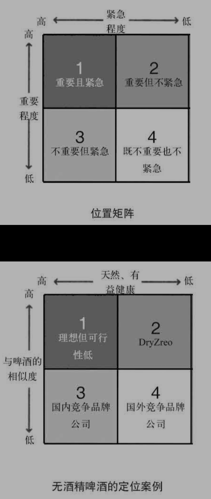
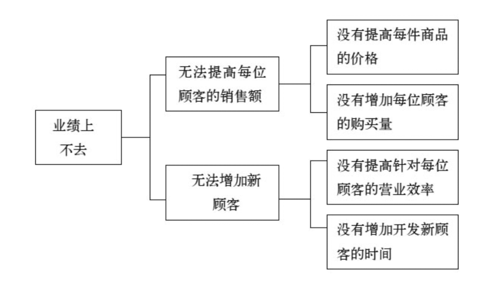
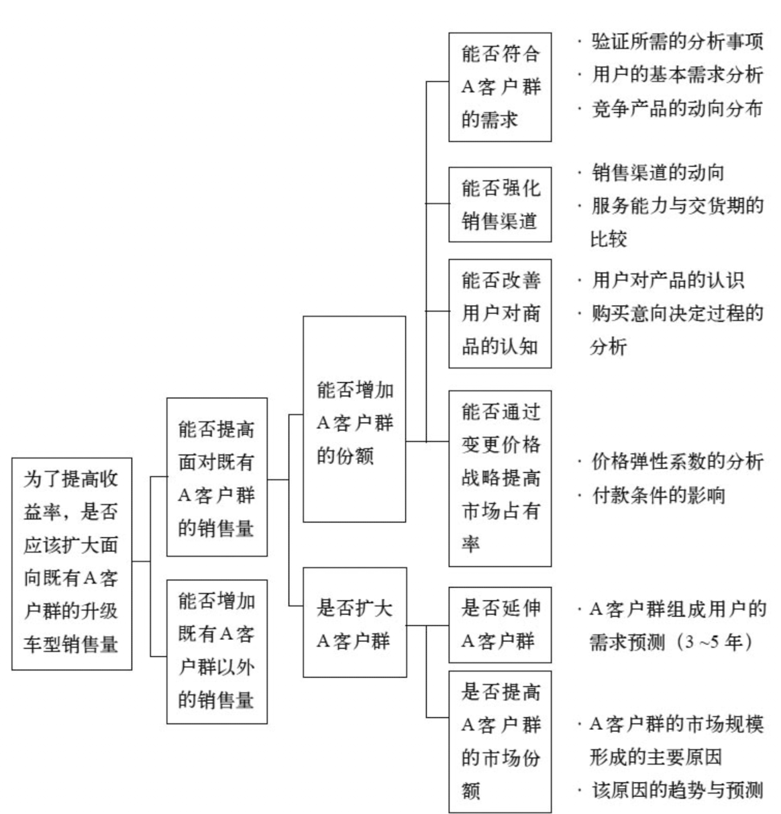
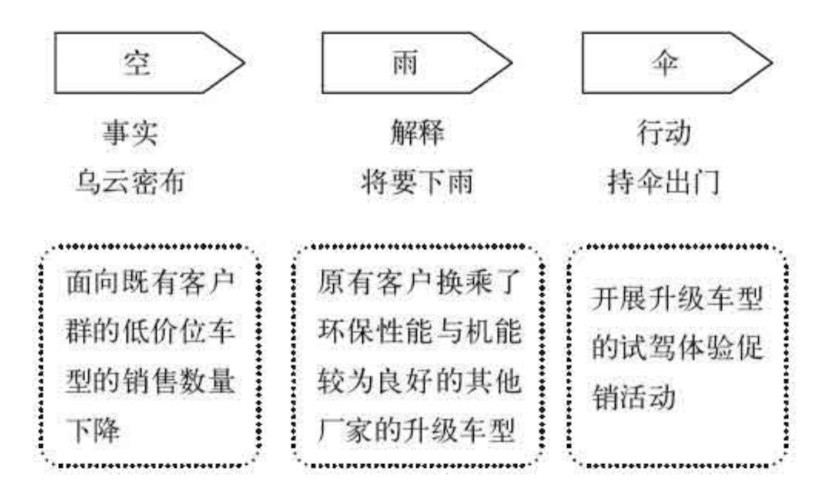

# 麦肯锡工作法： 个人竞争力提升50%的7堂课

## 思维导图

:::markmap

# 麦肯锡工作法

## 背景

- 麦肯锡的公司是做什么的？
  - 帮助他人寻找问题答案，解决问题

## 目的

- 了解麦肯锡的工作方式，提升问题解决能力

## 麦肯锡人特质

- 客户第一为工作原则
  - 亲自感受客户的困境：不依赖二手信息，需到现场，亲自收集信息，作为基础进行深入思考，会更具说服力和价值
  - 积极面对困难：无论任何原因，给客户的承诺目标必须达成，不能因时间等因素降低标准。需提供紧迫感，以实现高价值交付
  - 尽善尽美地工作：追求高质量产出，以提高工作绩效。如果无法持续创造客户满意的价值，会被迫辞退
- 认可要么持续创造价值，要么离开
- 优先聘用有能力的人
- 人人渴望自立自强
- 面对问题和挑战时镇定自若
- 重视外在体现
  - 衣着和随身物品，给客户体现其品味
  - 材料细节斤斤计较，有简述也有详述，一目了然，以便满足客户多样需求
- 重视框架使用，提取附加价值的信息，以保障事半功倍
  - 调查问卷设计：不能只有封闭式问题，还需要有开放式问题，以更好服务于问卷目标
  - 3C框架（顾客customer、竞品competitor、公司company）：了解客户和竞品的行为和意识等，再决定公司的定位和行动
  - 位置矩阵：用以决策行为顺序
    - 
  - 逻辑树框架：将问题拆成多个小问题
- 认为他人对自己的评价，取决于工作结果
- 清楚自己的独特优势，并利用于工作中
- 从根本上解决问题
  - 思考问题时，多考虑根本原因

## 解决问题的基本步骤

- 原则
  - 明确目标，以保障高效无误完成工作
  - 寻找真正的问题，并考虑好ROI，再开始解决问题
- 解决问题的原意并不是应对已经发生的事情，而是深入研究问题的本质
  - 为什么会出现这种问题？→ 根本原因
  - 如何做才能防止这类问题的发生？→ 根本解决方案
- 整体流程
  - 把握问题结构，明确问题相关因素
  - 分解问题：用逻辑树，将大问题变成多个小问题
    - 
    - 需注意不漏不重，抓大放小
  - 验证假说：用要点树，将要点拆细
    - 
    - 需注意不漏不重
  - 推导解决方案："空雨伞"——现状如何，现状意味着什么，解决方案与对策
    - 
- 注意点
  - 避免局限于现状和制约条件，应站在理想状态下思考如何解决问题
  - 保持思维的逻辑性，明确原因和结果，避免问题重复和遗漏
  - 多思考为什么，过程中量化问题和方案，以提高逻辑严谨性
  - 解决方案需给出：针对谁、做什么、如何做，以从根本解决问题

## 处理信息的技巧

- 亲自到场确认信息真实性，收集一手信息，避免使用二手信息
- 分析数据表象后，要创造出更有价值的信息
- 着眼于对方有益的方式输出信息，让信息具有冲击力，产生更多想法

## 提高解决问题的思考方法

- 避免只看问题表象，要挖掘根本原因，解决问题时多思考未来可选的改进措施
- 竭尽全力，绝不放弃的决心
- 保障睡眠充足，避免身心俱疲，尽量选择早上思考问题
- 避免焦虑情绪，保持思维清晰，学会放松自己，在忙碌时也保持放松的心态，可尝试冥想、运动、玩乐
- 多运用思维框架，减少无用思考，并在思考前制定目标和预期结果
  - 了解更多思维框架，认识到自己的思维框架，并尝试改变它
- 区分对方的意见和事实，意见往往不是根本问题，事实是根本问题
  - 例：有人提了会议时间长的意见，如果选择缩短会议时间，会议就会变得没有意义，其实事实在于会议没有创新性讨论
- 从问题出发，将目标拆解为多个问题思考，切问题要简洁有力
  - 提问时，先搁置自己的想法，人们凭借对方的询问，才识别到某件事的重要性，会提升信赖感
    - 问题类型：转变视角、探索原因、识别价值观等
    - 电梯测试：30s传达核心疑问，简洁有力包含问题点、解决方案和实施办法
  - 回答问题时，需识别根本问题，例如思考如何制定销售战略，转变为思考如何降低成本，可能可以创造更大价值
- 从全局视角思考问题，避免片面的消息影响作为全局结论

## 提高自身能力的方法

- 明确自己的个人优势，寻找是否存在其他使用的途径，扩大可能性，提高自身存在价值
- 审视自己的外表，外表是内在的体现，内在充实丰满，外在才会表现得干练和充满活力
- 养成记录的习惯，选用简单的记录工具，梳理线索和疑问，形为深入思考的工具
- 寻找榜样，了解对方的工作方式，学习其精华，积极主动探讨问题
- 面对失败，不做评判，需思考是否可以带来正面影响，其中蕴含的可能性

## 创造成果的能力

- 在限定时间取得成果，遇到问题可独立解决，以成果为导向展开思考和行动
- 面对难相处的同事，尝试寻找对方身上10个优点，从而产生情感共鸣
- 把握向领导汇报的节奏，及时得到支援
- 思维开放，倾听团队成员声音，形成自由的讨论环境
- 分工合理，明确每位团队成员个人职责
- 面对困难和疑问，多尝试和周围人沟通解决
- 使用项目甘特图，任务拆解细致，时间明确，高质量完成自己的部分
- 分析失败时，需对照原计划对比差异，发散思维，寻找原因，激发创意
- 设计会议时，明确会议目标，并同步会议参与者
  - "我们"比"我"的观点，更容易产生共鸣
  - 会议重点不在于推行自己的主张，而在于从自己的观点或质疑为契机，激发大家的想法或意见，创造更大的价值
- 提出有效质疑，可使用分析框架，以得到合适的答案

## 演示的技巧

- 准备材料前，明确希望分享点，产生共鸣点
- 准备材料时，按金字塔结构梳理，让人一目了然，表达上应是具体的而不是抽象的，更能打动人
  - 传达"空雨伞"，内容需符合逻辑且必要
  - 信息表达清晰明确，简洁有力，扣人心弦

:::
