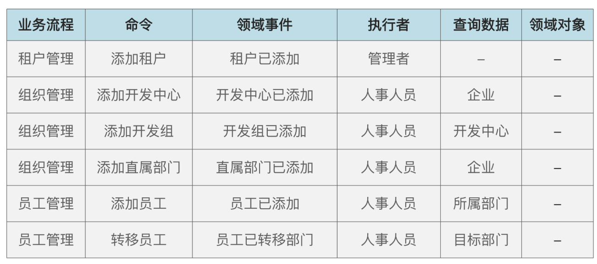
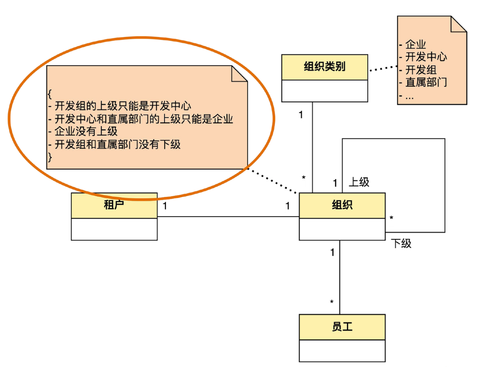
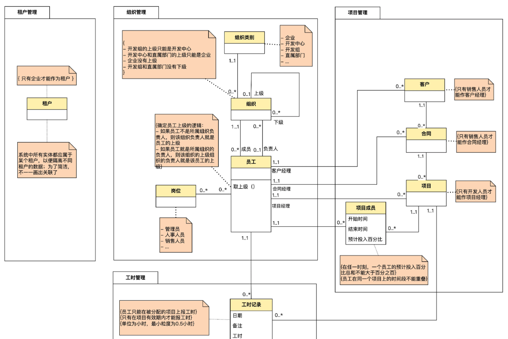
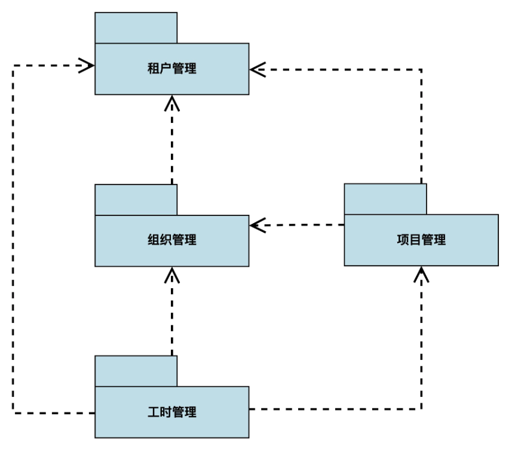

# 手把手教你落地DDD

## 思维导图

:::markmap
# 手把手教你落地DDD

## 事件风暴

### 1. 识别领域事件

- 领域事件是业务流程中每个步骤引发的结果。命名上一般是完成时 + 被动语态。
- 注意点：
    - 技术事件不是领域事件： 比如事务已回滚、缓存已命中
    - 查询功能不是领域事件： 比如用户信息已查询

### 2. 识别命令

- 命令是引发领域事件的操作。命名上一般是动词 + 主语。
- 识别过程中，需要考虑命令的执行者、查询数据，并标记出来

### 3. 识别领域名称

从命令、领域事件、执行中、查询数据中，找到的名词性概念。

### 常见问题

- 是否需穷举所有步骤？
    - 只列出主要的、足以用于表达和交流领域知识的步骤，不需要列出所有细节。
- 是否需体现严格的时间顺序？
    - 只要有大致的顺序即可，可以用流程图、时序图补充。
- 每个步骤的颗粒度如何把握？
    - 宜粗不宜细
- 如何保存和维护事件风暴结果？
    - 使用便签或者表格均可
        - 

### 领域建模

- UML建模
    - 约束： 注释里增加大括号来表示约束
        - 
    - 多重性： 使用 `0..*` 表示0到多个， `1..1` 表示必须1个等
    - 完整建模
        - 
    - 宏观层面 - 包图
        - 
:::