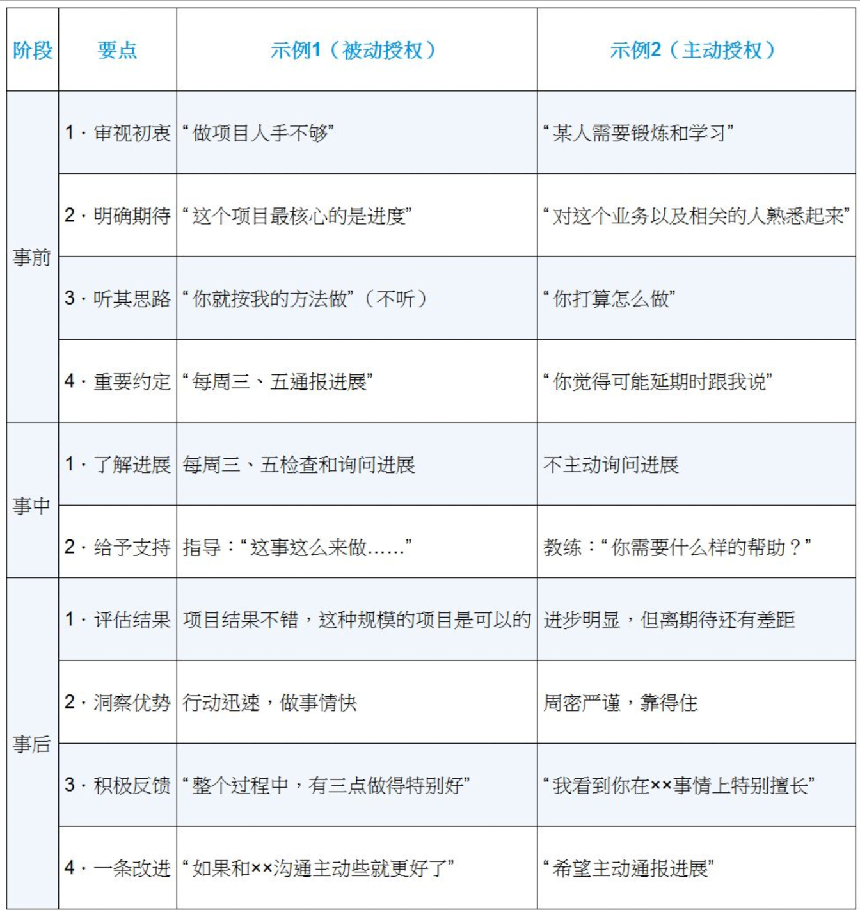

# 知行

## 问答

> 问自己几个问题
>
> - 管理适合我吗？
> - 管理要做什么？需要做到什么程度？
> - 怎么做好管理？

- 什么是管理？
  - 看方向、带人和做事
- 如何做好管理？
  - 建立角色认知，以管理者视角思考问题并做出反应
  - 做好管理规划、团队建设、任务管理、管理沟通

- 管理的意愿是否强烈？

  - 想解决更复杂的问题

  - 个人能做的事比较少，管理能推动更复杂的事落地

- 管理的价值是什么？
  - 协调和推动项目落地
  - 解决团队问题
  - 视野更大
- 团队工作目标是否明确？
- 技术能力和管理能力的冲突如何解决？
  - 减少编码时间，不放弃技术，关注不同人不同技术深度，注重技术应用
  - 技术上寻求编码外更高效的学习方式

- 技术方案评估维度有哪些？
  - 结果评估： 技术指标的衡量标准，如何衡量，目标是否达成
  - 可行性评估： 从投入成本、维护成本、机会成本、协作成本角度，判断能不能做，值不值得做
  - 风险评估： 方案带来的损失可能性和边界
- 技术判断力如何提升？
  - 建立技术学习机制，保持技术敏感度
  - 建立技术专项汇报
  - 和专家交流
  - 听取工作汇报内容

- 管理价值如何被认可？
  - 获取更好的业绩、回报
  - 帮助员工成长

- 管理风格有哪些？
  - 发号施令型： 关注目标和结果，不需要亲力亲为，员工只需要按指令执行，员工有压迫感，缺少人的关注，执行力强，梯度差
  - 以身作则型： 又称支持式管理，关注人的感受，甚至接替做事；员工会有归属感，但无法带动大规模团队
  - 激发辅导型： 又称教练式管理，辅导和启发员工，不执行但把控好节奏和方向；重视人和事，但是精力消耗较大
  - 无为而治型： 关注目标和结果，不重视人和事，不成熟的团队会导致野蛮生长，成熟的团队下成员会有更多发挥的空间

- 上级沟通聊什么？

  - 近期事项的看法、意见和评价
  - 明确上级看重的地方

- 团队战斗力如何提升？

  - 提高动力： 能力培养、员工激励（工作意愿）
  - 提高合力： 团队分工、协作水平
  - 提高耐力： 梯队建设、文化建设

- 任务管理如何做好？

  - 分清优先级
  - 有效执行
  - 流程机制

- 新团队如何接手？

  - 建立角色认知

  - 明确团队目标，拆解目标任务

  - 识别团队能力

  - 做好任务管理

  - 做好文化建设

- 团队规划如何设计？
  - 明确团队核心价值，职能： 为什么设立该团队？
  - 明确团队发展期待，业务/团队/技术目标
  - 明确团队产出期待，关键任务
  - 明确投入的资源，人力清单、组织架构
- 团队目标如何实现？
  - 上传下达

- 管理者的平台发挥空间受限条件有哪些？
  - 人： 成员人数
  - 财： 团建、培训、差旅费用
  - 物： 办公设备
  - 时间： 目标规划的时间预期
  - 信息： 业务或人员的信息
  - 权限： 绩效评价权限、激励权限、参加会议权限
- 实现需求的方式有哪些？
  - 自研
  - 招聘
  - 人才借调
  - 跨部门合作
  - 外包
  - 采购云服务
  - 购买方案

- 团队如何建设？
  - 明确专业能力，通用能力，人格力量方向的能力点，需要传达到位
  - 设立成员的能力培养目标
  - 根据目标和成员能力明确成员数量

- 专业能力有哪些？
  - 各技术栈的广度、深度
- 通用能力有哪些？
  - 结构化思考能力： 逻辑清晰，层次分明
  - 团队协作能力： 多人合作，主动沟通
  - 项目管理能力： 项目推进，交付
  - 快速学习能力： 新工作、新挑战能力
  - 沟通表达能力
  - 带人能力

- 人格力量有哪些？
  - 良好的品质： 迎难而上、坚持不懈、积极正向、主动担当、主动积极、一跟到底等
  - 日常沟通
- 人格力量如何建设？
  - 通过日常沟通发现，通过文化宣传建设

- 能力培养如何达成？
  - 7-2-1法则： 70%靠工作实践，20%靠相互交流和讨论，10%靠听课和看书自学
  - 自学： 组织培训，推荐或购买书记，提供学习资料
  - 交流： 组织兴趣小组，技术专题交流会，代码评审会，重点工作复盘
  - 实践： 授权和辅导，调研工作项目化，总结沉淀内化

- 学习动力如何激发？
  - 推：
    - 明确工作要求： 多长时间内熟悉某个业务
    - 建立学习机制
    - 同伴压力： 营造学习氛围
    - 建立惩罚机制
  - 拉：
    - 树立榜样： 将特别有学习意愿的人设立标杆
    - 配备导师： 有问题及时沟通
    - 技能图： 明确成长路径
  - 放：
    - 给机会： 挑战自我
    - 给空间： 自主思考和决策
    - 给耐心： 允许犯错，给做事机会

- 员工激励范围是哪些？
  - 外驱力： 对服从性的奖励，如表扬，需满足具体原则、公开原则、及时原则
  - 内驱力： 对投入的奖励，如： 自驱力、工作热情和追求价值
- 员工幸福感来源有哪些？
  - 正面情绪： 团队成员间的协作氛围
  - 人际关系： 新人归属和融入感
  - 投入： 发挥各人所长
  - 成就： 工作任务设立价值成果化，避免指令式
  - 人生意义： 达成团队使命和愿景

- 虚拟组织用于什么场景？
  - 为了某个特定目的和工作内容把大家组织在一起
  - 专人专事，聚焦目标，高效执行，比如： 用户体验优化分队等
  - 资源投入配置合理
  - 保持归属感，价值认可

- 团队协作水平如何提升？
  - 整体统筹： 找到协作问题，解决冲突，推进各项工作
  - 建立机制： 学习协作机制，培养默契
  - 提升互信： 增进彼此认识和了解的机会，如团建和合作
  - 不断练习： 重复以上内容

- 团队如何选人？
  - 技能匹配程度： 不单单是和自己能力相近的人，最好能力互补
  - 协作能力
  - 文化价值观
- 团队如何培养人？
  - 制定个人发展计划（IDP）： 只讲意向和计划，避免成长之外的承诺
  - 做好工作授权
  - 建立反馈机制

- 工作如何授权？
  - 工作授权三段法

- 团队梯队如何建设？
  - 能力备份： 可由骨干或者非团队成员备份，如果业务繁忙，可分多个阶段进行，周期为一个季度、半年、一年；
    - 阶段一： 相互熟悉和了解对方业务，可通过读文档、代码、串讲、开交流会方式进行
    - 阶段二： 介入业务，从小项目开始相互联手，原负责人带着做
    - 阶段三： 大型项目练手
- 团队文化如何建设？
  - 提炼： 从负责人身上提炼优秀品质，放大到整个团队，以身作则；描述上应生动简练
  - 主张： 团队文化传达到位，季度会或者一对一沟通时进行
  - 践行： 沟通IDP、评优表彰、选拔导师、项目复盘、辅导时，需检查执行情况
- 团建活动如何设计？
  - 初衷： 为了放松还是激励？
  - 目标： 需要达成什么效果，协作还是文化？
  - 手段： 活动是否和目标匹配

- 团队凝聚力如何提升？
  - 设立共同愿景
    - 提炼团队职责、使命和工作目标
    - 在合适的场合不突兀地同步使命和愿景
  - 提升员工归属感
    - 职责清晰
    - 良好的人际关系
    - 共同认可的团队文化价值观
  - 增进相互了解
    - 多创造机会沟通
  - 共同面对挑战
    - 共同应对大型项目和紧急事件
    - 跨团队对抗性活动

- 做事如何做好？
  - 事前： 排列任务优先级
  - 事中： 监督是否案计划推进
  - 事后： 总结经验教训，形成规矩和做法

- 有效执行的障碍有哪些？
  - 目标不清晰
  - 总负责人缺失
  - 缺乏有效运转机制： 遵循机制依赖人的主动性，需要监督执行情况纠偏
  - 沟通不到位

- 任务检查如何进行？
  - 任务执行检查表

- 要让机制具备可执行性，流程机制建立需遵循哪些原则？
  - 简单原则： 可操作性强，只需最低学习成本和操作成本
  - 关键原则： 关键节点不宜太多，3~5个为宜
  - 问责原则： 跟进人负责监督执行情况
  - 实用原则： 要有场景，要有实用价值，随着场景更新而升级

- 高效执行如何设计？
  - 个体产能高： 员工能力和意愿
  - 合作水平高： 分工和协作能力
  - 团队方向明确： 团队目标感
  - 工作时长

- 沟通的目的是什么？
  - 建立沟通通道
  - 同步信息
  - 表达情感
  - 输出影响

- 如何倾听？
  - 3F倾听原则

- 提问的方式有哪些？
  - 封闭式问题： 回答者仅需回答是否，常用场景为降低回答成本，收敛聚焦话题，得出结论加以确认
  
  - 开放式问题： 回答者不受限制陈述，常用场景为收集信息和观点，激发对方表达意愿
  
- 向上沟通解决什么问题？
  - 目标
    - 对齐目标理解
    - 确定目标
    - 主动定目标
  - 进度
    - 项目进度汇报
    - 介绍项目细节
  - 资源
    - 寻求资源
  - 结果
    - 了解对结果的反馈

- 如何做好沟通？
  - 明确沟通目的
  - 明确沟通带来的价值

- 沟通理解偏差如何减少？
  - 回放确认/正向反馈： 多问“你是不是这个意思”、“你看我理解的是否正确”

- 向下沟通需要注意什么？
  - 表达积极意图、建设性方案、建设性反馈

- 对沉默寡言的员工如何沟通？
  - 找到切入点： 对方所达成的成就
  - 表达欣赏
  - 表示好奇： 如何达成
  - 继续挖掘

- 员工行为不符合标准怎么办？
  - 场景如： 项目延期、工作质量较差、推皮球
  - 满足三大原则
    - 人没问题原则，需对事不对人，不贴标签
    - 具体性原则，指明具体问题点
    - 面向未来原则，体现问题，提供改变的出口
  - 意图转换，避免“我不要”意图，而是问自己，我要什么，再思考怎么做合适
- 不符合标准的行为为什么存在？
  - 每个负面背后，都有一个正向的目的，需分析并沟通达成双方满意的方案
- 员工沟通不顺畅怎么办？
  - 场景如： 需要花费大量时间经历去管理的人
  - 需要识别员工身上的问题，共同去克服
  - 从做事和团队的建设性去识别这部分人，都不符合需尽早淘汰
- 绩效都好，如何给C？
  - 原因： 对绩效制度不满
  - 向上沟通申请更大的回旋空间
  - 绩效制度存在上限缺陷和下限价值
- 绩效目标如何设计？
  - 确保普适性： 共同遵守的要求
  - 确保稳定性： 避免朝令夕改，制度价值在于自觉遵守

- 如何处理情绪问题？
  - 认知： 识别自己的情绪
  - 接纳： 选择疏导而不是压抑
  - 觉察： 找到策略跳出情绪
- 管理方法论起到什么作用？
  - 出现一个情况时，根据全景图定义问题清单，明确问题所属区间，从而更好判断影响范围。如： 员工提离职

- 如何设计管理方法论
  - 18要素版管理框架

- 处理管理问题有哪些步骤？
  - 定义问题
  - 明确目标
  - 选择方式
  - 评估结果： 吸取经验，完善方法论

## 概念

NLP逻辑层次图

