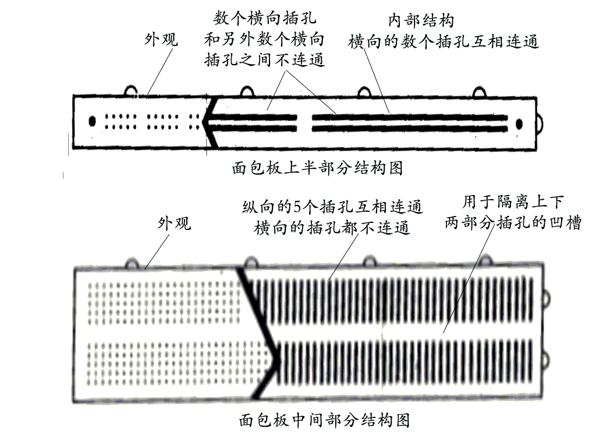
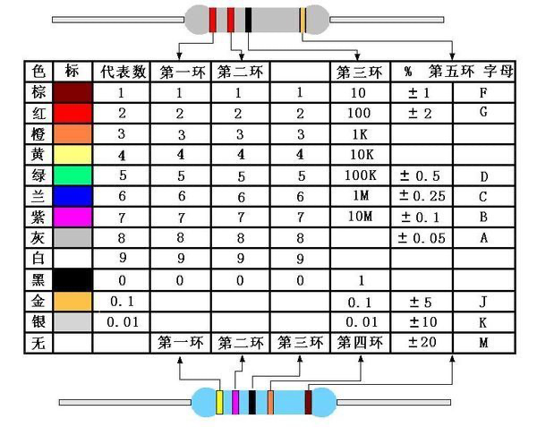

## uno板

- GND 负极

## 面包版

- 电源区： 上下部分，连接电源
- 器件区： 中间部分，放元器件，纵向导通

## 电阻

### 色环电阻

通过在电阻上涂不同的色环，来区分电阻的阻值。常用的分为四环和五环电阻：

- 四环电阻： 前二环代表数字，第三环代表阻值倍数，最后一环为误差。
- 五环电阻： 前三环代表数字，第四环代表阻值倍数，最后一环为误差。

## 二极管

- 短引脚接负极（器件区）
- 长引脚接正极（电源区）

