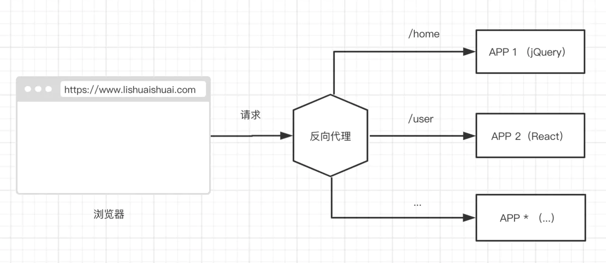
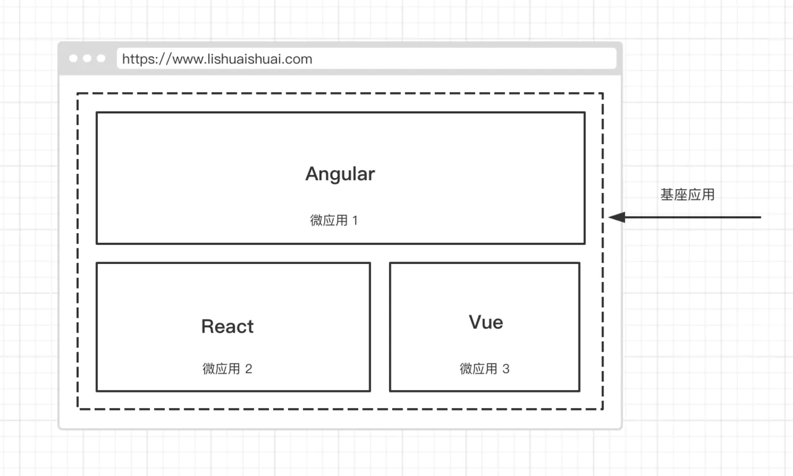
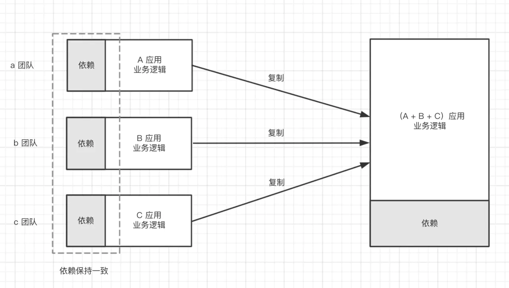
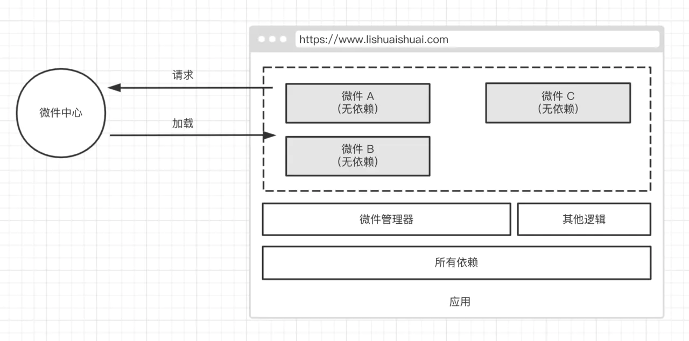

## 架构风格

1. 分层架构：每一层为上层提供服务
2. MVC架构：模型、视图和控制器职责分离
3. 发布/订阅架构：基于事件的架构风格
4. 管道和过滤器：处理数据流的架构模式

## 架构设计

### 层次设计

层次金字塔，自上而下设计架构，至下而上完善架构

1. 系统级： 整个系统如何与外界通信，如：前后的分离架构、微前端架构
2. 应用级： 应用外部如何共享组件、通信等，如：模式库、组件库、设计系统
3. 模块级： 应用内部如何模块化、数据和状态管理等，如：组件化、模块化
4. 代码级： 从基础设施保障架构实施，如：规范、原则、质量

## 代码架构

主要是对代码命名风格的规范统一

### 测试策略

1. E2E测试
2. 服务测试
3. 组件测试
4. 单元测试

## 构建流

构建流中包含编译，如：gulp是基于管道（Pipe）思想的流编程，而webpack仅负责将代码编译为浏览器可执行的es5代码。

## 设计风格指南

- 设计原则：大小、位置、间距等
- 色彩：主题色、功能色、中性色
- 文字排印：字体、大小、对齐方式等
- 布局
- 组件库
- 文档、图片规范等

### 沉淀

- 组件库
- 模式库：组件库中用到的通用代码

## 微前端架构

### 特点

- 应用自治：减少模块间依赖
- 单一职责：要求页面间关联性低
- 技术栈无关

### 拆分原则

- 按照业务拆分
- 按照权限拆分
- 按照变更的频率拆分
- 按照组织结构拆分
- 跟随后端微服务拆分

### 拆分方式

- 路由分发

- 前端微服务化：是微服务架构在前端的实施，每个前端应用都是完全独立（技术栈、开发、部署、构建独立）、自主运行的，最后通过模块化的方式组合出完整的前端应用。通常配备single-spa

- 微应用：即在开发时，应用都是以单一、微小应用的形式存在，而在运行时，则通过构建系统合并这些应用，组合成一个新的应用。

- 微件化：微件（widget），指的是一段可以直接嵌入在应用上运行的代码，它由开发人员预先编译好，在加载时不需要再做任何修改或者编译。

- 前端容器化：用iframe承载应用
- 应用组件化：使用Web Components


### 通信机制建立

#### bridge eventbus

用于跨层级的通讯，由底层建立，遵守制定通信规则。

```js
// 监听的事件名称由 应用名称 : 动作 + 名称 组成
bridge.on('basic:update-menu')
```

## 渐进式架构

几种方式：

- 更新
- 重构
- 迁移
- 重写
- 重新架构

### 更新

让旧应用的依赖和环境不断更新，以免成为一个不可维护的遗留系统

#### 升级项

- 依赖升级
- 框架升级
- 语言升级

#### 指定维护策略

- 合理的时间间隔，如三个月一次
- 定期检查依赖或使用工具自动检测
- 为更新预留时间和精力
- 准备文档策略，以记录过程中遇到的问题

### 常见问题

- 重写的意义是否重大
- 时间成本能否接受
- 代码中隐藏的业务能否发现


## 参考文献

- 前端架构：从入门到微前端
- UX最佳实践：提高用户体验影响力的艺术
