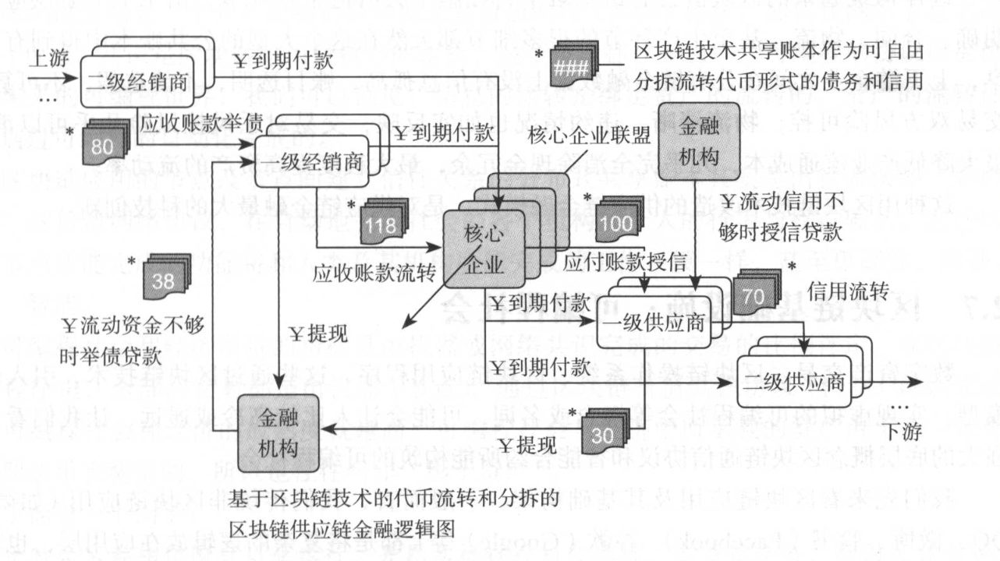

## 介绍

区块链技术是围绕着如何保持数据的一致、如何确保公共账本的数据不被篡改展开的。

## 技术组成 / 原理

最基本的技术组成，经典结构：

- 共识机制： 节点的账本数据一致
- 密码算法： 确保账本数据的不可篡改性以及数据发送的安全性
- 网络路由
- 脚本系统： 扩展账本数据的表达范畴
- 区块链账本

### 区块链账本

区块数据在逻辑上分成了区块头和区块体，每个区块头中通过梅克尔根θ关联了区块中众多的交易事务，而每个区块之间通过区块头哈希值（区块头哈希值就是一个区块的身份证号）串联起来。

### 共识机制

在区块链系统中，存在着多种这样的筛选方案，比如PoW ( Proof of Work，工作量证明）、PoS( Proof of Stake, 权益证明）、DPoS( Delegate Proof of Stake ，委托权益证明）、PBFT( Practical Byzantine Fault Tolerance，实用拜占庭容错算法）等

### 密码算法

区块中包含的每一笔事务数据也会被计算出一个哈希值，称为“事务哈希”，每一个事务哈希都可以唯一地表示一个事务。对一个区块中所有的事务进行哈希计算后，可以得出一组事务哈希，再通过对这些事务哈希进行加工处理，最终会得出一棵哈希树的数据结构。晗希树的顶部就是树根，称为“梅克尔根”。通过这个梅克尔根就可以将整个区块中的事务约束起来，只要区块中的事务有任何改变，梅克尔根就会发生变化，利用这一点，可以确保区块数据的完整性。

### 脚本系统

驱动区块链系统不断进行各种数据的收发

### 网络路由

在分布式的网络结构中，不存在一个指定的服务器，大家没法通过一个服务器来直接交换彼此的身份信息，就只能依靠彼此联系并传播信息。在区块链系统中，这个功能一般会定义成一种协议，称为“节点发现协议”。除了要发现节点外，更重要的一个功能就是同步数据。节点要保持自己的账本数据是最新的，就必须要时时更新自己的数据。从哪更新呢？既然没有服务器来下载，那就是通过邻近的节点了。通过向邻近节点发送数据请求来获得最新的数据，节点彼此都充当服务者和被服务者，通过这种方式，网络中的每一个节点都会在某一个时刻达成数据上的一致。

## 区块链分类

### 根据网络范围划分

#### 公有链

所谓公有就是完全对外开放，任何人都可以任意使用，没有权限的设定，也没有身份认证之类，不但可以任意参与使用，而且发生的所有数据都可以任意查看，完全公开透明。

在公有链的环境中，节点数量是不固定的，节点的在线与否也是无法控制的，甚至节点是不是一个恶意节点也不能保证。

#### 私有链

私有链是与公有链相对的一个概念，所谓私有就是指不对外开放，仅仅在组织内部使用的系统，比如企业的票据管理、账务审计、供应链管理等，或者一些政务管理系统。

在私有链环境中，节点数量和节点的状态通常是可控的，因此在私有链环境中一般不需要通过竞争的方式来筛选区块数据的打包者，可以采用更加节能环保的方式，比如在上述共识机制的介绍中提到的PoS( Proof of Stake，权益证明）、DPoS( Delegate Proof of Stake，委托权益证明）、PBFT(Practical Byzantine Fault Tolerance，实用拜占庭容错算法）等。

#### 联盟链

联盟链的网络范围介于公有链和私有链之间，通常是使用在多个成员角色的环境中。

由于联盟链一般用在明确的机构之间，因此与私有链一样，节点的数量和状态也是可控的，并且通常也是采用更加节能环保的共识机制。

### 根据部署环境划分

- 主链： 最长的原始链条
- 测试链： 供测试用途的区块链网络

### 根据对接类型划分

- 单链： 能够单独运行的区块链系统
- 侧链： 属于一种区块链系统的跨链技术，具有可将不同的链结合起来的特点。侧链能起到一个对主链功能扩展的作用，很多在主链中不方便实现的功能可以实现在侧链中，而侧链再通过与主链的数据交互增强自己的可靠性。
- 互联链： 区块链系统之间的互联，可以彼此互补，每一类系统都会有长处和不足之处，彼此进行功能上的互补，甚至可以彼此进行互相的验证，可以大大加强系统的可靠性以及性能。

### 比特币地址算法

我们可以发现比特币的地址其实就是通过公钥转化而来的，将上图简化一下，就是下面这么一个过程：

所以，在比特币系统中，本质上并没有一个叫作“地址”的东西，因为“地址”是可以通过公钥转化而来的，可以理解为公钥的另外一种形式，而公钥又是可以通过私钥计算出来的，因此在比特币钱包中，真正需要妥善保存的是生成的私钥数据。

## 应用场景

- 银行： 各个银行将交易流转记录到去中心化的共享账本，使得银行在企业信用评估环节有了更多信息，从而更好地给到合适的贷款优惠政策
- 资产分割、流转、交易、体现、利息、支付

## 现代密码算法发挥的作用

## 网络共识算法

## 区块链扩展

## 以太坊技术结构 / 智能合约开发

## 超级账本项目 / Fabric使用

## 设计一个微型区块链系统

## 当前区块链技术问题
