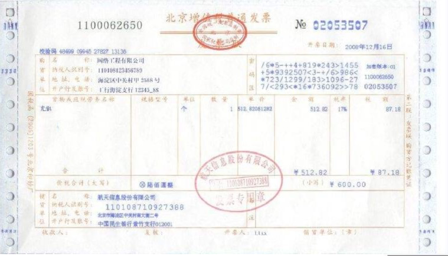
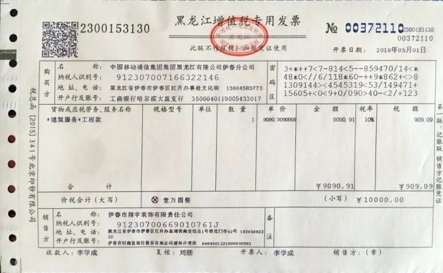
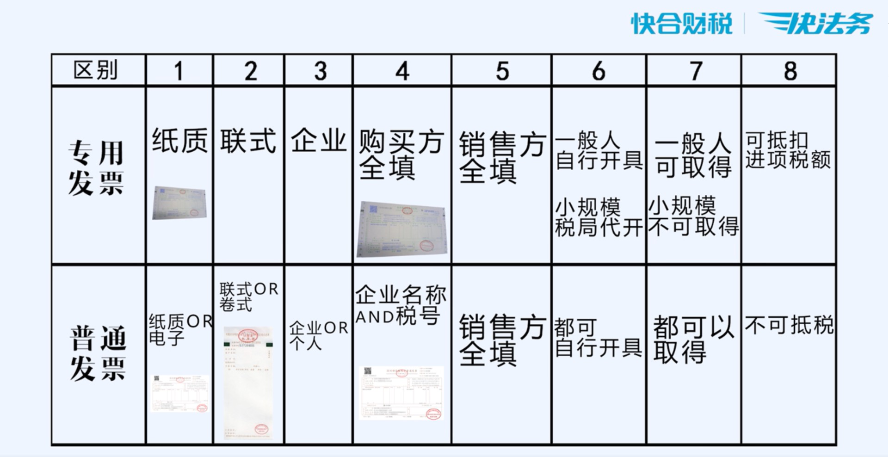

岗位：
会计：就是把企业有用的各种经济业务统一成以货币为计量单位，通过记账、算账、报账等一系列程序来提供反映企业财务状况和经营成果的经济信息。
出纳： 办理本单位的现金收付、银行结算及有关财务，保管库存现金、有价证券、财务印章及有关票据等工作的总称。

通识：
* 消费者购买商品时，已缴纳过商品的增值税了

增值税发票：
集销售凭证、记账凭证、报税凭证、抵税凭证、购买凭证等功能为一体的票。
普票（普通发票）：由从事经营活动并办理了税务登记的各种纳税人领购使用。是一种商事凭证。消费者为个人或小规模纳税人时、免税商品、未税务登记的个人时需开普票。
专票（专用发票）：只能由增值税一般纳税人领购使用。是一种商事凭证，也是一种扣税凭证。劳务行为时需开专票。
发票填写项：购货单位、销货单位、收款人、复核、开票人、密码区、税务合计

借贷：
借贷记账法是一种复合记账法，“借”“贷”是记账符号，借贷相等。
贷：来款金额
借：出款金额

凭证：
记录借贷金额，允许多张凭证，但借贷金额必须相等

报增值税：
销项金额申报的是税前金额

报所得税：

销项金额申报的是税后金额

纳税人分类及征税条件：

一般纳税人（一般人）：
* 年应征增值税销售额大于500万及以上
小规模纳税人（小规模）：
* 年应征增值税销售额小于500万
* 年应征增值税销售额超过小规模纳税人标准的其他个人（除个体工商户以外的其他自然人）

分类转换：

小规模转为一般纳税人的方法（可不转）：
* 会计核算健全，能提高准确税务资料的小规模
* 年应征增值税销售额超500万的非企业性质单位

特殊情况：

可按小规模纳税人纳税：
* 年应税销售额超过小规模纳税人标准的非企业性单位

只能按小规模纳税人纳税：
* 年应税销售额超过小规模纳税人标准的其他个人（即除个体工商户以外的其他自然人）

登记管理：

* 小规模转一般纳税人资格实行登记制，登记事项由增值税纳税人向其主管税务机关办理。
* 除国家税务总局另有规定以外，纳税人一经登记为一般纳税人后，不得转为小规模纳税人。

征税办法以及发票使用：

* 小规模纳税人采用简易计税方法计算增值税应纳税额（不允许抵扣进项税），部分小规模能自行开具增值税专用发票，不能自行开的可以到税务机关申请代开增值税专用发票。

计税方法：

一般计税方法：

当期应纳税额：

* 当期应纳税额 = 当期销项税额 - 当期准予抵扣的进项税额

当期销项税额：

* 当期销项税额 = 不含增值税销售额 * 适用税率
* 当期销项税额 = 含增值税销售额 / （1 + 适用税率） * 适用税率

简易计税方法：

* 应纳税额 = 不含税销售额 * 征收率
* 应纳税额 = 含税销售额 / （ 1 + 征收率） * 征收率

进口环节增值税：

进口非应税消费品：

* 应纳税额 = 组成计税价格 * 税率
* 应纳税额 = （关税完税价格 + 关税税额） * 税率

进口应税消费品：

* 应纳税额 = 组成计税价格 * 税率
* 应纳税额 = （关税完税价格 + 关税税率 + 消费税税率） * 税率

扣缴计税方法：

境外单位或者个人在境内发生应税行为，在境内未设有经营机构的，扣缴义务人按照下列公式计算应扣缴纳税额

* 应扣缴税额 = 购买方支付的价款 / （1 + 税率） * 税率

增值税纳税义务发生时间：

纳税人销售货物或应税劳务，其纳税义务发生时间通常为收讫销售款项或者取得索取销售款项凭证的当天；先开具发票的，为开具发票的当天。按销售结算方式的不同，具体分为：

1. 采取直接收款方式销售货物的，不论货物是否发出，// TODO

应收税率：

应收增值税范围：
* 销售、进口货物 16% （xxx）10%
* 销售加工、修理修配劳务 16%
* 销售服务
* 销售无形资产
* 销售不动产

后三者为营改增业务：
* 有形动产租赁：16%
* 交游基建不租不销转土：10%
* 其他：6%

