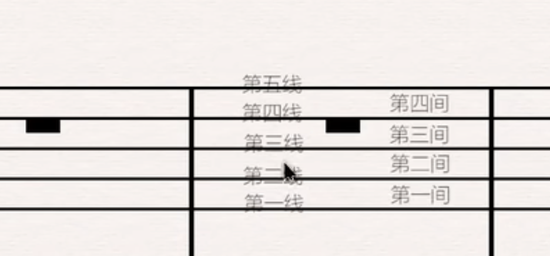
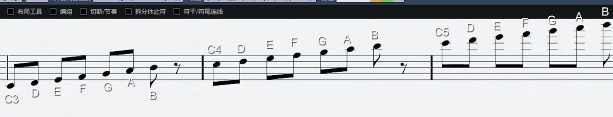
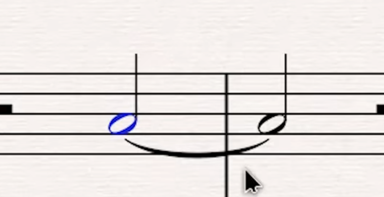

## 乐谱基础

- 线与间

- 各类音名

关键音名：

- 下加一线： C3
- 第三间： C4

连音符： 无需二次点击

## 实战

### city of stars

## 资源地址

- [乐谱学习](https://www.bilibili.com/video/BV17b411y7g3?p=2&spm_id_from=pageDriver)
- [city of stars](https://puduoduo123.com/29714.html)

