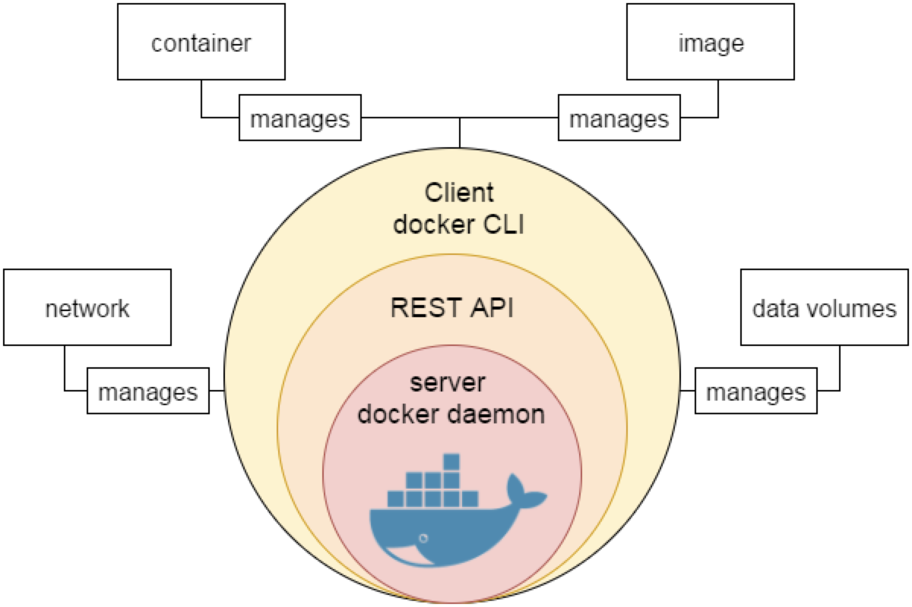
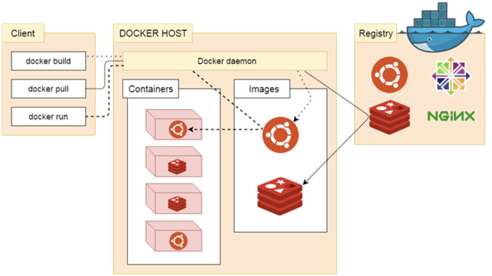

## 简介

一种虚拟化容器技术，使用的是客户端-服务器（C/S）架构模式，使用远程 API 来管理和创建 Docker 容器。





### 优点

- 减少对宿主机完整环境的开销
- 运行于内核，秒级启动
- 一次创建一套可配置镜像，解决多个环境不一致问题
- 镜像可复用，更易于拓展镜像

| 特性 | 容器 | 虚拟机 |
| --- | --- | --- |
| 启动 | 秒级 | 分钟级 |
| 硬盘使用 | 一般为 MB | 一般为 GB |
| 性能 | 接近原生 | 弱于 |
| 系统支持量 | 单机支持上千个容器 | 一般几十个 |

### 概念

| 标题 | 说明 |
| --- | --- |
| 镜像(./images) | Docker 镜像是用于创建 Docker 容器的模板。 |
| 容器(Container) | 容器是独立运行的一个或一组应用。 |
| 客户端(Client) | Docker 客户端通过命令行或者其他工具使用 Docker API (https://docs.docker.com/reference/api/docker_remote_api) 与 Docker 的守护进程通信。 |
| 主机(Host) | 一个物理或者虚拟的机器用于执行 Docker 守护进程和容器。 |
| 仓库(Registry) | Docker 仓库用来保存镜像，可以理解为代码控制中的代码仓库。Docker Hub(https://hub.docker.com) 提供了庞大的镜像集合供使用。国内知名仓库有 |
| Docker Machine | Docker Machine是一个简化Docker安装的命令行工具，通过一个简单的命令行即可在相应的平台上安装Docker，比如VirtualBox、 Digital Ocean、Microsoft Azure。 |

### 安装

分CE（社区版）、EE（企业版，收费），需安装完docker后安装镜像加速器

## 镜像

镜像的唯一标识是**ID**和**摘要（digests）**

### 基本操作

#### 获取镜像

格式： docker pull [选项] [Docker Registry 地址[:端口号]/]仓库名[:标签]

```sh
# 获取node镜像
$ docker pull node:8.9.4
# 获取镜像摘要
$ docker image ls --digests
```

#### 删除镜像

```sh
# 根据短ID删除镜像（短ID即镜像ID的前三位）
$ docker image rm 501
# 根据标签删除镜像
$ docker image rm nodejs:8.9.4
# 根据镜像摘要删除镜像
$ docker image rm node@sha256:xxxxxxx
```

### 镜像分类

#### 顶层镜像

已下载的镜像

```sh
# 获取顶层镜像
$ docker image ls
# 获取node镜像
$ docker image ls node
# since过滤出版本后的镜像，before过滤出之前的
$ docker image ls -f since=node:8.9.4
```

#### 虚悬镜像（dangling image）

一般是无用的镜像

```sh
#  获取虚悬镜像
$ docker image ls -f dangling=true
```

#### 中间层镜像

顶层镜像的依赖镜像，伴随着顶层镜像删除而消失

```sh
# 在所有镜像中可以看到
$ docker image ls -a
```

### 定制镜像

写一个Dockerfile

```Dockerfile
FROM node # 基础镜像，必传，scratch为空镜像
ENV version=1.0
ARG name # 通过--build-arg传入时，需声明变量，不声明会报错
VOLUME /data # 定义匿名卷，将写入操作存储到指定文件
EXPOSE 2333 # 声明容器端口，与 -p <宿主端口>:<容器端口>有差异
WORKDIR /dist # 指定工作目录
USER redis # 指定linux当前用户
ADD source.tar.gz / # 解压文件到根目录
COPY source.tar.gz / # 复制压缩文件到根目录
RUN echo 'hello josh $version'  # 在命令行执行指令，使用环境变量
ONBUILD RUN ["npm", "install"] # 在构建下一个镜像时执行指令
```

直接执行构建，也支持用git repo或压缩包构建

```sh
$ docker build -t node:j1 . # 以当前目录为路径上下文，根据当前目录下的Dockerfile建立一个名为node且标签为j1的镜像
$ docker build - < Dockerfile
```

## 容器

### 基本操作

运行容器

```sh
$ docker run node:lastest # 从镜像新建容器并启动
$ docker start [containerId] # 启动一个已停止的容器
$ docker run -d josh:test # 后台运行容器（守护态运行）
$ docker run -it [image]:[tag] [command] # 运行并执行指令
```

查看日志

```sh
$ docker container logs [containerId or NAMES] # 查看容器输出的日志
```

停止容器

```sh
$ docker container stop [containerId] # 停止容器
```

进入守护进程

```sh
$ docker exec -it [containerId] bash # 进入进程执行命令行
```

删除容器

```sh
docker container rm [NAMES] # 删除指定容器
docker container prune # 删除终止状态容器
```

## 仓库

### 基本操作

登录

```sh
$ docker login [registry]
```

登出

```sh
$ docker logout
```
推送

```sh
$ docker push [registry]/[username]/[name]:[tag]
```

## 数据管理

两种方式，数据卷或挂载主机目录

### 数据卷基本操作

创建数据卷

```sh
$ docker volume create [vol-name]
```

获取数据卷列表

```sh
$ docker volume ls
```

查看数据卷信息

```sh
$ docker volume inspect [vol-name]
```

挂载数据卷

```sh
$ docker run -d -p 2000:2000 --mount source=[vol-name],target=[container-path] [image]:[tag] # 将[vol-name]改成主机路径即挂载在主机文件下
```

删除数据卷

```sh
$ docker volume rm [vol-name]
$ docker volume prune # 删除无主的数据卷
$ docker rm -v [containerId] # 删除容器同时删除数据卷
```

## 网络配置

### 基本操作

外部访问端口

```sh
$ docker run -P [image]:[tag] # 提供随机端口访问应用暴露端口
$ docker run -p [宿主端口]:[容器端口] [image]:[tag] # 宿主机端口转发到容器端口
```

查看映射端口配置

```sh
$ docker port [containerId]
```

新建网络

```sh
$ docker network create -d bridge [net-name] # -d指定网络类型，bridge或overlay
```

连接容器

```sh
$ docker run -it --rm --name [container-name] --network [net-name] [image-name] # 容器连接到网络
```

获取挂载信息

```sh
$ mount
```

配置DNS，调整`、etc/docker/daemon.join`

```json
{
    "dns": [
        "114.114.114.114,
        "8.8.8.8"
    ]
}
```

查看容器DNS

```sh
# 进入容器的命令行后执行
$ cat etc/resolv.conf
```

# 相关问题

- **无法启动docker**

```sh
$ sudo /etc/init.d/docker start
```

# 相关技术

- [registry私有注册中心](https://docs.docker.com/registry)
- [harbor私有镜像管理](https://github.com/goharbor/harbor)
- [portainer容器管理及异常监控](https://www.portainer.io)
- [gitlab-ce代码管理仓库](https://docs.gitlab.com/omnibus/docker)
- [gitlab内存占用过多问题](https://blog.csdn.net/ouyang_peng/article/details/84066417)
- [gitlab相关配置调整](https://blog.csdn.net/crper/article/details/81291034)

# 相关文献

- [Docker官方文档](https://docs.docker.com/)
- [Docker深入浅出](https://www.funtl.com/zh/docs-docker)
- [WSL2](https://blog.icodef.com/2019/06/15/1629)
- [Microsoft WSL2安装说明](https://docs.microsoft.com/zh-cn/windows/wsl/wsl2-install)
