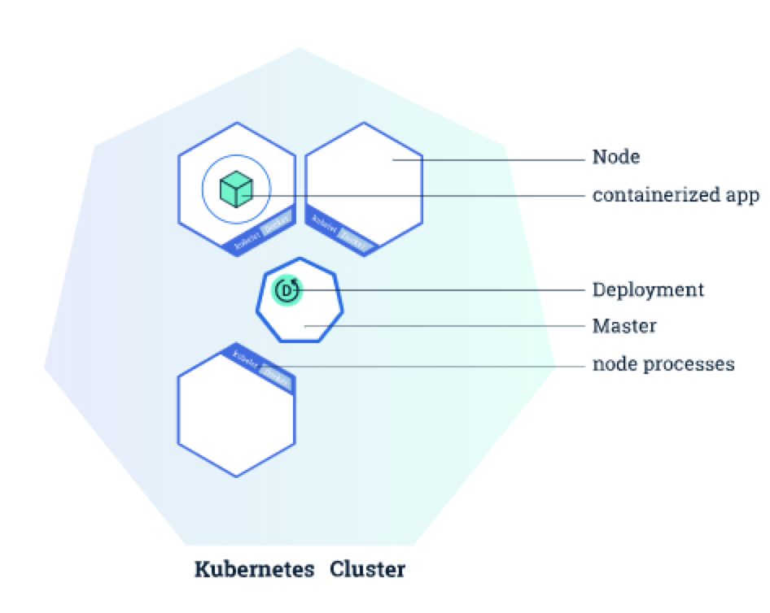
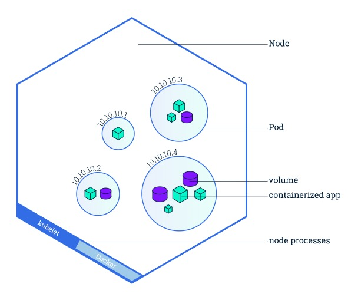
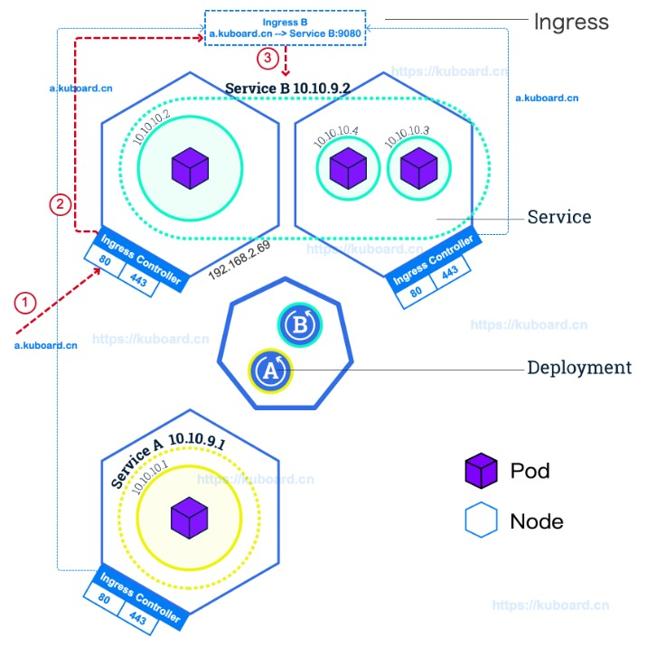
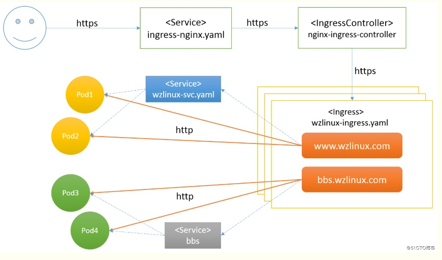

## 介绍

- 自动化容器的部署和复制
- 随时扩展或收缩容器规模
- 将容器组织成组，并提供容器间负载均衡
- 很容易地升级应用程序的新版本

## 名词

- Deployment 部署

可创建镜像和容器

- Pod 容器组

最小可用单元，与worker节点（Node）绑定，可包含一个或多个容器，以及共享资源（网络、存储、容器）

- Node 节点

- Service 服务

- Labels 标签

- LabelSelector 标签选择器

## k8s基础架构







## kubectl指令

- 应用YAML文件

```sh
kubectl apply -f xxx.yaml
```

- 查看Deployment

```sh
kubectl get deployments
```

- 查看Pod

```sh
kubectl get pods
```

- 显示有关资源的详细信息

```sh
kubectl describe deployment [deployment名称]
```

- 查看容器日志

```sh
kubectl logs -f [Pod名称]
```

- 在pod的容器环境内执行命令

```sh
kubectl exec -it [Pod名称] [指令]
```

- 查看所有节点列表

```sh
kubectl get nodes -o wide
```

- 查看节点状态

```sh
kubectl describe node <your-node-name>
```

- 查看集群信息

```sh
kubectl cluster-info
```

- 查看apiserver情况

```sh
 kubectl logs -n kube-system -f --tail 20 kube-apiserver-farmer 
```

- 编辑配置

```sh
kubectl edit [kindType] [metadata.name]
```

- 创建配置文件

```sh
kubectl create configmap [name] --from-file=[rename].yaml=./config.yaml
```

- 查看标签

```sh
kubectl get pods --show-labels
```

- 打标签

```sh
 kubectl label node [node_name] [label_name]=[label_value]
```

- 容器重启

```sh
kubectl get pod PODNAME -n NAMESPACE -o yaml | kubectl replace --force -f -
```

## yaml配置

```yaml
# Pod.yaml

apiVersion: v1
kind: Pod
metadata:
  namespace: env # 命名空间 用于区分环境
  name: pod-name # 项目容器组名称
  labels: # 标签键值对
        appType: inner # 自定义标签标识，应用类型：inner内部应用 outer外部应用
spec:
  - name: container-name # 容器名称
    image: [image-name]
    ports:
    - containerPort: 80
    env:
    - name: HOST_IP # 变量名
      valueFrom:
        fieldRef:
          fieldPath: status.hostIP
    - name: NODE_PORT
      value: 32010 # 变量值
  nodeSelector: # 节点选择器，通过标签匹配节点
    appType: inner # 容器调度到包含该标签的节点上
  nodeName: farmer # 指定节点名称
```

## Dashboard

1. 先下载 `/root/.kube/kubecfg.p12` 文件，装进浏览器

2. **访问地址：** https://{k8s-master-ip}:6443/api/v1/namespaces/kubernetes-dashboard/services/https:kubernetes-dashboard:/proxy/#/login

3. 获取token

```sh
kubectl -n kubernetes-dashboard describe secret $(kubectl -n kubernetes-dashboard get secret | grep admin-user | awk '{print $1}')
```

## Ingress Controller

类似nginx，用于负载均衡，控制worker的路由，主要配置deployment service ingress三套yaml



### deployment.yaml

```yaml
# nginx-deployment.yaml
apiVersion: apps/v1      #与k8s集群版本有关，使用 kubectl api-versions 即可查看当前集群支持的版本
kind: Deployment        #该配置的类型，我们使用的是 Deployment
metadata:               #译名为元数据，即 Deployment 的一些基本属性和信息
  name: nginx-deployment        #Deployment 的名称
  labels:           #标签，可以灵活定位一个或多个资源，其中key和value均可自定义，可以定义多组，目前不需要理解
    app: nginx  #为该Deployment设置key为app，value为nginx的标签
spec:           #这是关于该Deployment的描述，可以理解为你期待该Deployment在k8s中如何使用
  replicas: 1   #使用该Deployment创建一个应用程序实例
  selector:         #标签选择器，与上面的标签共同作用，目前不需要理解
    matchLabels: #选择包含标签app:nginx的资源
      app: nginx
  template:         #这是选择或创建的Pod的模板
    metadata:   #Pod的元数据
      labels:   #Pod的标签，上面的selector即选择包含标签app:nginx的Pod
        app: nginx
    spec:           #期望Pod实现的功能（即在pod中部署）
      containers:       #生成container，与docker中的container是同一种
      - name: nginx     #container的名称
        image: nginx:1.8.0      #使用镜像nginx:1.8.0创建container，该container默认80端口可访问
```

### service.yaml

```yaml
# nginx-service.yaml
apiVersion: v1
kind: Service
metadata:
  name: nginx-service   #Service 的名称
  labels:       #Service 自己的标签
    app: nginx  #为该 Service 设置 key 为 app，value 为 nginx 的标签
spec:       #这是关于该 Service 的定义，描述了 Service 如何选择 Pod，如何被访问
  selector:         #标签选择器
    app: nginx  #选择包含标签 app:nginx 的 Pod
  ports:
  - name: nginx-port    #端口的名字
    protocol: TCP           #协议类型 TCP/UDP
    port: 80            #集群内的其他容器组可通过 80 端口访问 Service
    nodePort: 10040   #通过任意节点的 10040 端口访问 Service
    targetPort: 80      #将请求转发到匹配 Pod 的 80 端口
  type: NodePort        #Serive的类型，ClusterIP/NodePort/LoaderBalancer
```

### ingress.yaml

```yaml
# nginx-ingress.yaml
apiVersion: networking.k8s.io/v1beta1
kind: Ingress
metadata:
  name: my-ingress-for-nginx  # Ingress 的名字，仅用于标识
spec:
  tls: # 证书
  - hosts:
    - www.joshwong.cn # 证书域名
    secretName: xxx-secret # 密钥名称
  containers:
  rules:                      # Ingress 中定义 L7 路由规则
  - host: www.joshwong.cn   # 根据 virtual hostname 进行路由（请使用您自己的域名）
    http:
      paths:                  # 按路径进行路由
      - path: /
        backend:
          serviceName: josh-home  # 指定后端的 Service 为之前创建的 nginx-service
          servicePort: 80
```

### secret.yaml

通过`kubectl create -f secret.yaml`或者`kubectl create [kind] [type] [metadata.name] [type.key] [value]`

三种加密类型：

- **Service Account**：用来访问Kubernetes API，由Kubernetes自动创建，并且会自动挂载到Pod的/run/secrets/kubernetes.io/serviceaccount目录中；
- **Opaque**：base64编码格式的Secret，用来存储密码、密钥等；
- **kubernetes.io/dockerconfigjson**：用来存储私有docker registry的认证信息。

```sh
# 通过命令创建
kubectl create secret tls blog-11020-secret --key blog.joshwong.cn.key --cert blog.joshwong.cn_bundle.crt 
```

```sh
# secret.yaml
apiVersion: v1
kind: Secret
data:
  tls.crt: base64 encoded cert 
  tls.key: base64 encoded key
metadata: 
  name: wzlinux-secret
  namespace: default
  type: Opaque # 
```

## 常见问题

### 安装问题

无法join到集群

**解决方法：** 

1. 查看俩宿主机是否ping得通，是否存在网段冲突问题
2. `kubeadm token list` 看是否失效，失效的话通过 `
kubeadm token create --print-join-command` 重新生成token

节点问题

**解决方法：**

通过`journalctl -f -u kubelet`查看日志

## 相关文献

[k8s教程](https://www.kuboard.cn/)

