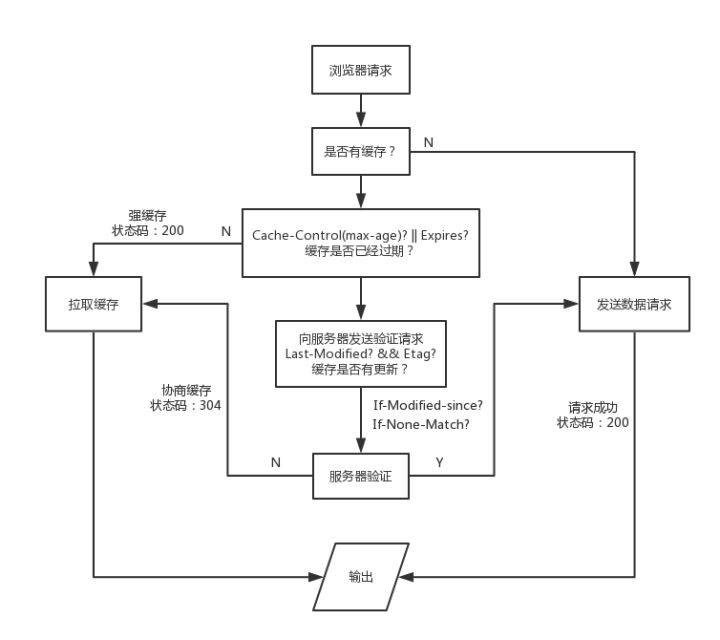
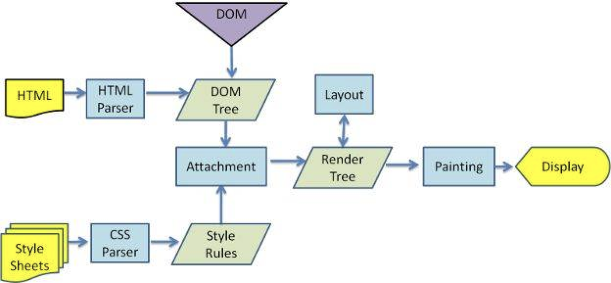

## 进程

- 浏览器进程： 输入地址，转换成http请求，输出到网络进程
- GPU进程
- 网络进程： 发起请求，根据响应头，输出到对应进程
- 渲染进程： 执行js脚本，生成DOM树和CSS树等
- 插件进程

### 渲染进程

- **GUI渲染线程：** 解析HTML、CSS，构建 DOM 树和 RenderObject 树，布局和绘制等。当界面需要重绘（Repaint）或由于某种操作引发回流（Reflow）时，该线程就会执行。
- **JavaScript引擎线程：** 主要负责解析 JavaScript 脚本并运行相关代码。 JavaScript 引擎在一个Tab页（Renderer 进程）中无论什么时候都只有一个 JavaScript 线程在运行 JavaScript 程序。需要提起一点就是，GUI线程与JavaScript引擎线程是互斥的，这也是就是为什么JavaScript操作时间过长，会造成页面渲染不连贯，导致页面出现阻塞的原理。
- **事件触发线程：** 当一个事件被触发时该线程会把事件添加到待处理队列的队尾，等待 JavaScript 引擎的处理。 通常JavaScript引擎是单线程的，所以这些事件都会排队等待JS执行。
- **定时器触发器：** 我们日常使用的setInterval 和 setTimeout 就在该线程中，原因可能就是：由于JS引擎是单线程的，如果处于阻塞线程状态就会影响记时的准确，所以需要通过单独的线程来记时并触发响应的事件这样子更为合理。
- **Http请求线程：** 在 XMLHttpRequest 在连接后是通过浏览器新开一个线程请求，这个线程就Http请求线程，它 将检测到状态变更时，如果设置有回调函数，异步线程就产生状态变更事件放到 JavaScript 引擎的处理队列中等待处理。

## 概念

### Load 和 DOMContentLoaded 区别

- **Load：** 事件触发代表页面中的 DOM，CSS，JS，图片已经全部加载完毕。
- **DOMContentLoaded：** 事件触发代表初始的 HTML 被完全加载和解析，不需要等待 CSS，JS，图片加载。

### 图层是什么？

一般来说，可以把普通文档流看成一个图层。特定的属性可以生成一个新的图层。不同的图层渲染互不影响，所以对于某些频繁需要渲染的建议单独生成一个新图层，提高性能。但也不能生成过多的图层，会引起反作用。通过以下几个常用属性可以生成新图层

- 3D 变换：translate3d、translateZ
- will-change
- video、iframe 标签
- 通过动画实现的 opacity 动画转换
- position: fixed

### 重绘（Repaint）和回流（Reflow）

- **重绘：** 是当节点需要更改外观而不会影响布局的，比如改变 color 就叫称为重绘
- **回流：** 是布局或者几何属性需要改变就称为回流。

### GC

垃圾回收机制（Garbage Collection），无法从GC根到达的对象，都将被GC回收。

GC根，指的是全局对象（window / document / 控制台）

## 过程

### 浏览器静态资源缓存策略

### HTTP请求过程

1. 构建请求
2. 查找缓存
3. HTTP请求： DNS -> 等待TCP队列 -> 建立TCP连接
4. HTTP响应

### 页面渲染过程

## 性能分析

- **Page Speed：** chrome拓展插件
- lighthouse
- Layers： chrome开发者工具菜单→more tools→Layers（开启渲染层功能模块）
- Rendering： chrome开发者工具菜单→more tools→rendering（开启渲染性能监测工具）

### 性能指标

- FP： 首次绘制（First Paint），标记浏览器渲染任何在视觉上不同于导航前屏幕内容之内容的时间点
- FCP： 首次内容绘制（First Contentful Paint），标记浏览器渲染来自 DOM 第一位内容的时间点，该内容可能是文本、图像、SVG 甚至 元素
- LCP： 最大内容渲染（Largest Contentful Paint），代表在viewport中最大的页面元素加载的时间. LCP的数据会通过PerformanceEntry对象记录，每次出现更大的内容渲染，则会产生一个新的PerformanceEntry对象.
- TBT： 总阻塞时长（Total Blocking Time），FCP到TTI间的时间，连续占用主线程的时间，是导致动画卡顿的罪魁祸首
- LCP： 最大内容绘制（Largest Contentful Paint），从输入URL到页面内容加载完的时间

### 页面加载过程

## 优化策略

### 静态资源打包优化

- 提取公共文件
- 代码体积压缩
- treeshake
- 模块联邦 ModuleFederationPlugin

### 图片资源优化

- 图片尺寸裁剪
- 雪碧图/使用字体图标
- 使用WebP格式图片

### 请求优化

- 减少请求
- 数据缓存
- 服务端渲染
- 微前端
- 加载顺序优化（prefetch： 预请求，闲时加载、preload： 预加载，与主模块并行加载）

### 网络优化

- gzip
- cdn
- 负载均衡
- http2
- PWA

### 处理速度优化

JS引擎线程和GUI渲染线程会相互阻塞，为了防止阻塞，可以将高耗时的js运算，放到worker去

- service worker 主要用于应用离线缓存
- web worker 主要用于应用运算
- webassembly

### 首屏加载速度优化

- 骨架屏： 防止阻塞在入口文件太久，从而可并发加载各子模块

## 参考文献

- [浏览器工作原理：浏览器组成&网络请求篇](https://juejin.im/post/6846687590540640263)
- [浏览器工作原理：渲染流程篇](https://juejin.im/post/6847902222349500430)
- [前端性能与异常上报](https://juejin.im/post/6844903648355418120)
- [网站性能优化实战](https://juejin.im/post/6844903613790175240)
- [浏览器页面资源加载过程与优化](https://juejin.im/post/6844903545016156174)
- [webpack magic comments](https://webpack.js.org/api/module-methods/#magic-comments)
- [Chrome Performance常见名词解释(FP, FCP, LCP, DCL, FMP, TTI, TBT, FID, CLS)](https://liuxuan.blog.csdn.net/article/details/104237256)
- [Web Worker 使用教程](http://www.ruanyifeng.com/blog/2018/07/web-worker.html)
- [Microtasks 与 Macrotasks](https://www.jianshu.com/p/47e3c40b8410)
- [仪表盘场景前端优化经验谈](http://qingbob.com/dashboard-optimize/)
- [JavaScript内存管理和优化](https://www.imooc.com/article/13489)
- [前端性能优化之 Performance 神器](https://www.sohu.com/a/150902639_505818)
- [蚂蚁金服如何把前端性能监控做到极致?](https://www.infoq.cn/article/dxa8am44oz*lukk5ufhy)
- [腾讯前端团队是如何做web性能监控的?](https://blog.csdn.net/sinat_17775997/article/details/107491675)
- [Chrome DevTools Memory](https://developers.google.com/web/tools/chrome-devtools/memory-problems?hl=zh-cn)
- [前端内存泄露浅析](https://segmentfault.com/a/1190000020277827)
- [performance对象介绍](https://www.cnblogs.com/xiaohuochai/archive/2017/03/09/6523397.html)

